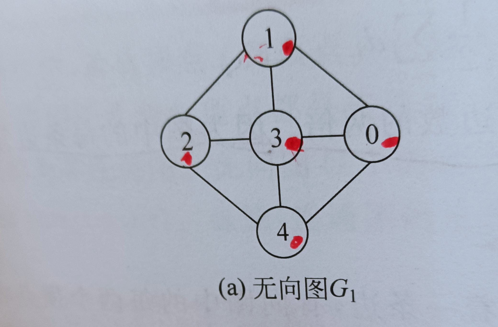
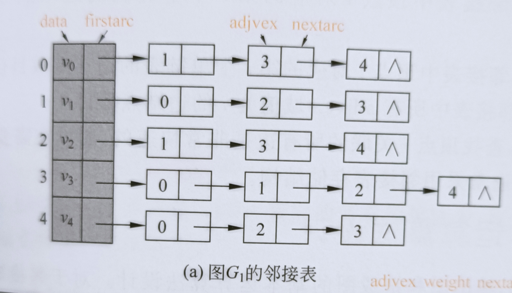
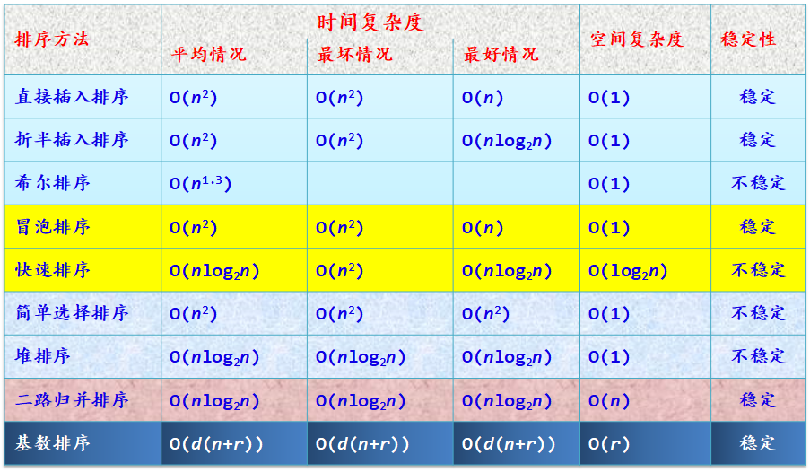

# 学习建议

- C语言运行环境：https://cplayground.com/


# 线性结构


## 数组


## 链表


## 栈


## 队列


# 树形结构

## 概念

 在树(tree)形结构中，每个结点有多个后继结点(succeeding node, succeesor)或称子结点(child, children)，但有且仅有一个前驱结点(precursor)或父结点(parent)，唯一的例外是根节点(root)没有父节点。那么如下概念就很明晰了：

- 根（root）：谁是根呢？那个没有父结点，从石头里蹦出来的结点就是根了。
- 兄弟结点(sibling)：拥有相同父结点的结点互称兄弟结点，这会我们的家谱血缘关系相似。
- 祖先（ancestor）与子孙(descendant)：祖先：父结点，父父结点，父父父...结点；子孙节点：子节点，子子...节点。
- 叶子(leaf)节点：不是所有结点都有子节点，没有子节点的叫叶子节点。
- 结点的度(degree)：就是该节点拥有的子节点个数。
- 路径(path)：某个结点沿着父结点的父结点的$\dots$父结点到根，这个过程经历了一系列结点。那么这些结点组成了“某个结点”到根结点的一条路径。你可以反过来，从根到“某个结点”这样看，你可想象一下顺藤摸瓜，"藤"就是这里所说的"路径"。由于每个结点的父结点唯一，那么到根节点的路径也唯一。路径长度就是这一系列结点的个数，不算自己。你还可以求任意两个结点的路径，把他们联系在一起的是他们共同的祖先。
- 森林（forest）：独木不成林，树的集合叫森林。
- 树的深度（depth): 可以用家谱的**代**来理解树的深度，你是你家族第几代人，就处在家族树为几的深度，看到那个英文了吧，以th结尾，自带**第**的属性。计算方式嘛也很简单，就是叶子节点到根的路径长度，由于深度是树的属性，谁能代表整个树的深度呢，肯定就是那个路径最长的叶子结点了，代表家族兴旺。由于根到自己的路径长度为0，所以深度为0，根的子结点距离根一步之遥，所以深度为1。如何计算树的深度呢？$depth(tree)=max(depth(tree.children))+1$
- 有序数：子树按一定的次序从左向右排列。
- 树的变种：
  - 二叉树：由空结点或者由一个根节点和称为左子树和一个称为右子树的二叉树构成。

##  树计算

1. 树的结点树等于所有结点的度之和再加一。相当于把所有结点的子结点算进去，再把根也算进去。

## 树的表示

1. 跟踪父结点：每个结点除了保存数据还需要保存父结点的指针。特点：寻找父结点简单，寻找子结点难。

```c++
struct node {
  data_t data;
  struct node *parent;
}
```

2. 跟踪子结点：每个结点除了保存数据还需要保存所有子结点的指针。特点：寻找子结点简单，寻找父结点难。

```c++
struct node {
  data_t data;
  struct node *children[MAX_CHILDREN_NUM]; // note: pointer of array
}
```


3. 兄弟链：一个指针指向最左边的孩子，一个指针指向他的下一个兄弟。特点实现普通树与二叉树的互转，缺点是寻找父结点难。

```c++
struct node {
  data_t data;
  struct node *child;
  struct node *sibling;
}
```

提示：

1. 可以根据自己的需要存储指针。孩子结点父亲结点，兄弟结点都存上，不是说非得选哪个。
2. 进程在linux中是用树表示的，Linus Torvalds用的什么结构呢？

## 二叉树

### 概念

1.  与度为二的树（2次树）的区别：2次树至少需要一个度为二的结点，二叉树没有这种要求；2次树不区分左右子树，而二叉树严格区分左右子树。
2. 完全二叉树：只允许最后两层结点度数小于2，而且最下面一层结点从左到右依次排列，看起就像右下角有个小缺口。
3.  满二叉树：只有度为0和2的结点，而且叶子结点全在最后一层。右下角的缺口都没有了。
4.  几乎完全二叉树：
5.  对于完全二叉树：编号为$i$的结点，其父结点编号为$\lfloor i/2 \rfloor $, 如果有左结点，则其编号为$2i$，如果有右结点，则其编号为$2i+1$。

### 普通树，森林与二叉树互转

 普通树转二叉树：

- 讲所有兄弟结点间连一条线
- 除了第一个子节点，删除父结点其他子节点的连线

还原：

- 某个结点的右孩子，右右孩子，右...右孩子是他的兄弟结点，他们与**某个结点**有共同的父亲结点。
- 因此，从最右的子节点开始断绝关系，把他们依次连接到**某个结点**的父结点即可。

森林转为二叉树

- 把森林中的每棵树转为二叉树
- 把后一棵树的根节点作为前一棵树的右子节点连起来

还原：

- 由于根没有父结点，因此与**某个结点**有没共同的父亲结点自立为树，形成森林。

### 二叉树的存储

1. 如果使用线性表（数组）表示完全二叉树，可以用以下性质：

> 编号为$i$的结点，其父结点编号为$\lfloor i/2 \rfloor $, 如果有左子结点，则其编号为$2i$，如果有右子结点，则其编号为$2i+1$。

这里有个细节需要注意：这里的编号是从1开始的，如果从0开始，那么左孩子为$2i+1$，右孩子为$2i+$2，你可以自己验证。编程的时候，数组第一个下标是0，你可以不用，也可以用另外一个关系式。

2. 如果用数组表示一般的二叉树，中间有结点缺失，那么可以用一些特殊符号表示空结点，把他补成一个完全二叉树。

3. 用链表表示。

用链表这就简单了。还记得前面我们记录子节点的表示方法吧，只需设置`MAX_CHILDREN_NUM=2`即可，然后用children[0]表示左结点，children[1]表示右结点，你也可以把数组拆成两个域left, right

```c++
struct node {
  data_t data;
  struct node *children[2]; 
}

// or like this
struct node {
  data_t data;
  struct node *left;
  struct node *right;
}

// or even add parent
struct node {
  data_t data;
  struct node *left;
  struct node *right;
  struct node *parent;
}
```


# 图

## 概念

- 图 G(graph) 由顶点集合 V(vertex)，边集合 E(edge) 组成，记做 $G=(V,E)$。
- 有向图的边用 $<i, j>$ 表示，$<i,j>$ 与 $<j,i>$ 不是同一条边。
- 无向图的边用 $(i,j)$ 表示，$(i,j)$ 与 $(j,i)$ 是同一条边。
- 一个顶点的出度与入度之和顶点的度，一个图的度数之和等于边数之和的两倍。
- 完全图：无向图中任意两顶点之间存在边，有向图任意两顶点存在反向的两条边。
- 路径：顶点 $i$ 到 $j$ 的路径是一个顶点序列$(i,v_1,\dots,v_i,j)$ ,路径长度等于边数。
- 环或回路：条路径的起始节点与结束结点是同一个结点。
- 连通性：图 $G$ 中任意两个顶点有路径相连，则称图是连通的，有向图称强连通的。无向图的极大连通子图称为 G 的连通分量，有向图的称作强连通分量。
- 拓扑序列：对于有向图 G ，其顶点序列 $v_1,v_2,\dots,v_n$ ，其中任何两个顶点 $i<j$ 时， $v_i$到 $v_j$ 有路径。
- AOE 网与关键路径：用有向图入度为零的顶点表示工程的开始事件，用出度为零的顶点表示工程结束事件，用边表示一项活动持续时间，那么这个有向图为边表示活动 AOE(activity on edge) 的网。

## 图的存储

1. 邻接矩阵

用矩阵元素 $A[i][j]$ 表示顶点$i,j$ 的关系：

- 对于无权图，$A[i][j]=1$ 表示有边 $<i,j>$，$A[i][j]=0$ 表示 $i,j$ 之间没有边。
- 对于带权图，$A[i][j]=w_{ij}$ 边 $<i,j>$ 的权重为$w_{ij}$，$A[i][j]=\infty$ 表示 $i,j$ 之间没有边, $A[i][j]=0$ 表示 $i=j$ ，即顶点自己到自己的权重。

边的权重怎么设可以根据具体问题调整。

我们可以得出如下结论：

- 无向图的邻接矩阵是对称矩阵。


2. 邻接表存储

先看一个邻接表的例子：





这是怎么存储的呢?

1. 左边那一列把所有的顶点存起来了。
2. 每个顶点右边挂的是与他直接他相连的所有顶点。

这个好理解：

- 在无向图中：你与我相连，我与你也相连，有向图就不一定了。
- 边的权重如何表示呢？在右边挂的结点增加一个权重域。


## 图算法

### 深度优先算法


### 广度优先算法


### Prim 算法


### Kruskal 算法


### Dijkstra 算法


### Floyd 算法


### 拓扑排序算法

1. 从有向图中选择一个没有前驱的顶点并输出他

2. 从图中删除该顶点，并删除从该顶点的全部有向边
3. 重复1, 2

### 求 AOE 网的关键活动

1. 事件就是 AOE 网的顶点，事件 $j$ 最早开始时间记为 $E(j)$ (early), 则

$$
E(j)=\max_{\forall <i,j>} \big( E(i)+w_{ij} \big)
$$

上式表示事件 $j$ 的最早开始时间为： $j$ 前一个事件 $i$ 最早开始时间加上活动 $<i,j>$ 持续时间中的最大值。

2. 事件 $i$ 最晚开始时间记为 $L(i)$ (latest), 则

$$
L(i)=\min_{\forall <i,j>} \big( L(j)-w_{ij} \big)
$$

上式表示事件 $i$ 的最早开始时间为： $i$ 后一个事件 $j$ 最晚开始时间减去活动 $<i,j>$ 持续时间中的最小值。

3. 关键事件：就是那些最早开始时间等于最晚开始时间的顶点即：$E(v)=L(v)$ 。
4. 关键路径就是关键事件的一个拓扑序列。


#  1. 算法学习101

## 1.1. 如何学习算法

很多时候，我们更感觉算法难学。一方面是复杂的数学知识，另一方面是繁琐的编程细节，甚至还需要理解计算机的工作原理。这样看来，算法确实难学，任何细节把握不好，会因为挫败感而放弃学习。

我们努力寻找一种平衡，使得算法的学习变得简洁，高效。

一般学习算法的途径有：

1. 看书。例如学校教材，《算法》红皮书，《算法导论》，《图解算法》，《计算机程序设计艺术》等。这些书难度各异，风格各异，厚度也不同。能有心情把学校教材看完，那就是了不起的成就。但是国内的的教材大家不怎么喜欢，一般自己再结合一本像《算法》红皮书这样的书来学习。其他的书是不可能能再看的，因为时间来不及。
2. 刷题。刷题就是上OJ网站写代码。例如九章算法，LeetCode等。以刷题来学习知识点的效率其实较低，题目多如牛毛，千变万化，拿出大把时间坚持刷一般人很难做到。OJ刷题的好处：一是可以检测自己的学习情况，即自己是不是真的理解了算法。二是增加做题的熟练度，以应付各种考试，因为考试限时，对熟练度要求高。所以那些准备ACM考试，研究生上机等考试的同学最喜欢刷题。考试不刷题，等于送人头。所以不考试，刷题意义不大。
3. 自己实现算法。优点：一是能把握学习节奏，二是不用找题，把经典用例实现即可，一通百通。缺点：一是没有测试用例（这也是OJ的优点），二是遇到困难求助难，三是容易放弃。

很多时候，我们感觉算法难学。一方面是繁杂的数学技巧，另一方面是繁琐的编程技巧，有时还要理解计算机的工作原理。这样看起来算法确实难学。


图片选自[如何系统地学习数据结构与算法？ - 程序员吴师兄的文章 - 知乎](https://zhuanlan.zhihu.com/p/137041568)

## 1.2. 算法学习思路

算法与特定的问题息息相关。也就是说算法(algorithms )与问题(problems)是一体两面。传统的算法学习重算法而问题。其中的模式就是先讲一个算法，然后摆几个与此算法相关的例题，布置几个相关的作业。然而，由于不理解问题，很多时候根本无从下笔，更不用说写代码了。

这启示我们可以从两个角度来学习算法：

1. 算法为主导的学习。先学习一个算法，然后用这个算法解决很多问题。这是我们最常见的，也是学校老师喜欢的方法。但自己学得很痛苦。
2. 问题为主导的学习。先了解问题的特性，比如如何描述问题，如何设用未知数表示量的关系，这些量如何更新与变化。然后，我们再用很多算法解决这个问题。这个角度是比较实用的路线。也是自己欠缺的。Steven S. Skiena的《算法设计手册》主要用的就是这个方法。

两种方法哪个好，并没有定论。我们讨论这些的目的是提供一些选择，当一条路走不通的时候，不妨试试另一条路。

## 算法学习容易犯的误区

- 盲目追求最优算法。实际上，“优与劣”是一个相对概念，评判标准不同，结果也就不同。只是大家都用时间，内存作为评判标准，这没有错，只是不适合对初学者。给初学者的建议是把算法跑通放在首位。自己的体会是抄别人的代码，“抄”不是Ctrl-v，是对着代码自己一个字符一个字符的敲，这样既能看到成果，又能学到知识，还能培养兴趣。想想自己因为盲目追求“好算法”走的弯路：浪费时间不说，还给自己造成算法很难学得错觉，容易把心态搞崩，怀疑人生。
- 一口气写出一个算法。自己之所以会犯这样的错误是因为“算法考试”惹的祸：考试必须在规定的时间解出答案来，要得分高，你怎么办？一靠IQ，二靠刷题，三靠手速，四靠乌七八黑。所以这会造成算法很难，算法是大神专利的错觉。自己写算法的体会：先写一个大概，能不能跑是一码事，至少可以骗自己说：不错，可以写代码了；然后修一修，补一补，修修补补结果通了。

以下笔记来自《算法设计技巧与分析》。这本书的优点：

- 书本的结构组织比较合理，经典算法，经典问题都有涉及。

- 对问题描述能切中要害。有问题的分析思路，有例子，有从常规思路到优化思路的对比。
- 分析详细。

缺点：

- 书比较老，排版丑。
- 算法用伪代码描述，不好抄。

总的感觉：干脆利落。

# 2. 算法分析

## 2.1. 复杂性表示


1. The big $O$ notation: $\exists n_0,c \quad \forall n \ge n_0  f(n) \le cg(n) \Leftrightarrow f(n)=O(g(n))$.
2. The $\Omega$ notation: $\exists n_0,c \quad \forall n \ge n_0  f(n) \ge cg(n) \Leftrightarrow f(n)=\Omega(g(n))$.
3. The $\Theta$ notation: $\exists n_0,c_1,c_2 \quad \forall n \ge n_0 \quad c_1g(n) \le f(n) \leq c_2g(n) \Leftrightarrow f(n)=\Theta(g(n))$.


## 2.2. 阶的关系

 $1 < \log\log(n) < \log(n) < n^{1/2} < n^{3/4} <n <n\log(n) <n^2 <2^n <n! <2^{n^2}$

## 2.3. 一些求和公式


$$
\begin{align}
\sum_i^n \frac{1}{i} &= \Theta(\log(n))\\
\sum_i^n \log(i) &= \Theta(n\log(n))\\

\sum_i^n{c^i} = \frac{1}{1-c} &= \Theta(1),c<1 \\

\sum_i^n ic^i &= \Theta(nc^n)
\end{align}
$$

## 2.4. 用递推式分析算法

用递推分析算法复杂度简洁直观易懂。但是递推式的求解比较复杂，下面是一些基本方法。弄懂这些能解决已经可以大部分问题。

### 2.4.1. 线性齐次递推式求解

线性齐次说的是：1.递推系数是常数，2.没有多余的加项。

常系数线性齐次递推式:
$f(n)=a_1f(n-1)+a_2f(n-2)+...+a_kf(n-k) $
特征方程:
$x^k=a_1x^{k-1}+...+a_kx^0$

如果是一阶的线性齐次递推式，那么:
$f(n)=a^nf(0) $

如果是二阶的，设$r_1, r_2$ 是特征方程的两个解，那么:
$$
f(n)=c_1r_1^n + c_2r_2^n, r_1 \ne r_2 \\
f(n)=c_1r^n + c_2nr^n, r_1 = r_2 = r
$$

$c_1,c_2$由初始条件确定。

### 2.5. 非齐次递推式的解

非齐次有很多种，例如带加项，带非常数系数（比较少见）。常见的算法分析一般是常数系数带加项。

- 第一类:
  $f(n)=f(n-1) + g(n),n \gt 1$ 的解为:

  $f(n)=f(0) + \sum_1^n g(i)$

- 第二类：

  $f(n)=af(n-1) + g(n),n \gt 1$ 的解法为:

  两边除以$a^n$: $\frac{f(n)}{a^n}=\frac{f(n-1)}{a^{n-1}} + \frac{g(n)}{a^n}$  

  把$\frac{f(n)}{a^n}$看作一个整体，则化为第一类。

- 第三类:
  $f(n)=g(n)f(n-1),n \gt 1$ 的解为: 

  $f(n)=g(n)g(n-1)\dots g(1)f(0) $

- 第四类:
  $f(n)=g(n)f(n-1) + h(n), n \gt 1$ 的解法为:
  令$f(n)=g(n)g(n-1)...g(1)f_1(n), n \gt 1, f_1(0)=f(0)$ 代回原式:

  $f_1(n)=f_1(n-1) + \frac{h(n)}{g(n)\dots g(1)}, n>1 $化为了第一种。

> 提示：后两类用的比较少，第一二类比较多，因为某些分治算法会有指数运算。而且那个系数$a$一般是2。

### 公式法：

$a,c,k$是非负整数，$b,d,x$是非负常数，且$n=c^k$, 以下递推式
$$
f(n)=
\begin{cases}
d & \quad n=1,\\

af(n/c)+bn^x &\quad n\ge2\\
\end{cases}
$$
的解是
$$
f(n)=
\begin{cases}
bn^x\log_c n+dn^x & \mbox{if }a=c^x,\\
\left( d+ \frac{bc^x}{a-c^x} \right)n^{\log_c a}-\left( \frac{bc^x}{a-c^x} \right) & \mbox{if } a\not=c^x
\end{cases}
$$

## 2.6. 数据结构与堆

堆是一个几乎完全二叉树，堆的每个节点都满足特性：对每个节点v与其父节点p，存储在其父节点的值不小于v。

堆的基本运算有：

```c
delete-max(H) //从一个非空堆H中删除最大值并返回
insert(H,x) //插入项x到堆H中
delete(H,i) //从堆中删除第i个元素
makeheap(A) // 以数组A创建堆
sift-up(H,i) //向上调整节点使他的值不比他的父节点大
sift-down(H,i) //向下调整节点使他的值不比他的父节点大

```

有n个节点的的堆T(一个几乎完全二叉树)可以由一个数组H[1...n]表示：
- 根节点存储在H[1],
- 如果节点x存储在H[i], 那么它的左子节点存储在H[2i], 右子节点在H[2i+1]，
- 非根节点的父节点存储在H[floor(i/2)]中 //floor()向下取整

> 几乎完全二叉树如果有右子节点，那么必有左子节点。

创建堆的算法；

```c
makeheap(A)
输入: 有n个元素的数组，
输出：转换成堆的数组A
for i <- floor(n/2) downto 1
  sift-down(A, i)
endfor
```

堆应用：堆排序
```c
heapsort(A)
输入：n个元素的数组
输出：排序好的数组A
makeheep(n)
for j <- n downto 2
  互换A[j]与A[1]
  sift-down(A[1...j-1],1)
endfor
```

## 2.7. 不相交集数据结构

给出有n个元素的集合S，这些元素被分成不相交集合。
每个子集用一个元素作为集合的代表，让集合中每个元素保存代表元素的指针，这样一个集合形成了一棵树，代表元素是根。所有的子集树形成了森林。

定义运算如下:

`find(x)`: 在森林中寻找元素x，返回x所在子集的代表元素。
`union(x,y)`: 把两个子集合并，让一个子集的根指向另一个子集的根。

由于普通的合并运算会使树的高度增加，某些元素到根的路径很长，导致查找效率低下。可采用如下两个策略解决：

1. 按树的高度合并。记录树的高度信息，合并(union)的时候，把高度低的树合并到高的树上，较高的树的高度不会增加；如果两棵树的高度一样，则选某一棵树，把另一棵树合并过来，**某一棵树**的高度加一。
2. 路径压缩。执行查找x的时候，先沿着路径找到根，并记下根的指针，再查找x一次，从x开始，把路径上的结点直接挂到根上。

虽然增加了某些union与find的复杂度，但是在高频的查找场景中，这些开销是值得的。


# 3. 归纳法

## 3.1. 选择排序

```c
rec-seletion-sort
输入: n个元素的数组A[1...n]
输出: 非降序排列的数组A[1...n]
注释：sort(i) 表示对A[i...n]排序

function sort(i):
if i < n then
  k <- i
  for j <- i+1 to n
    if A[j] < A[k] then k <-j
  endfor
  if k!=i then 互换A[i], A[k]
  sort(i+1)

```
复杂度是n^2

## 3.2. 基数排序

```c
radixsort
输入：一张含有n个数的表L={a1,a2,...,an}和k位数字
输出：非降序排列的L
for j=1 to k
  准备十个空表L0,...,L9
  while L 非空
    a=L中的下一个元素；删除a
    i=a中的第j位数字；将a加入表Li中
  endwhile

  L=L0
  for i=1 to 9
    将Li加入L中
  endfor
endfor
return L
```

基数排序不一定是十进制，更一般可以按每个域对整个记录排序。例如日期分别按年月日排序。

## 3.3. 整数幂

$ x^n = (x^{\frac{n}{2}})^2 $，$n$为偶数; 

$x^n =x(x^{\frac{n-1}{2}})^2$, $n$为奇数。

## 3.4. 多项式求值

```c
pn(x)=an*x^n+...+a1*x+a0
=(...((an*x+an-1)*x+an-2)...)*x +a0

pn(x)=x*pn-1(x) + an-n
```

## 3.5. 寻找多数元素

方法：在原序列中去除两个不同的元素之后，那么在原序列中的多数元素在新序列中还是多数元素。

```c
输入: n个元素组成的数组A[1...n]
输出: 若存在多数元素就输出，否则输出none

c=candidate(1)
count=0
for j=1 to n
  if A[j]==c then count=count+1
endfor

if count > floor(n/2) then return c

fountion candidate(m)
j=m,c=A[m],count=1
while j< n and count >0
  j==j+1
  if A[j]=c then count=count+1
  else count=count-1
end while
if j ==n then return c
else return candidate(j+1)
```
# 4. 分治

分治的范式：

1）划分。将复杂的问题分解为简单地子问题。

2）治理。当问题规模减小到可以解决时的解决方案。

3）组合。将子问题的结果归拢。可以是合并，排序，搜索，找最大值或最小值，矩阵加法等。组合至关重要，因为算法的效率很大程度上取决于如何实现这一步。

## 4.1. 最大最小值算法
```python
# 输入：n元数组A[1...n],n=2**k
# 输出: (x,y), A中最大与最小值

import math
def minmax(low, high):
  if high-low == 1:
    A[low] < A[high] ? return(A[low],A[high]) : return(A[high],A[low])
  else:
    mid=math.floor((low+high)/2)
    x1,y2=minmax(low,mid)
    x2,y2=minmax(mid,high)
    x=max(x1,x2)
    y=min(y1,y2)
    return(x,y)
```

## 4.2. 二分搜索

```python
# Name: binarySearch
# Input: None descending sorted array A[1...n], target x
# Output : if A[j]=x, ouput j, esle 0 (-1)

def binary_search(low,high):
  if(low>high):
    return 0
  else:
    mid=floor((low+high)/2) #round down
    if x==mid:
      return mid
    elif x<mid:
    	return binary_search(low,mid-1)
    else:
      return binary_search(mid+1,high)
 
binary_search(1,n)
.end.
```

Time: $O(\log n)$


## 4.3. 合并排序

```python
# Name: mergesort(low,high)
# Input: A[1...n]
# Output: None descending sorted array A[1...n]

def mergesort(low,high):
  if low<high:
    mid=floor((low+high)/2)
    mergesort(A,low,mid)
    mergesort(A,mid+1,high)
    merge(A,low,mid,high)
    
# use
mergesort(A,1,n)

.end.
```

comparation

Time: $\Theta(n\log n)$

Space: $\Theta(n)$

## 4.4. 寻找中项与第k小元素

### 4.4.1. 问题描述

中项（中位数，median）：在一个数组里，如果某个元素比他大和比他小的元素个数一样多，他就是中项；如果比他小的元素有k-1个，那么他就是第k小元素(kth element)。如果A[1..n]是一个从小到大排序的数组，中项就是中间（数学表示为：$\lceil n/2\rceil$，可以分别用奇偶数验证）那个元素；第k小元素就是第k小元素啦。

所以解决这个问题最简单的方法是先排序，然后直接取数即可。排序最快：$\Theta(n\log n)$ 。

### 4.4.2. 更快的解决方法

随便取一个数$x$，以这个数为标准把原数组分割为三部分：

- $x$;
- 比$x$小的部分，数的个数为$x_1$；
- 比$x$大的部分, 数的个数为$x_2$。

有点像定义了。

- 如果运气好，$x_1=k-1$, 那么这个“随便取的”数就是第k小数。
- 运气差了点，$x_1>k-1$, 那第k小数就应该在比$x$小的部分，比$x$大的部分就不用考虑了。
- 运气差了点，$x_1<k-1$, 那第k小数就应该在比$x$大的部分，比$x$小的部分就不用考虑了。

重复这个过程，元素越来越少，我们的运气也会越来越好，最好的时候就是只剩下一个元素，绝对是他没错。


### 4.4.3. 算法具体过程

```python
# Name: split
# Input: unsorted array A[low..high]
# Output: divided array A, new position of the reference element
# Commet: This is not the algorithm that solve kth problem

def split(A,low,high):
  i=low
  x=A[low]
  for j in range(low+1,high):
    if(A[j]<=x):
      i=i+1
      if i!=j:
        swap(A[i],A[j])
    
  # dont't forget A[low]
  swap(A[low],A[i])
  return i
#end#
```

### 4.4.4. 选择第k小元素的算法

```python
# Name: select
# Input: array A[1..n], k
# Output: kth element of A

def select(A,low,high,k):
  ref = split(A,low,high) # A is changed
  if (ref-k)==0:
    return A[ref]
  elif (ref-k)>0:
    select(A,low,ref-1,k)
  else:
    selet(A,ref+1,high,k-ref)
 
# get answer
select(A,1,n,k)
#end#
```

### 4.4.5. 分析与总结


## 4.5. 快速排序

```python
# Name: quicksort
# Input: array A[1..n]
# Output: sorted array A

def quicksort(A,low,high):
  if low < high:
    ref=split(A,low,high)
    quicksort(A,low,ref-1)
    quickwort(A,ref+1,high)
    
# get answer
quicksort(A,1,n)

#end#
```

## 4.6. 大整数乘法

## 4.7. 最近点对问题

# 5. 动态规划

## 5.1. 最长公共子序列问题

Given an alphabet $\Sigma$ and  string A, B with length n,m respectively. $A=a_1a_2\dots a_n$. Substring of $A$ can be described as $a_{i_1}a_{i_2}\dots a_{i_k}$, Here $i_1,\dots i_k \in [1,n], 1\le i_1<i_2<\dots<i_k\le n$.

L[i,j]: The length of longest common substring of $A=a_1\dots a_i$ and $B=b_1\dots b_j$. If $i=0 or j=0, L[i,j]=0$
$$
L[i,j]=
\begin{cases} 
0  & i=0 \mbox{ or } j=0 \\
L[i-1,j-1]+1 & i>0,j>0,a_i=b_j\\
\max{(L[i-1,j],L[i,j-1])} & i>0,b>0,a_i\ne b_j
\end{cases}
$$
LCS:

```python
for i in range(0,n+1):
  L[i,0]=0
for j in range(0,m+1):
  L[0,j]=0
for i in range(0,n+1):
  for j in range(0,m+1):
    if a[i]==b[j]:
      L[i,j]=L[i-1,j-1]+1
     else:
      L[i,j]=max(L[i-1,j],L[i,j-1])

.end.
```

Time: $\Theta(mn)$

Space: $\Theta(min(m,n))$

## 5.2. 矩阵链相乘

## 5.3. 所有点对的最短路径

G(V,E) is a undirected graph. Each edge $(i,j)$  has non negtive length $w[i,j]$, If there is no edge between$(i,j)$, $w[i,j]=\infty$. **Distance** $D[i,j]$ is defined as the shortest path between $(i,j)$, $D_k[i,j]$ is the distance between $(i,j)$ without passing by any of ${k+1,k+2,\dots,n}$.

$$
D_k[i,j]=
\begin{cases}
w[i,j] & k=0 \\
\min(D_{k-1}[i,j],D_{k-1}[i,k]+D_{k}[k,j]) & 1\le k\le n
\end{cases}
$$

```python
# Name: Floyd
# Input: n*n matrix w[n,n] that descibe edges of G(V,E)
# Output: D, D[i,j] is the distance(i,j)
# Comment: the index is not the array index, but a notation of vertex

D=w # 用w初始化D
for k in range(1,n+1):
  for i in range(1,n+1):
    for j in range(1,n+1):
      D[i,j]=min(D[i,j],D[i,k]+D[k,j])

```

Time: $\Theta(n^3)$

Space: $\Theta(n^2)$

## 5.4. 背包问题

The most common problem being solved is the **0-1 knapsack problem**, which restricts the number $x_i$ of copies of each kind of item to zero or one. Given a set of  $n$ items numbered from $1 \to n$, each with a weight $w_i$ and a value $v_i$, along with a maximum weight capacity $W$.
$$
maximize\,\sum_i^n v_ix_i \\
subject\ to \sum_i^n w_ix_i\le W\ and\ x_i\in\left\{0,1\right\}
$$


Here $x_i$ represents the number of instances of item $i$ to include in the knapsack. Informally, the problem is to maximize the sum of the values of the items in the knapsack so that the sum of the weights is less than or equal to the knapsack's capacity.

Let $V[i,j]$ equals the maximum value of first $i$ items with $j$ capacity, here $i\in[0,n]; j\in[0,W]$.

$V[0,j]=0$, because there is nothing in pack.$V[i,0]=0$, because you can't put anything into the pack.
$$
V[i,j]=
\begin{cases}
0 & \mbox{if }i=0\ or\ j=0\\
V[i-1,j] & \mbox{if }j<w_i\\
\max(V[i-1,j],V[i-1,j-w_i]+v_i) &\mbox{if }i>0\ and\ j\ge w_i
\end{cases}
$$


```python
# Name: knapsack
# Input: 
#   1. w[i]: the weight of item i
#   2. v[i]: the value of item i
#   3. W: the weight capacity
# Output: V[n,W]

for i in range(0,n+1):
  V[i,0]=0
for i in range(0,n+1):
  V[0,i]=0
  
for i in range(1,n+1):# [1,n)
  for j in range(1,W+1):# [1,W)
    V[i,j]=V[i-1,j]
    if w[i]<=j:
      V[i,j]=max(V[i,j],V[i-1,j-w[i]]+v[i])
     
return V[n,W]

.end.
```


## 最长递增子序列LIS

### 问题描述：

求一个序列的最长递增子序列，这样的子序列是允许中间越过一些字符的，即留“空”。

例如：4 2 3 1 5 的最长递增子序列为 2 3 5，长度为 3 。

[LeetCode 链接](https://leetcode-cn.com/problems/number-of-longest-increasing-subsequence/)

$L_i$表示以$A_i$结尾的最长递增子序列的长度，$L_i$由前面所有的长度决定：
$$
L_i=
\begin{cases}

\max_{j} \{ L_j+1\} & j<i, 且A_i>A_j \\
1 & 没有任何A_j满足A_i>A_j\\
\end{cases}
$$

代码：
```python
# Name: LIS
# Input: A[1..n]
# Output: number of longest increasing subsequence 
def LIS(A[1..n]):
  N = len(A[1..n])
  L=[]
  for i in range(1,N+1):
    L[i]=1 #  as 1
    for j in range(1, i):
      if A[i]>A[j]:
        L[i]=max(L[i],L[i]+1)
  # get the answer
	retrun max(L)

#end#
```

# 6. 贪婪算法

Greedy  algorithms is useful when solving local optimal  problems.

## 6.1. 背包问题2

If we can pack an item more than once, how can we solve this problem?

We can calculate **cost performance ** $y_i=\frac{v_i}{w_i}$, we should get more items whose $y_i$ is higher.

## 6.2. 最短路径问题

Given  a Digraph $G(V,E)$, we define **distance** as the shortest path length between two vertex. There is a special vertex called  source $s$.

if $y \in Y$, r[y] is the shortest path length between s and y went through  some $x\in X$.

```Python
X={1}, Y=V-{1}
r[1]=0 # self
for v in Y: #init r[]
  if hasEdge(1,v):
    r[v]=edge[1,v]v# length
   else:
    r[v]=double.infinity

while Y!={}:
  for y in Y:
    if isMin(r[y]):# greedy
      move(y,Y,X)
      updateNeibour(y,Y)
```

Dijkstra:

```python
# Input: G(V,E), V={1,2,...,n}
# Output: distence[1,v], v in V

X={1}, Y=V-{1}, r[1]=0
for y in Y: # init r[]
  if hasEdge(1,y):
    r[y]=length[1,y]
   else:
    r[y]=double.inifinity

while Y!={}:
  y=Y[isMin(r[y])]
  X=X+{y} # add y to X
  Y=Y-{y} # remove y from Y
  for edge in edges.of(y): # all edges from y
    if (w in Y) && (r[y]+length[y,W]<r[w]):
      r[w]=r[y]+length[y,w]
      
```

$\Theta(n^2)$

## 6.3. 最小耗费生成树

The Minimun cost spanning tree: Given Weighted connected undirected graph $G(V,E)$. $T $ is one of $G$'s spanning tree, which makes sum of weights about edges in $T$ minimum.

Solving method:

1. sort edges by weight in none descending order.
2. add edge to tree $T$ only if it doesn't cause a circle(no more tree).


How to solve it:

```python
T={},X={1},Y=V-{1}
while Y!={}:
  (x,y)=findMinimumEdge(X,Y)# x in X, y in Y
  X+={y}
  Y-={y}
  T+=(x,y)
```

Prim:

```python
# Input: G(V,E), V={1,2,...,n}
# Output: set of edges that contibute to minimum cost spanning tree.
# c[x,y]: weight of edge[x,y], cost
# N[y]: x (in X) which is conneted to y and has minimum w[x,y]
# C[y]: c[y,N[y]]
T={},X[1]=True,Y[1]=False # if X[v]=True, means v is in X
for y in range(2,n+1):# init x,y
  if isConnect(1,y):
    N[y]=1
    C[y]=c[1,y]
   else:
    C[y]=double.infinity
    
while Y!={}: 
  y=Y[minimum(C[y])]
  T+=(y,N[y])
  X+={y}
  Y-={y}
  foreach n in Neibors(y):
    if c[y,n] < C[n]:
      N[n]=y
      C[n]=c[y,n]

#end#
```

时间复杂度：


Kruskal: 

```python
# Input: G(V,E), V=1,2,...,n
# Output: set of edges that contibute to minimum cost spanning tree.
# Comment: requires union found
egdes.sortByNoneDesc()
for edge(v,?) in edges:
  makeset({v})

T={}
while T.length <n-1: # tree finished
  edge(x,y)=edges.next()
  if Find(x)!=Find(y):
    T.add((x,y))
		Union(x,y)
    
.end.
```


# 7. 回溯算法

## 问题描述

回溯算法是一种深度优先搜索方法，一般用于组合优化问题，这类问题的解可以用一个向量表示：$x=(x_1,x_2\dots,x_i,\dots,x_n)，x_i\in X_i$，其中$n$代表了问题的规模，可已知也可能未知。$X_i$代表了解向量分量$x_i$可选项集合，可以事先给出，也可临时构造，如下所示：

- 子集生成问题，$X_i=\{0,1\}$，表示元素$x_i$在或不在子集中。
- 对于三着色问题，$X_i=\{0,1,2\}$代表节点$x_i$的可选的三种颜色。
- 对于八皇后问题，$X_i$表示第$i$个皇后$x_i$可放的位置，这里$n$等于8。
- 对于迷宫问题，$X_i$表示路径上第$i$个节点$x_i$可走通的坐标位置，这里$n$与$X_i$事先都未知，需要走一步看一步。

现在我们把问题弄清楚了，回溯法就是从头到尾（$i=1\to n$），在每个$X_i$中选一个$x_i$去构造部分解$x'=(x_1,\dots,x_i)$：

- 如果$x'$可接受，那么就往前走：在$X_{i+1}$中选一个$x_{i+1}$去构造部分解$x'=(x_1,\dots,x_i,x_{i+1})$，如此循环直到得到最终解。
- 如果$x'$不可接受，那么就需要从$X_i$中选择另一个候选项$x'_i$重新构造部分解$x'=(x_1,\dots,x'_i)$，满足条件就往前走，不满足又得重构。
- 如果$X_i$的候选项都试完了依然没有满足条件的解，那么前面选的解有问题，这时就需要**回溯**到上一步从$X_{i-1}$中选择另一个候选项重新$x'_{i-1}$构造部分解$x'=(x_1,\dots,x'_{i-1})$，满足条件就往前走，不满足又得重构。
- 就这样不断试错，最终得到解。那我们是不是做了很多无用工呢？我们这个叫试错，不叫无用功，失败是也是成功的重要组成部分，没有失败，就没有所谓的成功。

问题的复杂度分析：

- 最好的运气：一遍跑通：$n$。
- 最坏的运气：所以的候选项都试一遍：$\prod_{i=1}^n|Xi|$。

## 算法的递归描述

```python
# Name: backtrack_recursive
# Input: Given X1,..,Xn explicitly or implicitly
# Output: x=(x1,x2,...,xn)

x=[] # the answer array
isFinished=False
def backtrackRecursive(x, i, isFinished):
  
  if isAcceptable(x,i):
    processAnswer(x)
    # test final answer
    if isFinalAnswer(x, i):
      isFinished=True
  else:
    candidates = makeCandidates(x, i) # i.e. make Xi
    for candidate in candidates:
      constructAnswer(x, candidate)
      # before forward zone
      backtrackRecursive(x, i+1)
      # back from i+1 here
      cancelAnswer(x, candidate)
      if isFinished:
        return

     

# get the answer
backtrackRecursive(x, 1)
  
```


```python
# name: backtrack-iter
# input: The Set X1,X2,...,Xn
# output: The soltion vector (x1,x2,...,xi), i=0,...,n; 0 for None

v=[]
isSolutionFound=false
k=1
while k>=1:
  for x in X[k]:
    v.append(x)
    if isSolution(v):
      isSolutionFound=true
      return v
    else:
      if isPartialSolution(v): k=k+1 # will this forward?
  v.pop()
  k=k-1
  
isSolutionFound ? return v: return None
```

Applications:
- 3-color
- 8-queens

## 7.1. 分支界限法解决旅行商问题

在图中找一个闭合路径，每个城市访问一次，而且耗费最小。
- 耗费矩阵：每个巡回恰好来自每一行每一列(不同行，不同列)。
- 耗费矩阵的归约。

### 分支界限法的思想：

分支界限法首先要确定一个合理的界限函数，在扩展子结点的时候，利用界限函数求出子结点的界限[down, up]，如果子结点的界限$low>up$, 那么将子节点丢弃，否则将子结点加入待处理节点表。当前结点处理完之后，就从待处理节点表取出一个新节点，重复以上过程，直到得到可接受的解。

待处理结点可以有如下几种组织方式：

1. 队列：即先进先出，是宽度优先搜索。
2. 优先队列：最佳优先搜索。

### 单源最短路径

在有向图G中，每一边都有一个非负边权。要求图G的从源顶点s到目标顶点t之间的最短路径。

剪枝策略：一旦某个结点的下界不小于当前找到的最短路径：则剪去该节点的子树。

# 8. P, NP, NPC, NPH

[P、NP、NPC、NPH问题的区别和联系](https://www.cnblogs.com/sench/p/10165376.html)

- P：能在多项式时间解决的问题。
- NP: 能在多项式时间验证，但是不能求解的问题。
- NPC：对所有的NP问题规约到一个问题，如果就出了这个问题，所有的NP问题都会求解了。

如果一个问题Q满足：
(1) Q是一个NP问题

(2)任意NP问题可在多项式时间归约到Q

那么Q是一个NPC问题。

- NPH：上述条件只满足(2)的问题。


# 9. 排序

## 概念

1. 排序(sort)。排序就是把元素按照从小到大或从大到小的顺序放置。
2. 关键字，简称键(key)。被选为排序标准的属性。对数组键就是元素值；对字典就是键；对书籍可能是书名，作者，时间。
3. 稳定性。具有相同关键字的元素排序前后的性对位置不变，则这种排序方法是稳定的(stable)，否则是不稳定的(unstable)。
4. 内排序，外排序。只在内存中就能完成的排序成为内排序，需要外存参与的则称为外排序。
5. 影响排序性能的因素：
   - 比较(compare)：关键字大小的比较。
   - 移动(move)：把元素移动到适合位置的过程。
6. 排序算法的思考方式：
   - 可以考察有序区，无序区是如何建立的。

## 插入排序

### 直接插入排序

1. 过程：将无序区的第一个元素插入到有序区的适当位置。

2. 要点：
   - 需要一个局部变量保存保存无序区第一个元素的位置。
   - 对于链表，插入高效；对于线性表，需要移动其他元素给适当元素留出空间。

```c++
// name: insert_sort
// input: unsorted array a[N]
// output: sorted array a[N]

void insert_sort(int (&a)[N]){
  // i: the first element of unsorted part
  // note: i starts with 1 not 0
  for(int i=1; i<N; ++i){ 
    int tmp=a[i];
    int j=i-1; // j: the right place a[i] will put
    for(; j>=0; --j){
      if(tmp<a[j]){
        a[j+1]=a[j];
      }else{  
        break;
      }
    }
    a[j+1]=tmp; // put a[i] at the right place in sorted part
  }
}

```

3. 复杂度：
   - 最好：比较次数：n-1，移动次数：0，是已经排好序的数组。
   - 最差：比较次数和移动次数：$O(n^2)$，反序情形。
   - 平均：$O(n^2)$

### 折半插入

1. 过程：将无序区的第一个元素插入到有序区的适当位置。在有序区找**适当位置**可以用二分法找，显然这样比简单地逐一比较来得快。

```c++
// name: insert_sort
// input: unsorted array a[N]
// output: sorted array a[N]

void insert_sort_binary(int (&a)[N]){
  // i: the first element of unsorted part
  // note: i starts with 1 not 0
  for(int i=1; i<N; ++i){ 
    int tmp=a[i];
    // binary search warning!!!
    int low=0, high=i-1, mid=(low+high)/2; // note: "/" will ignore decimal
    for( ; low<high; mid=(low+high)/2 ){
      if(tmp<a[mid]){
        high=mid-1;
      }else{  
        low=mid+1;
      }
    }
    // mid+1 is the right place
    for(int j=i-1; j>mid; --j){ // need move other elements because this is array not list
      a[j+1]=a[j];
    }
    a[mid+1]=tmp; // put a[i] at the right place in sorted part
  }
}

```

### 希尔(shell)排序

1. 过程：把n个元素分为d组，而且同一组的元素相隔d个元素，再在组内应用简单的插入排序。
2. 优点：较少的移动次数

```c++
// name: shell_sort
// input: unsorted array a[N]
// output: sorted array a[N]

void shell_sort(int (&a)[N]){
	int tmp=0;
  for(int d=N/2; d>0; d=d/2){// d=N/2 -> 1
    for(int i=d; i<N; ++i){
      tmp=a[i];
      int j=i-d;
      for( ; j>0 && tmp<a[j]; j=j-d){
        a[j+d]=a[j];
      }
      a[j+d]=tmp;
    }
  }
}
```

## 交换排序

交换排序就是当两个元素反序时，就交换他们的值，直到没有反序的值。

### 冒泡排序(buble sort)

1. 过程：想象一下烧水的时候，气泡从下往上冒的过程，气泡原来越大还是越来越小呢？冒泡排序就是把无序区第一个元素和他前一个元素比较，如果比他前一个元素小，就交换他们，这个元素就像前冒了一步，如果比他前一个元素小，就一直冒。什么时候冒不动呢？就是当他比前一个元素大的时候。

```c++
// name: bubble_sort
// input: unsorted array a[N]
// output: sorted array a[N]

void bubble_sort(int (&a)[N]){
  for(int i=1; i<N; ++i){
    for(int j=i-1; j>=0; --j){
      if(a[i]<a[j]){
        swap(a[i],a[j]);
      }
    }
  }
}
```

2. 分析
   - 最好的情况：原数组已排序，比较次数：n-1，移动次数：0
   - 最差的情况：原数组逆序，比较次数：$O(n^2)$，移动次数：$O(n^2)$
   - 平均：比较次数：$O(n^2)$，移动次数：$O(n^2)$

## 快速排序

如果大家看了前面[分治->快排](4.5. 快速排序)那一章的话，函数`split()`用到了`swap()`，所以也属于交换排序啦。

## 选择排序

选择排序的想法简单：每次从无序区里**选择**最小的元素，把他放到有序区的末尾，当无序区的元素用完了之后就得到原数组的升序排列了。

要点：需要一个局部变量保存有序区的末尾位置, 需要一个临时变量保存无序区的最小元素。

### 简单选择排序

1. 过程：简单选择排序就是用简单方法选择最小元素，什么是简单呢？看了其他不简单的就知道了。

```c++
// name: select_sort
// input: unsorted array a[N]
// output: sorted array a[N]

void select_sort(int (&a)[N]){
  for(int i=0; i<N ++i){
    int tmp=i+1; // it doesn't matter tmp init as what number
    for(int j=i+1; j<N; ++j){
      if(a[j]<a[tmp]){
        tmp=j;
      }
    }
    // now a[tmp] is the minimum nunber of unordered area
    swap(a[i],a[j]);
  }
}
```

2. 复杂度：$O(n^2)$

### 堆排序

1. 过程：聪明的你一定想到了堆这种数据结构了，每次从堆（大顶堆）里弹出的元素不正好是最大值吗？

```c++
// name: heap_sort
// input: unsorted vector<int> v
// output: sorted vector<int> v

#include <algorithm>    // std::make_heap, std::pop_heap
#include <vector>       // std::vector

void heap_sort(std::vector<int> &v){
  for(int i=0; i<v.size(); ++i){
    std::make_heap(v.begin(), v.end()-i, std::less<>{}); // or greater if you want descending sort
  	std::pop_heap(); // this will put the max element in the end
  }
}
// see https://en.cppreference.com/w/cpp/algorithm/make_heap
```

2. 分析：由于每次`make_heap`花费 $\log n$ ，故排序花费 $n\log n$。


## 排序方法的比较



> 注意：1. 稳定性和实现算法的具体方式有关，主要看比较有没有把相等也考虑进去。


