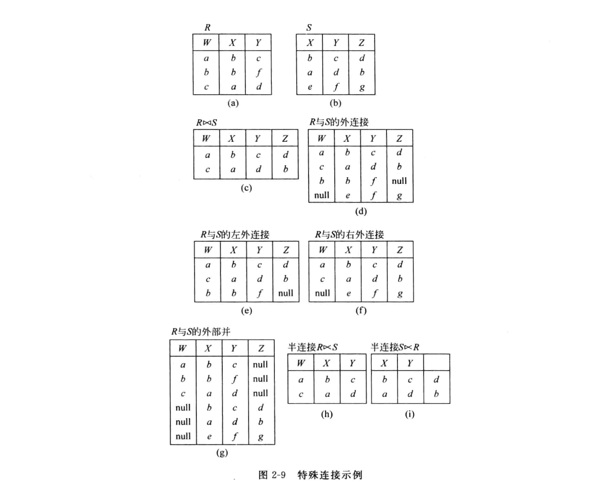

# 数据库原理与技术


# 数据库概述

## 数据模型与信息模型

现实世界：事物，特征，关键特征

信息模型：实体，属性，实体键

数据模型：记录，数据项，关键字

## 信息模型的表示


实体集之间的联系分为两种，即实体集之间的联系与实体集内部的联系。

实体集之间的联系是指不同实体集之间的联系。如学生集与老师集。

实体内部的联系是指实体集属性之间的相互关系。

:question: 学生集与学生集之间的关系算什么呢？

实体集间的联系主要分为如下三类：

- 一对一联系 1：1
- 一对多联系 1：n
- 多对多联系 m：n

## E-R图

实体集用矩形表示。

属性用椭圆表示。

联系用菱形表示。

## 数据模型三要素

- 数据结构：数据对象类型的集合，如关系模型中的域，属性，关系，各种键。
- 数据操作：增删改查
- 数据完整性约束

数据模型的分类：

- 三种基本的数据模型：层次模型，网状模型，关系模型
- 面型对象的模型：采用了面向对象方法中的对象，方法，消息，属性，继承等概念。
- 谓词模型：基于逻辑的模型，是演绎数据库与知识数据库的基础。
- XML模型
- NoSQL模型，数据结构简单多样
- 扩充的数据模型：综合体

## 三种基本模型的特点

**层次模型**

- 数据结构简单，查询效率高

- 良好的完整性支持

- 不适合表达多对多关系

- 数据库操作限制多，独立性差

**网状模型**

网状模型与层次模型的区别是网状模型的一个子结点可以有多个父结点。

- 较直接的描述现实世界
- 存储效率高
- 结构复杂，不易使用
- 数据独立性差

**关系模型**

实体之间的联系是通过表格自然表示的。

- 有坚实的理论基础
- 结构简单易用
- 数据独立性及安全性好
- 查询效率低


## 数据库系统结构

三级模式结构：子模式，模式和内模式

**模式（Schema）**

是数据库中全体数据的逻辑结构和特征描述，是所有用户的公用数据库结构。

- 一个数据库只有一个模式
- 模式与具体应用程序无关，他只是装配数据的一个框架
- 模式用语言描述和定义，需定义数据的逻辑结构、数据有关的安全性。

**子模式**

使用户所见和使用的局部数据的逻辑结构。

- 一个数据库可以有多个子模式，每个用户至少使用一个子模式。
- 同一个用户可以使用不同的子模式，每个子模式可以被不同的用户使用。
- 模式是对全体用户数据及其关系的的综合与抽象，子模式是根据所需对模式的抽取。

**内模式**

内模式是数据物理结构和存储方法的描述。

- 一个数据库只有一个内模式
- 一个数据库有多种文件构成，如用户数据文件，索引文件以及系统文件
- 内模式设计直接影响数据库的性能

**数据独立性与二级映像功能**

数据独立性是指数据与程序间的的互不依赖性。分为物理独立性与逻辑独立性。

物理独立性：数据库物理结构的改变不影响逻辑结构及应用程序。

逻辑独立性：数据库逻辑结构的变化不改变应用程序。

:bulb:模式与数据库的区别。模式是数据库结构的定义和描述，只是一个数据库的一个框架，他本身不涉及任何具体数据。数据库是按照模式的框架装入数据而建成的，他是模式的一个实例。

 **数据库系统结构**：单机模式，主从模式，CS模式，分布式


# 关系数据库

## 关系数据结构

**笛卡尔积**

笛卡尔积是在域上的运算。域是一组具有相同数据类型的集合。给定一组域 $D_1,D_2,\dots,D_n$ 的笛卡尔积为：
$$
D_1 \times D_2 \times \dots\times D_n=\{(d_1, d_2,\dots,d_n) \quad| \quad d_i \in D_i,\;i=1,2,\dots,n\}
$$
其中每个元素 $(d_1, d_2,\dots,d_n)$ 称为元组。

**关系**

一组域笛卡尔积的有限子集称为关系。

关系的基本数据关系是二维表。

元组与属性：二维表中的行称为关系的元组，列称为属性。列中的元素为该元素的该属性的的值，称为分量。每个属性所对应的值的变化范围叫属性的域，他是一个值的集合。

候选键：可唯一标识每一个元组的属性。

主键：用关系组织数据时，用一个候选键作为该关系的唯一性标识。

外键：关系 $R_1$ 中的一个属性不是它的候选键而是另一个关系 $R_2$ 的候选键。:bulb:外键提供了一种表示两个关系联系的方法。

组合键：把两个以上的属性作为唯一性标识。


【概念辨析】

码：唯一标识实体的属性或属性组合称为码。

候选码(关键字，键)：某一属性组的值能唯一标识一个元组而其子集不能（去掉任意一个属性都不能标识该元组），则称该属性组为候选码。

主码(主键、主关键字): 若一个关系有多个候选码，选择其中一个为主码。

主码=主键=主关键字，关键字=候选码 候选关键字=候选码中除去主码的其他候选码。


主属性：包含在任一候选关键字中的属性称主属性。

非主属性：不包含在任何一个候选关键字中的属性称为非主属性。

:warning:这些概念晕得很，后面的范式理论会再次用到。​


**关系的性质**

- 每一列的数据类型相同
- 列名不允许相同
- 元组相异性
- 行序无关，列序无关
- 列中元素的值不可再分


**关系模式**（Relational Schema）

关系模式指出关系由哪些属性组成。

$R(U)=R(A_1,A_2,\dots,A_n)$


**关系的完整性约束**


- 实体完整性：主键的值不能为空。
- 参照完整性：外键要么空缺，要么引用一个实际存在的值。

- 用户定义的完整性：属性能否为空，是否唯一，取值范围，默认值，属性间满足函数关系？


# 关系代数

关系代数可分为：

- 集合运算
- 关系运算
- 扩冲的关系运算

## 集合运算

**并**

关系 $R$ 与 $S$ 的并由属于 $R$ 或属于 $S$ 的元组组成。记做：
$$
R \cup S=\{t | t\in R \or t \in S\}
$$
**差**

关系 $R$ 与 $S$ 的差由属于 $R$ 但不属于 $S$ 的元组组成。记做：
$$
R - S=\{t | t\in R \or t \notin S\}
$$
**交**

关系 $R$ 与 $S$ 的交由既属于 $R$ 又属于 $S$ 的元组组成。记做：
$$
R \cap S=\{t | t\in R \and t \in S\}
$$

**笛卡尔积**

关系 $R$ 与 $S$ 的笛卡尔积由 $R$ 中的元组与 $S$ 中的元组拼接而成。记做：
$$
R\times S=\{t_rt_s|(t_r\in R)\and(t_s\in S) \}
$$


## 关系运算

**选择**（Selection）

选择关系上满足条件的元组，表示如下：
$$
\sigma_F(R)=\{t| F(t)=True\}
$$
**投影**（Projection）

投影就是选择关系中的某些属性， 由于元组不能重复，需要去重后输出：
$$
\Pi_A(R)=\{t[A]\}
$$
**连接**（Join）

连接就是在两个关系的笛卡尔积中选取满足一定条件的元组。记做：
$$
R \underset{A \theta B}{\bowtie} S= \sigma_{R.A\;\theta\;S.B}(R\times S)
$$

有两个特殊的连接：

1. 等值连接：即 $\theta$ 为 $=$
2. 自然连接：要求比较的分量必须是相同的属性组，记为

$$
R \bowtie S= \Pi_{去重后的属性组}\big(\sigma_{R.A_1=S.A_1\and\dots\and R.A_k= S.A_k}(R\times S)\big)
$$


**除**（Division）

设有关系 $R(X,Y)$ 和 $S(Y,Z)$，$\Pi_X(R)$ 属性上的值记为 $x_i$。

先介绍一个概念：像集

$x_i$在关系 $R$ 中对应的像集 $Y_X$ 定义为:
$$
Y_X= \Pi_Y(\sigma_{X=x_i}(R))
$$
那么 $R \div S$ 定义为$\{x_i\}$，$x_i$ 对应的像集 $Y_X$ 包含 $\Pi_Y(S)$ 

**[例子](https://www.cnblogs.com/yuanqi/p/4589967.html)**


求得 $RS\div S$ 结果为：{ 张三 } 

$RS÷S$ 在这里解决的问题就是：得到选修了所有课程的学生。
$RS÷S$ 的意义就是：在RS中找出所有包含关系的S元组，然后投影。


至少：相同的表做笛卡尔积，学号相同但选课不同。


## 扩充的投影运算

【广义投影】

投影运算 $\Pi_{F_1\dots F_n}(R)$ 中 $F_n$ 是属性与常量的算术表达式。

【外连接】



【聚集】

一组关系的统计，计算值，常用聚集函数有：max，min，avg，sum，count，在使用时，在聚集函数前加 G。

例：$G\; avg(age)(\sigma_{age\ge18}(student))$


【重命名】

设有关系R(A,B,C)和关系S(B,C,D)，则 $R\times S$ 的属性必须写成 $A,R.B,R.C,S.B,S.C,D$，对R的属性进行重名运算后 $R\times S$ 写成 $\rho_{R(A,X,Y)}(R)\times S$ 的属性写成 $A,X,Y,B,C,D$。


## 关系代数运算规则


交换律

笛卡尔积：$E_1\times E_2 = E_2\times E_1$

自然连接：$E_1 \Join E_2 = E_2\Join E_1 $


结合律

笛卡尔积：$(E_1\times E_2)\times E_3 = E_1\times(E_2\times E_3)$

自然连接：$(E_1 \Join E_2)\Join E_3 =E_1 \Join( E_2\Join E_3) $


投影串接：$\Pi_{A_1,A_2,\dots,A_n}$


# SQL语言

- SQL 语言是什么？如何理解记忆 SQL 语言？
- SQL 建模语言?
- SQL 数据操作语言？
- SQL 控制语言？


【基本概念】

SQL 语言是数据库语言，和数据库打交道就需要用数据库语言。数据库语言不止一种，因为不同的数据库说的语言不一样。但并不是完全不一样，这与人类语言类似，有外语，有方言。

数据库有许多种，最常见的是关系数据库，它们都用 SQL 语言，还有许多 NoSQL 数据库，例如 MongoDB，Redis， Neo4j等，他么的语言都不一样。


【数据库语言的理解】

数据库管理系统一般有如下需求：

- 数据库层面，包括数据库的建立，修改，删除，表模式的定义，修改，约束。
- 数据层面：表内数据的增删改查，表间连接，聚合函数等。
- 管理层面：数据库层面的控制，例如角色与权限管理，登录，数据库备份等。

SQL 语言由相应的子语言组成：

- 数据库建模语言（DDL）：定义数据库对象，表模式。
- 数据操纵语言（DML）：数据的增删改查（CRUD）。
- 数据控制语言（DCL）：访问控制，授权等。


【数据库建模语言】


表模式语言

```sql
CREATE TABLE user
(user_id INT NOTNULL,
 name VARCHAR(8) NOTNULL,
 age  INT,
 sex  BOOLEAN,	
 PRIMARY KEY(user_id)
)

CREATE TABLE course
(course_id INT NOTNULL,
 name VARCHAR(8) NOTNULL,
 price  INT,
 PRIMARY KEY(course_id)
)

CREATE TABLE grade
(grade_id INT NOTNULL,
 user_id INT,
 course_id INT,
 score  INT,
 PRIMARY KEY(id),
 FOREIGN KEY(user_id) REFERENCE user ON DELETE CASCADE,
 FOREIGN KEY(course_id) REFERENCE course ON DELETE CASCADE,
)

ALTER TABLE user
ADD (email VARCHAR(32));

ALTER TABLE user
MODIFY (email VARCHAR(64));

ALTER TABLE user
DROP email [CASCADE|RESTRICT];

CREATE [UNIQUE | CLUSTER] INDEX nameindex ON user(name);
DROP INDEX nameinde

DROP TABLE user [CASCADE|RESTRICT];
```


【数据操纵】

```sql
SELECT [ALL|DISDINCT] name, age
FROM user
WHERE age > 35 AND age <40
GROUP BY sex [HAVING sex=true]
ORDERBY name [ASC|DESC]


SELECT COUNT(*), MAX(grade), MIN(grade)
FROM grade
WHERE student_id =1 AND grade>60
```

一些运算符：$=,>,>=,<,<=,<>, AND, OR, NOT$

BETWEEN

IN, NOT IN

LIKE，%：0个多个，_：一个字符


【嵌套查询】


```sql
SELCET name
FROM students
WHERE age>(
	SELECT AVG(age)
    FROM students
)

/* s_c(sno,grade) */
SELECT sno
FROM s_c
GROUP BY sno
HAVING AVG(grade) >= ALL(
	SLECT AVG(grade)
    FROM S_C
    GROUP BY (sno)
)

/*
 x > ALL(sub query) ---> `true` only if x > all in sub query
 x> some (sub query) ---> `true` if x > one element in sub query
*/
```


# 关系数据库理论


## 基本概念


【函数依赖】

设 $R(U)$ 是属性集 $U$ 上的关系模式，$X,Y$ 是 $U$ 的子集，如果属性 $Y$ 的值由 $X$ 决定，则称 $Y$ 函数依赖于 $X$，记为 $X\to Y$ ，$X$ 也叫决定因素。

【例】设 R(读者编号，姓名，图书编号，书名，借书日期)，求其函数依赖。

【解】读者编号 $\to $ 姓名，图书编号 $\to$ 书名，(读者编号，图书编号) $\to$ 借书日期。


函数依赖的理解：反应表中属性之间的决定关系，即当 $X$ 的值确定以后，$Y$ 的值被唯一确定。

:bulb:这种决定关系不是绝对的，需要根据实际需求而定。


【非平凡依赖】：$X\to Y$，但 $Y\not \subseteq X$，Y 有X没有的属性。

【平凡依赖】：$X\to Y$，但 $Y \subseteq X$。


【完全函数依赖】

在 $R(U)$ 中，如果 $X\to Y$，并且对于 $X$ 的任何一个真子集 $X^{\prime}$，都有$X^{\prime} \not \to Y$，称 $Y$ 完全依赖于 $X$，记做 $X \xrightarrow{f} Y$。

:bulb: $X$ 不能再小了。​


【部分函数依赖】

在 $R(U)$ 中，如果 $X\to Y$，并且对于 $X$ 的存在真子集 $X^{\prime}$，有$X^{\prime}\to Y$，称 $Y$ 部分依赖于 $X$，记做 $X\xrightarrow{P} Y$。

X\xrightarrow{P} Y

【传递函数依赖】

设 $R(U)$ 是属性集 $U$ 上的关系模式，$X,Y,Z$ 是 $U$ 的子集，如果 $X\to Y,Y\not \to X,Y\to Z$，有 $X\to Z$，则称 $Z$ 传递函数依赖 $X$，记做 $X\xrightarrow{t}Z$。


【候选键】

属性全集 $U$ 和函数依赖集 $F$ 决定的关系模式可以表示为 $R<U,F>$。

设 $X$ 为 $R<U,F>$ 的属性或属性集  ，若 $X\xrightarrow{f} U$，则 X 为 $U$ 的候选键，简称键。

- 唯一决定一个元组。
- 属性个数最小。
- 存在性和不唯一性。

主键：候选键可能有多个，从候选键中选取一个作为主键。

主属性：包含在任何一个候选键中的属性。

非主属性：不包含在任何一个候选键中的属性。

:bulb: 函数依赖右边不出现的属性必在侯选键中。


【逻辑蕴含】

设 $F$ 是关系模式 $R<U,F>$ 的一个函数依赖集，$X,Y$ 是 $U$ 的子集，若果从 $F$ 中的函数依赖关系能够推出 $X\to Y$，则称 $F$ 逻辑蕴含 $X\to Y$。


【Armstrong定理】

- 如果 $Y\subseteq X \subseteq U$，则 $F$ 逻辑蕴含 $X\to Y$。平凡函数成立。
- 如果 $F$ 逻辑蕴含 $X\to Y, Z\subseteq U$，则 $F$ 逻辑蕴含 $XZ\to YZ$。可以同时增加属性。

- 如果 $F$ 逻辑蕴含 $X\to Y, Y\to Z$，则 $F$ 逻辑蕴含 $X\to Z$。传递。

- 合并：若 $X\to Y,X\to Z$，则 $X\to YZ$。

- 拆分：若 $X\to YZ$，则 $X\to Y,X\to Z$。
- 伪传递：若 $X\to Y,WY\to Z$，则 $WX\to Z$。


【函数依赖集 $F$ 的闭包】

设关系模式 $R<U,F>$ ，$X,Y$ 是 $U$ 的子集，函数依赖集 $F$ 的闭包 $F^{+}$ 是 $F$ 能推出的所有函数依赖的集合。

:bulb: 不好求。​


【属性集 $X$ 的闭包】

设关系模式 $R<U,F>$ ，$X$ 是 $U$ 的子集，属性集 $X$ 的闭包 $X^{+}$ 是由 $X$ 从 $F$ 中能推出的所有函数依赖右部的集合。

【例】在 $R(A,B,C)$中，$F=\{A\to B,B\to C\}$，则 $A^+ = ABC,B^+=BC,C^+=C$


判断函数依赖是否由 Armstrong 定理的方法：

设关系模式 $R<U,F>$ ，$X,Y$ 是 $U$ 的子集，则 $X\to Y$ 能由 $F$ 根据  Armstrong 定理导出的充要条件是 $Y\subseteq X^+$。


【求 $X^+ 的算法$】

设关系模式 $R<U,F>$ ，$X$ 是 $U$ 的子集，求 $X^+$

输入：$U，F，X$

输出：$X^+$

步骤：用递推法

1. $X_0=X$
2. $X_{i+1}=X_i\cup A$，其中 $A$ 是由 $X_i$ 从之前步骤未用过的 $F$ 中能推出的所有函数依赖右部的集合。

3. 重复2直到 $X_{i+1}=X_i$。


【函数依赖集的等价】

设 $F,G$ 是两个函数依赖集，如果 $F^+=G^+$，则称 F 和 G 是等价的。

性质：

1. 若 $G\subseteq F$，则 $G^+\subseteq F^+$

2. $(F^+)^+=F^+$


【等价的充要条件】

两个函数依赖集 $F$ 和 $G$ 等价的充要条件是：$F\subseteq G^+$ 且 $G\subseteq F^+$


【多值依赖】

设 $R(U)$ 是属性集 $U$ 上的一个关系模式。$X，Y，Z$ 是 $U$ 的子集,并且 $Z=U-X-Y$。关系模式 $R(U)$ 中多值依赖 $X\to\to Y$ 成立，当且仅当对 $R(U)$ 的任一关系 $r$ ，给定的一对 $(x，z)$ 值有一组 $Y$ 的值，这组值仅仅决定于 $ x$ 值而与 $z$ 值无关。

在函数依赖中，$X$ 与 $Y$ 是否存在函数依赖关系，只需考察 $X,Y$ 的两组属性，与别的属性无关。而多值依赖是全模式的依赖关系，$X$ 与 $Y$ 是否存在多值依赖还需看属性 $Z$。


多值依赖的性质

- 对称性：若 $X\to\to Y$ ，则 $X\to\to Z$。 

- 合并：若 $X\to\to Y，X\to\to Z$ ，则 $X\to\to YZ$。 

- 相交：若 $X\to\to Y，X\to\to Z$ ，则 $X\to\to Y\cap Z$。 

- 传递：若 $X\to\to Y，Y\to\to Z$ ，则 $X\to\to Y-Z,X\to\to Z-Y$。 

- 一组值：若 $X\to Y$ ，则 $X\to\to Y$。 


【最小函数依赖】

1. 右部最简
2. 左部无多余属性
3. 无多余函数依赖集


【定理】

任何函数依赖集F都等价于一个最小函数依赖集。


【最小依赖集求法】

1.用分解规则使右部仅含单属性。

2.去掉左部多余属性。$XY\to A$，要判断 $Y$ 是否多余，在分解后的 $F$ 中求$X^+$，若 $A\subseteq X^+$，则Y是多余的。

3.去掉多余的行数依赖。要判断 $X\to A$ 是否多余，在去掉此依赖之后的 $F$ 中求$X^+$，若 $A\subseteq X^+$，则 $X\to A$ 是多余的。


## 范式


【1NF】

属性不可再分，是原子的。


【2NF】

$R$  中的每一个非主属性都完全依赖于 $R$ 中的任一候选键。

特点：不存在部分依赖。


【3NF】

$R$ 中的任何一个非主属性都不传递函数依赖于 $R$ 中的任一候选键。


【BCNF】

设关系模式 $R<U,F> \in 1NF$ ，所有非平凡函数依赖 $F$ 的左部都包含 $R$ 中的任一候选键。

或者说 $R$ 中的所有非平凡函数依赖的决定因素都包含一个候选键。


【4NF】

设关系模式 $R(U)$ ，所有非平凡**多值依赖** $D$ 的左部都包含 $R$ 中的任一候选键。


- 什么是闭包？如何求闭包？
- 如何求关系模式的候选键？
- 如何判断模式的范式？


【求候选键方法】

1. 只出现在依赖左边的属性，它一定在某一候选键中。
2. 只出现的依赖右边的属性一定不在候选键中。
3. 既不出现在左边与右边的属性那么在候选键中。
4. 两边都出现的属性待定。

最终判决：求一定出现的候选键集X的闭包，如果为U则满足，否则加入待定的属性直到闭包变成全集。 


## 关系模式的分解


设有关系模式 $R(A_1,A_2,\dots,A_n)$，$R_i$ 是 $R$ 的一些子集，若 $R_1\cup R_2\cup\dots\cup R_k=U$，则称用 $\rho=(R_1,R_2,\dots,R_k)$ 代替 R 的过程为关系模式的分解。


【无损连接】

分解不会丢失信息。

设 $\rho=(R_1,R_2)$ 是R 的一个分解，$\rho$ 具有无损连接的充要条件是 $R_1\cap R_2\to (R_1-R_2)\in F^+$ 或 $R_1\cap .R_2\to (R_2-R_1)\in F^+$。


【无损连接检验算法】


【函数依赖保持性】

模式分解后的语义没有改变。


【3NF无损连接与函数依赖保持分解】


# 数据库设计


# 数据库保护与事务管理


# 对象关系数据库


[]