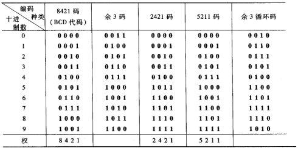

# 数字逻辑

# 数制与编码

## 进位计数制

- 选取一个基数 $N$，满 $N$ 进一。
- 循环使用 $N$ 个数字。

整数在进制间的转换：除 $N$ 取余，最后的余数在高位。

小数在进制间的转换：乘 $N$ 取整，最后的整数在低位。

:bulb:小数未必能彻底转换。

二进制，八进制，十六进制间转换的快速方法：分组。

## 几种常见的编码

**BCD 码**

**奇偶校验码**：在原二进制位上加入校验信息。

奇校验就是在信息之前或之后增加1位校验位，使得校验位与信息位一起构成的的码字中所含的1个数为奇数。

偶校验就是在信息之前或之后增加1位校验位，使得校验位与信息位一起构成的的码字中所含的1个数为偶数。

**汉明码**

**原码，反码，补码**

# 逻辑代数

逻辑代数是一个封闭的代数系统，由逻辑变量，逻辑常量：0与1，基本逻辑运算：与、或、非，组成。

:construction:与或非的真值表。

## 基本运算

### 与

$$
\begin{align}
A\sdot 0&=0\\
A\sdot 1&=A\\ 
A\sdot A&=A
\end{align}
$$
### 或

$$
\begin{align}
A+ 1&=1\\
A+ 0&=A\\ 
A+ A&=A
\end{align}
$$

### 非

$$
\begin{align}
\overline{0}&=1 \\
\overline{1}&=0 \\
\ \overline{\overline{A}}&=A \\
\end{align}
$$

复合逻辑运算

| 运算名     | 表达式                          | 简记法        |
| ---------- | ------------------------------- | ------------- |
| 与非运算   | $P=\overline{AB}$               |               |
| 或非运算   | $P=\overline{A+B}$              |               |
| 与或非运算 | $P=\overline{AB+CD}$            |               |
| 异或运算   | $P=A\overline{B}+\overline{A}B$ | $P=A\oplus B$ |
| 同或运算   | $P=AB+\overline{AB}$            | $P=A\odot B$  |

数字系统中把实现以上运算的电路称作门。

### 异或

$$
\begin{align}
A\oplus 0&=A\\
A\oplus 1&=\overline{A}\\
A\oplus A&=0\\
A\oplus \overline{A}&=1\\
A \oplus B &=\overline{A} \oplus \overline{B} \\
\overline{A\oplus B} &= \overline{A}\oplus B =A\oplus \overline{B}
\end{align}
$$

### 同或

$$
\begin{align}
A\odot 0&=\overline{A}\\
A\odot 1&=A\\ 
A\odot A&=1 \\
A\odot \overline{A}&=0
\end{align}
$$
两个关系：
$$
\begin{align}
\overline{A\odot B}&=A \oplus B\\
\overline{A\oplus B}&=A \odot B\\
A\oplus B\oplus C &= A \odot B \odot C
\end{align}
$$

## 运算定律

交换律：
$$
\begin{align}
A+B&=B+A \\
A\sdot B &=B \sdot A\\
A\oplus B&=B \oplus A \\
A\odot B&=B \odot A \\
\end{align}
$$

结合律：
$$
\begin{align}
(A+B)+C&=A+(B+C)\\ 
A\sdot (B \sdot C)&=A \sdot (B \sdot C)\\
A\oplus (B \oplus C)&=A \oplus (B \oplus C)\\
A\odot (B \odot C)&=A \odot (B \odot C)\\
\end{align}
$$

分配律：
$$
\begin{align}
A+(B\sdot C)&=(A+B)\sdot(A+C)\\ 
A\sdot (B + C) &=(A \sdot B)+(A\sdot C)\\
A(B \oplus C)&=AB \oplus AC\\
A+ (B \odot C)&=(A + B) \odot(A+C)\\

\end{align}
$$

互补律：
$$
\begin{align}
\overline{A} +A&=1 \\ 
\overline{A}\sdot A&=0
\end{align}
$$

反演律：
$$
\begin{align}
\overline{A+B} &=\overline{A}\sdot\overline{B} \\ 
\overline{A\sdot B}&=\overline{A}+\overline{B}
\end{align}
$$

## 逻辑函数

设某逻辑电路的输入逻辑变量为 $A_1,A_2,\dots,A_n$，设输出逻辑变量为 $F$，则 $F$ 与 $A_1,A_2,\dots,A_n$的关系可表示为：
$$
F=f(A_1,A_2,\dots,A_n)
$$
逻辑函数相同：
$$
F_1=f_1(A_1,A_2,\dots,A_n),F_2=f_2(A_1,A_2,\dots,A_n)
$$
当任意一组 $A_1,A_2,\dots,A_n$ 赋值 $F_1,F_2$ 的值相同，那么$f_1,f_2$ 相同。判断逻辑函数相同的方法：真值表，代数推导，卡诺图法。

## 逻辑函数表示方法

**逻辑代数表达式**
$$
F=f(A,B)=\overline{A}B+A\overline{B}
$$
 :bulb:简写规则：

- 非下可以不加括号：$\overline{A\sdot B}$
- 与运算符省略：$A\sdot B :AB$
- 优先级：$()>\overline{A}>\sdot>\oplus>+$

**真值表**

**卡诺图**

## 重要规则

**代入规则**

可以用任意逻辑函数 $F$ 代替一个逻辑变量：
$$
\overline{A+X}=\overline{A}\sdot \overline{X},\quad  \mbox{Let }X=B+C \\
\overline{A+B+C}=\overline{A}\sdot\overline{B}\sdot\overline{C}
$$

**反演规则**

对于一个逻辑表达式 $F$，把其中的0改成1，1改成0，原变量改成反变量，反变量改成原变量，+改成 $\sdot$，$\sdot$ 改成+即可得到该逻辑函数的反函数 $\overline{F}$。

:bulb:+改成 $\sdot$注意加括号。

**对偶规则**

对于一个逻辑表达式 $F$，把其中的0改成1，1改成0，+改成 $\sdot$，$\sdot$ 改成+，即可得到该逻辑函数的对偶式 $F^{\star}$。

对偶规则：如果 $F=G$，则 $F^\star=G^\star$。

## 化简公式

定律1：
$$
A+AB=A \\
A(A+B)=A
$$

定律2：
$$
A+\overline{A}B=A+B\\
A(\overline{A}+B)=AB
$$

定律3：
$$
\overline{A+B}=\overline{A}\sdot \overline{B} \\
\overline{A\sdot B}=\overline{A}+\overline{B}
$$

定律4：
$$
AB+A\overline{B}=A\\
(A+B)\sdot(A+\overline{B})=A
$$

定律5：
$$
AB+\overline{A}C+BC=AB+\overline{A}C \\
(A+B)\sdot(\overline{A}+C)\sdot(B+C)=(A+B)\sdot(\overline{A}+C)
$$

:bulb:可以发现上下两式是对偶关系。

## 逻辑函数的标准形式

两种基本形式：

“与-或式”，“积之和”：$F=AB+A\overline{B}C+C$

“或-与式”，“和之积”：$F=(A+\overline{B})(B+C+D)\overline{B}$

除此之外还有混合式：$F=(AB+C)(A+B\overline{C})+B$

### 最小项

最小项：又称标准积， $n$ 个输入变量以变量或其反变量的**积**的形式出现且仅出现一次。$n$ 个变量可构成 $2^n$个最小项。

简记法：把这 $n$ 个变量按字典序排列：$AB\overline{P}Q\overline{A_1}A_2$，原变量用1表示，反变量用0表示得0-1序列：110101，再记为 $m_{53}$

**最小项的性质**

- 最小项的 $n$ 个变量只有一种赋值方式使最小项值为1.

-  $n$ 个变量构成的两个不同最小项相与值为0
-  $n$ 个变量的全部最小项相或值为1

**标准“与-或”式**

由若干最小项相或构成的逻辑公式，也叫最小项表达式。

例如：
$$
\begin{align}
F(A,B,C,D)&=AB+A\overline{C}D+A\overline{B}C\overline{D}\\
 &=ABCD+ABC\overline{D}+AB\overline{C}D+AB\overline{C}\overline{D}+A\overline{B}\overline{C}D+A\overline{B}C\overline{D}\\
 &=m_{15}+m_{14}+m_{13}+m_{12}+m_{9}+m_{10}\\
 &=m(9,10,12,13,14,15)

\end{align}
$$

### 最大项

最大项：又称标准和， $n$ 个输入变量以变量或其反变量的**和**的形式出现且仅出现一次。$n$ 个变量可构成 $2^n$个最大项。

简记法：把这 $n$ 个变量按字典序排列：$A+B+\overline{P}+Q+\overline{A_1}+A_2$，:exclamation:原变量用0表示，反变量用1表示得0-1序列：001010，再记为 $M_{10}$

**最大项的性质**

- 最大项的 $n$ 个变量只有一种赋值方式使最大项值为0。

- $n$ 个变量构成的两个不同最大项的和为1。
- $n$ 个变量的全部最大项之积为0。

**标准“或-与”式**

由若干最大项相或构成的逻辑公式，也叫最大项表达式。

例如：
$$
\begin{align}
F(A,B,C)&=(A+B+\overline{C})(A+\overline{B}+C)(A+\overline{B}+\overline{C})(A+B+C)\\
&=M_{1}M_{2}M_{3}M_{0}\\
&=M(0,1,2,3)
\end{align}
$$
:bulb:**两种表达式的关系：**
$$
\begin{align}
F(A,B,C,D)&=m(1,3,5,7,9,11,13,15)\\
&=M(0,2,4,6,8,10,12,14)
\end{align}
$$
互补的关系。

:bulb:记忆口诀：小幺幺，大零零：最小项的原变量为1，原表达式等于成真赋值的最小项之和；最大项的原变量为1，原表达式等于成真赋值的最大项之积。

## 逻辑函数化简

最简“与-或”式：

- 与的项数最少。
- 与式包含尽量少的变量。

**代数法**

用化简公式即可。

**卡诺图**

