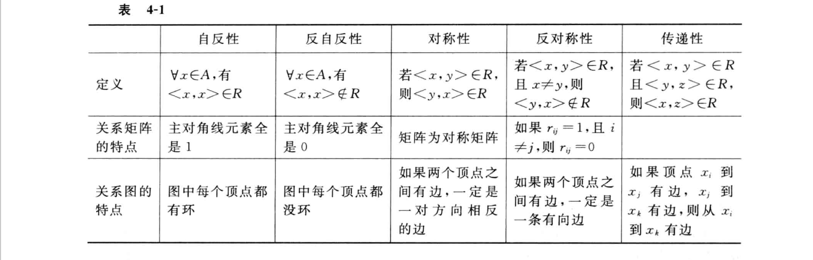

# 逻辑推理

## 命题

命题：能判断真假的陈述句。

简单命题或原子命题：不能分为更简单的句子。用小写字母 $p, q, r$ 表示。简单命题的真值是确定的，由称命题常项。

命题变项或命题变元： $x+1>5$ 不是命题，当 $x$ 的值确定后才能判断真假。也用小写字母 $p, q, r$ 表示。

复合命题：由简单命题用逻辑连接词连接而称的命题。

连接词如下：

| 名称       | 符号              | 举例                  | 含义                     |
| ---------- | ----------------- | --------------------- | ------------------------ |
| 否定连接词 | $\neg$            | $\neg p$              | 非 $p$                   |
| 合取连接词 | $\and$            | $p \and q$            | $p$ 且  $q$，合取式      |
| 析取连接词 | $\or$             | $p \or q$             | $p$ 或 $q$， 析取式      |
| 蕴含连接词 | $\rightarrow$     | $p \rightarrow q$     | 若 $p$ 则 $q$， 蕴含式   |
| 等价连接词 | $\leftrightarrow$ | $p \leftrightarrow q$ | $p$ 当且仅当 $q$，等价式 |
| 与非联结词 | $\uparrow$        | $p \uparrow q$        | $\neg (p \and q)$        |
| 或非联结词 | $\downarrow$      | $p \downarrow q$      | $\neg (p \or q)$         |

命题符号化步骤：

1. 把命题中的简单命题拎出来，用小写英文字母表示。
2. 用逻辑词把简单命题连接起来。

**例题**

​	小李只能选一个梨或苹果。

​	$p$：小李拿一个梨

​	$q$：小李拿一个苹果

​	---> $(p \and \neg q) \or (\neg p \and q)$

注意这里的或为排斥或。

## 公式

命题公式或公式：由命题常项与命题变项用连接词连接起来的式子。

赋值或解释：设 $A$ 由命题变项 $p_1,p_1,\dots,p_n$ 组成，为 $p_1,p_1,\dots,p_n$ 指定一组真值叫赋值。有 $n$ 个命题变项的公式有 $2^n$ 种赋值。

真值表：列出公式所有赋值方法的表。

永真式或重言式：公式 $A$ 在所有的赋值方法下均为真。

永假式或矛盾式：公式 $A$ 在所有的赋值方法下均为假。

可满足式：公式 $A$ 至少有一种赋值方法为真。永真式是可满足式，反之不成立。

$n$ 元真值函数：$F:\{0,1\}^n \rightarrow \{0,1\}$

**等值**：设 $A,B$ 是两个命题公式，若等价式 $A \rightarrow B$ 是重言式，则称 $A $与 $B$ 是等值的，记做 $A \Leftrightarrow B$。

常见的等值公式列表：

| 公式                                                         | 说明     |
| :----------------------------------------------------------- | -------- |
| $\neg \neg A \Leftrightarrow A$                              | 双重否定 |
| $ A \or A \Leftrightarrow A$                                 |          |
| $ A \and A \Leftrightarrow A$                                |          |
| $ A \or B \Leftrightarrow B \or A$                           |          |
| $ A \and B \Leftrightarrow B \and A$                         |          |
| $(A \or B)\or C \Leftrightarrow A \or (B \or C)$             |          |
| $(A \and B)\and C \Leftrightarrow A \and (B \and C)$         |          |
| $A \or (B\and C \and D) \Leftrightarrow (A \or B) \and (A \or C) \and (A \or D)$ |          |
| $A \and (B\or C) \Leftrightarrow (A \and B) \or (A \and C)$  |          |
| $\neg (A \or B) \Leftrightarrow \neg A \and \neg B$          |          |
| $\neg (A \and B) \Leftrightarrow \neg A \or \neg B$          |          |
| $A \or (A\and C) \Leftrightarrow A $                         |          |
| $A \and (A\or C) \Leftrightarrow A $                         |          |
| $A \or 1 \Leftrightarrow 1$                                  |          |
| $A \and 0 \Leftrightarrow 0$                                 |          |
| $A \or 0 \Leftrightarrow A$                                  |          |
| $A \and 1 \Leftrightarrow A$                                 |          |
| $A \or \neg A \Leftrightarrow 1$                             |          |
| $A \and \neg A \Leftrightarrow 0$                            |          |
| $A \rightarrow B \Leftrightarrow \neg A \or B$               |          |
| $A \leftrightarrow B \Leftrightarrow (A \rightarrow B) \and (B \rightarrow A)$ |          |
| $A \rightarrow B \Leftrightarrow \neg B \rightarrow \neg A$  |          |
| $A \leftrightarrow B \Leftrightarrow \neg A \leftrightarrow \neg B$ |          |
| $(A \rightarrow B)\and(A \rightarrow \neg B) \Leftrightarrow \neg A$ |          |

等值置换：若 $A \Leftrightarrow B$ ，则 $\varPhi(A) \Leftrightarrow \varPhi(B)$

## 范式

简单析取式：由有限个命题变项或其否定构成的析取式。

简单合取式：由有限个命题变项或其否定构成的合取式。

析取范式：由有限个简单合取式构成的析取式。

合取范式：由有限个简单析取式构成的合取式。

两个性质：

一个析取范式是矛盾式，当且仅当它的每个简单合取式是矛盾式。

一个合取范式是重言式，当且仅当它的每个简单析取式是重言式。

范式存在定理：

任何一个公式都存在一个与之等值的析取范式与合取范式。但是不唯一。

极小项与极大项：

设有 $n$ 个命题变项，若在简单合取式中每个命题变项与其否定有且仅有一个出现一次，这样的简单合取式称为极小项。 $n$ 个命题变项可形成  $2^n$ 个极小项。

设有 $n$ 个命题变项，若在简单析取式中每个命题变项与其否定有且仅有一个出现一次，这样的简单析取式称为极大项。 $n$ 个命题变项可形成  $2^n$ 个极大项。

标记方法：把命题变项按字典序排列，如 $a, c, \neg e, p, \neg q, r, x_1, x_2$；对应二进制位为：$11010111$，有 $\neg $ 的用0表示，没有的用1表示；对应十进制描述：$m_{215}$，其实就是二进制模式对应的十进制数。

主析取范式：如果公式 $A$ 的析取范式的简单合取式全是极小项。任何公式都有唯一的主析取范式。

主合取范式：如果公式 $A$ 的合取范式的简单析取式全是极大项。任何公式都有唯一的主合取范式。

求主析取范式方法1：

1. 先求 $A$ 析取范式 $A^{\prime}$
2. 若$A^{\prime}$ 的某简单合取式不含某个命题变项 $p$ 或 $\neg p$ , 则:

$$
B\Leftrightarrow B\and 1 \Leftrightarrow B\and (p \or \neg p) \Leftrightarrow (B\and p)\or( B \and \neg p)
$$

3. 把变成极小项的简单合取式用写成 $m_i$ 的形式。
4. 将 $m_i$ 合并，然后从小到大排列。

主析取范式与主合取范式的应用：

1. 判断两个公式是否等值
2. 判断公式的类型：重言式，矛盾式，可满足式？
3. 真与假赋值方法

:memo: 思考题：

- 永假式的主析取范式与主合取范式是什么？

- $p \and q$ 的主析取范式与主合取范式是什么？

## 全功能集

全功能集：设 $S$ 是一个联结词的集合，如果任一真值函数都可用仅含 $S$ 中的联结词的命题公式表示，则称 $S$ 为全功能集。

:star:**定理**：$\{\neg,\and, \or \}$， $\{\neg, \and\}$，$\{\neg, \or\}$，$\{\neg, \rightarrow\}$ ，$\{\uparrow\}$，$\{\downarrow\}$ 都是全功能集。

证明方法：

由于任何公式可以表示成主析取范式，第一个成立。

由于 $p\or q \Leftrightarrow \neg \neg (p \or q) \Leftrightarrow \neg (\neg p \and\neg q )$，可见 $\or$ 可以由 $\neg, \and$ 替换。

其实任何包含全功能集的联结词集合式全功能集。

最简展开式：对主析取范式进行简化，使其包含最少的运算。

:sparkles: 最简展开式求解方法：卡诺图法。

## 推理

若 $(A_1 \and A_2\and\dots\and A_n ) \rightarrow B$ 为重言式，则称  $A_1 \and A_2\and\dots\and A_n$ 推出结论 $B$ 的推理正确，$B$ 称为 $A_1 \and A_2\and\dots\and A_n$ 的有效结论或逻辑结论。

与用 $A \Leftrightarrow B$ 表示 $A \leftrightarrow B$ 是重言式类似，用 $A \Rightarrow B$ 表示 $A \rightarrow B$ 是重言式。

:bulb:推理正确不能保证结论正确。

推理定律：

| 定律                                                         | 描述       |
| ------------------------------------------------------------ | ---------- |
| $A \Rightarrow (A\or B)$                                     | 附加       |
| $(A\and B) \Rightarrow A$                                    | 化简       |
| $(A\rightarrow B) \and A \Rightarrow B$                      | 假言推理   |
| $(A\rightarrow B) \and \neg B \Rightarrow \neg A$            | 拒取式     |
| $(A\or B) \and \neg A \Rightarrow B$                         | 析取三段论 |
| $(A\rightarrow B) \and (B\rightarrow C)\Rightarrow (A\rightarrow C)$ | 假言三段论 |
| $(A\leftrightarrow B) \and (A\leftrightarrow C)\Rightarrow (A\leftrightarrow C)$ | 等价三段论 |
| $(A\rightarrow B) \and (C\rightarrow D) \and (A \or C)\Rightarrow (B\or D)$ | 构造性两难 |

构造证明两种技巧：

1. 附加前提证明法，把结论变成前提：

$$
(A_1\and A_2\and \dots\and A_n)\rightarrow (A\rightarrow B) \Leftrightarrow (A_1\and A_2\and \dots\and A_n \and A)\rightarrow B
$$

其实：$\neg A_n \or (\neg A \or B)\Leftrightarrow \neg A_n \or \neg A \or B$

2. 归谬法：

$$
(A_1\and A_2\and \dots\and A_n \and A)\rightarrow (B) \Leftrightarrow \neg (A_1\and A_2\and \dots\and A_n \and A \and \neg B)
$$

只要 $A_1\and A_2\and \dots\and A_n \and A \and \neg B$ 是矛盾式，就能说明推理正确。

# 一阶逻辑

一阶逻辑也称谓词逻辑。

## 基本概念

个体常项：表示具体的和特定的个体的词，常用小写的英文字 $a,b,c,\dots$母表示。

个体变项：表示抽象的，或泛指的个体，常用小写的英文字 $x,y,z,\dots$母表示。

个体域，论域：个体变相的取值范围。当无特殊说明时，个体域只宇宙所有事物，称为全总个体域。

谓词常项：表示具体性质或关系的谓词，一般用大写英文字母 $F,G,H,\dots$ 表示。

谓词变项：表示抽象或泛指的谓词。

$F(x)$： 表示个体变项 $x$ 具有性质 $F$ 。

$L(x,y)$： 表示个体变项 $x,y$ 具有关系 $L$ 。

有时也把以上两种个体变项与谓词的联合体称作谓词。

 $n$ 元谓词：含 $n$ 个个体词的谓词称为 $n$ 元谓词，用 $P(x_1,x_2,\dots,x_n)$ 表示，它是以个体变项的个体域为定义域，以 $\{0,1\}$ 为值域的函数，它不是命题。

0元谓词：不带个体变项的谓词，0元谓词常项都是命题。

量词：除了个体词和谓词，还需要表示数量的词。量词用全称量词和存在量词两种。

**全称量词**：一切，所有，用 $\forall$ 表示，$\forall x$ 表示个体域中所有的个体，$\forall x F(x)$ 表示个体域中的所有个体都具有性质 $F$。

**存在量词**：有一个，存在，用 $\exist$ 表示，$\exist x$ 表示存在个体域中的个体，$\exist x F(x)$ 表示个体域中存在有个体具有性质 $F$。

:bulb:注意所讨论的个体域，可引入特性谓词。

**谓词公式转化为命题公式**

设个体域为有限集 $D={a_1,a_2,\dots,a_n}$，则
$$
\forall xA(x) \Leftrightarrow A(a_1)\and A(a_2)\and\dots\and A(a_n)\\
\exist xA(x) \Leftrightarrow A(a_1)\or A(a_2)\or\dots\or A(a_n)
$$
:warning: 量词顺序不能随便颠倒。

例如：设 $D$ 为实数集，$H:x+y=5$

那么 $\forall x \exist yH(x,y)$ 与 $\forall x \exist yH(x,y)$ 表达的含义不同，前者为真而后者为假。

## 一阶谓词逻辑公式及解释

字母表定义如下：

- 个体常项：$a,b,c,\dots,a_i,b_i,c_i\dots$
- 个体变项：$x,y,z,\dots,x_i,y_i,z_i,\dots$
- 函数符号：$f,g,h,\dots,f_i,g_i,h_i,\dots$
- 谓词符号：$F,G,H,\dots,F_i,G_i,H_i\dots$
- 量词符号：$\forall,\exist$
- 联结词符：$\neg,\and,\or,\rightarrow,\leftrightarrow$
- 括号和逗号：$(),$

项的递归定义：

1. 个体常项和个体变项是项

2. 若 $\phi(x_1,x_2,\dots,x_n)$ 是任意n元函数，$t_1,t_2,\dots,t_n$ 是项，则 $\phi(t_1,t_2,\dots,t_n)$ 也是项

3. 只有限次使用以上两个规则生成的符号串才是项。

原子公式：

设 $\R(x_1,x_2,\dots,x_n)$ 是任意n元谓词，$t_1,t_2,\dots,t_n$ 是项，则 $\R(t_1,t_2,\dots,t_n)$ 称为原子公式。

合式公式：

1. 原子公式是合式公式
2. 若 $A$ 是合式公式，$\neg A$ 也是合式公式。
3. 若 $A,B$ 是合式公式， 则 $A\and B,A\or B, A\rightarrow B, A\leftrightarrow B$也是合式公式。
4. 若 $A$ 是合式公式，则 $\forall xA, \exist x A$ 也是合式公式。
5. 有限次利用以上规则构成的符号串才是合式公式。

合式公式又称谓词公式，简称公式。

在合式公式 $\forall xA, \exist x A$ 中，称 $x$ 为指导变项，$A$ 为相应量词的辖域。在辖域中，$x$ 的所有出现称为约束出现，A中不是约束出现的变项称为自由出现。

封闭的合式公式、闭式：公式A中无自由出现的个体变项。

换名规则：讲一个指导变项及其在辖域中所有约束出现替换成公式中没有出现的个体变项符号。

解释：给公式中出现的每一个个体常项符号，函数变项符号，谓词变项符号赋值。

一个解释 $I$ 由如下4部分构成：

1. 非空个体域 $D$。
2. 给论及的每一个个体常项符号指定一个 $D$ 中的元素。

3. 给论及的每一个函数变项符号指定一个 $D$ 中的函数。
4. 给论及的每一个谓词变项符号指定一个 $D$ 中的谓词。

永真式，逻辑有效式：公式 $A$ 在任何解释和在该解释下的任何赋值都为真。

矛盾式，永假式：公式 $A$ 在任何解释和在该解释下的任何赋值都为假。

可满足式：公式 $A$ 在存在一个解释和在该解释下的一个赋值都为真。

代换实例：设 $A_0$ 是含命题变项 $p_0,p_1,\dots,p_n$ 的命题公式，$A_1,A_2,\dots,A_n$ 是n个谓词公式，用 $A_i$ 处处代换 $p_i$ 得到的公式 $A$ 称为 $A_0$ 的代换实例。

## 一阶逻辑等值式与前束范式

等值式：设 $A,B$  是一阶谓词逻辑中的两个公式，若 $A\leftrightarrow B$ 为逻辑有效式，则称 A 与 B为等值式，记做$A\Leftrightarrow B$

否定等值式：
$$
\neg \forall xA(x) \Leftrightarrow \exist x\neg A(x) \\
\neg \exist xA(x) \Leftrightarrow \forall x\neg A(x) \\
$$
量词辖域收缩与扩张等值式：
$$
\forall x(A(x)\or B) \Leftrightarrow \forall xA(x)\or B \\
\forall x(A(x)\and B) \Leftrightarrow \forall xA(x)\and B \\
\forall x(A(x)\rightarrow B) \Leftrightarrow \exist xA(x)\rightarrow B \\
\forall x(B\rightarrow A(x)) \Leftrightarrow B\rightarrow \forall xA(x) \\

\exist x(A(x)\or B) \Leftrightarrow \exist xA(x)\or B \\
\exist x(A(x)\and B) \Leftrightarrow \exist xA(x)\and B \\
\exist x(A(x)\rightarrow B) \Leftrightarrow \forall xA(x)\rightarrow B \\
\exist x(B\rightarrow A(x)) \Leftrightarrow B\rightarrow \exist xA(x) \\
$$

量词等值分配：
$$
\forall x(A(x)\and B(x)) \Leftrightarrow \forall xA(x)\and \forall xB(x)\\
\exist x(A(x)\or B(x)) \Leftrightarrow \exist xA(x)\or \exist xB(x)\\
$$
下面两个等值式成立：
$$
\forall x \forall y A(x,y) \Leftrightarrow \forall y \forall x A(x,y) \\
\exist x \exist y A(x,y) \Leftrightarrow \exist y \exist x A(x,y) \\
$$
**前束范式**

设谓词公式 $A$  有如下形式：
$$
Q_1x_1Q_2x_2\dots Q_nx_nB
$$
其中每个 $Q_i$ 为 $\forall$ 或 $\exist$ ，$B$ 为不含量词的为此公式。

#  集合论

## 概念

集合

集合的子集

包含

集合相等

真子集

空集

幂集：集合 $A$ 的全体子集构成的集合，记做 $P(A)$：
$$
P(A)=\{x|x\subseteq A\}
$$
全集

## 集合的运算

集合的交，并，补

绝对补：记做 $ \sim A$，相对全集的补，$A-B=A\cap\sim B$

$A$ 与 $B$对称差：$A\oplus B=(A-B)\cup(B-A)$

例子见教材P61

## 集合中元素的个数

基数：集合中元素的个数，记做 $card A =n$，也可记做 $|A|=n$。

**容斥原理**
$$
|A_1\cup A_2\cup\dots\cup A_m|= \\
\sum\limits_{i=1}^{m}|A_i|-\sum\limits_{1\le i<j\le m}|A_i \cap A_j|+ \sum\limits_{1\le i<j<k\le m}|A_i \cap A_j\cap A_k|-\dots+(-1)^m |A_1\cap A_2\cap\dots\cap A_m|
$$

欧拉函数

欧拉函数 $\phi(n)$ 是一个重要的函数，在密码学中有重要应用。$\phi(n)$ 表示 $\{1,2,\dots,n-1\}$ 中与 $n$ 互素的元素个数。欧拉函数的计算方法为：

1. 把n质因数分解为 $n=p_1^{m_1}p_2^{m_2}\dots p_k^{m_k}$
2. 记 $A_i=\{x|(0\le x <n-1) \and (p_i\bmod x=0)\}$
3. 那么 $|A_i| = \frac{n}{p_i},|A_i\cap A_j|=\frac{n}{p_ip_j},\dots$ 
4. 则

$$
\begin{align}
\phi(n)&=|\overline{A_1}\cap \overline{A_2}\cap\dots\cap\overline{A_k}| \\
&=\dots\\
&=n\prod_{i=1}^k(1-\frac{1}{p_i})
\end{align}
$$

# 二元关系和函数

## 集合的笛卡尔积与二元关系

有序对，序偶：两个元素 $x,y$ 按一定的顺序排列而成的二元组，记做 $<x,y>$ 或 $(x,y)$

当 $x\not= y$ 时，$<x,y>\not =<y,x>$

有序n元组：$<x_1,x_2,\dots x_n>$

笛卡尔积：$A\times B=\{<x,y>|x \in A\and y\in B\}$

如果 $|A|=m,|B|=n$，则 $|A\times B|=mn$

笛卡尔积的运算性质：
$$
A\times\empty =\empty\times B=\empty
$$
当 $A\not = B,A\not =\empty,B\not= \empty$ 时：
$$
A\times B \not= B\times A
$$
分配律：
$$
\begin{align}
A\times(B\cup C)=(A\times B)\cup (A\times C)\\
(B\cup C)\times A=(B\times A)\cup (C\times A)\\
A\times(B\cap C)=(A\times B)\cap (A\times C)\\
(B\cap C)\times A=(B\times A)\cap (C\times A)\\
\end{align}
$$

二元关系：如果一个集合为空集或他的元素都是二元有序对，记做 $R$，如果 $<x,y>\in R$，记做 $xRy$，否则记做 $x \not R y$。

A 到 B 的二元关系：由 $A\times B$ 的任何子集所定义的二元关系，如果 $A=B$，则称 A上的二元关系。

三种特殊关系：

- 空关系：“那个集合”为空集
- 全域关系 $E_A$：$E_A=\{<x,y>|x\in A\and y\in B\}$

- 恒等关系 $I_A$：$I_A=\{<x,x>|x\in A\}$

还可定义其他一些关系如小于等于关系：

设 A 是实数集 $\mathbb{R}$ 的某个子集，则A上的小于等于关系可定义为：
$$
L_A=\{<x,y>|x,y\in A \and x\le y\}
$$

**关系矩阵**

定义在 $A=\{x_1,x_2,\dots,x_n\}$ 上的关系 R可表示为：
$$
r_{ij}=
\begin{cases}
1\quad x_iRx_j\\
0\quad x_i\not R x_j
\end{cases}
$$
**关系图**

设图 $G=<V,E>$，满足：$V=A=\{x_1,x_2,\dots,x_n\}$，如果 $x_i R x_j$，那么有向边 $<x_i,x_j>\in E$，那么G就是 R 的关系图。

## 关系运算

定义域$dom R$：$domR= \{x|\exist y(<x,y>\in R)\}$

值域$ranR$：$ranR= \{y|\exist x(<x,y>\in R)\}$

域$fldR$: $fldR=domR\cup ranR$

可以看出定义域就是第一个元素构成的集合，值域就是第二个元素构成的集合。

**其他运算**

设 $F,G$ 为任意关系，A为集合：

$F$ 的逆 $F^{-1}=\{<x,y>|\quad yFx\}$。

:question: $F$ 与 $G$ 的合成 $F\circ G=\{<x,y>|\exist z(xGz\and zFy)\}$，$x$ 通过 $F\circ G$最终变到 $y$，其实定义的是左复合，一般来说 $F\circ G \not =G \circ F $。

$F$ 在 $A$ 上的限制 $F\upharpoonright A=\{<x,y>|xFy\and x\in A)\}$，描述了 F 仅对A中元素的作用。

$A$ 在 $F$ 下的像 $F[A]=ran(F\upharpoonright A)$，描述了A在F作用下所变成的那个新集和。

运算法则
$$
(F^{-1})^{-1}=F\\
domF^{-1} = ranF,ranF^{-1}=domF\\
(F\circ G)\circ H=F\circ (G\circ H)\\
(F\circ G)^{-1}=G^{-1}\circ F^{-1}
$$

并运算与交运算性质
$$
F\circ (G\cup H)=(F\circ G)\cup(F\circ H)\\
F\circ (G\cap H)\subseteq(F\circ G)\cap(F\circ H)\\
(G\cup H) \circ F=(G\circ F)\cup(H\circ F)\\
(G\cap H) \circ F \subseteq(G\circ F)\cap(H\circ F)\\
$$
关系的幂运算

设 $R$ 为 $A$ 上的关系，$n$ 为自然数，则 $R$ 的 $n$ 次幂定义如下：

1. $R^0=\{<x,x>|x\in A\}$
2. $R^n=R^{n-1}\circ R$

幂运算有如下性质：
$$
R^m\circ R^n=R^{m+n}\\
(R^m)^n=R^{mn}
$$

## 关系的性质

关系有如下5种性质：自反性，反自反性，对称性，反对称性，传递性：

## 关系的闭包

设R是非空集合A上的关系，人们希望R具有一些有用的性质，例如自反性，对称性，传递性。为此需要在R中添加一些有序对而构成新的关系 $R^{\prime}$具有期望的性质，但又不想 $R^{\prime}$ 变得太大，因此添加的有序对要尽可能的少。满足这些要求的 $R^{\prime}$ 就是R的自反（对称，传递）闭包。

数学语言定义如下：

1. $R^{\prime}$ 是自反（对称，传递）的
2. $R\subseteq R^{\prime}$
3. A上包含R自反关系的任何 $R^{\prime\prime}, R^{\prime}\subseteq R^{\prime\prime}$

自反闭包记做 $r(R)$，对称闭包记做 $s(R)$，传递闭包记做 $t(R)$。

求闭包的方法

1. $r(R)=R\cup R^0$
2. $s(R)=R\cup R^{-1}$
3. $t(R)=R\cup R^2\cup R^3 \cup\dots$

关系矩阵
$$
M_r=M+E\\
M_s=M+M^\mathrm{T}\\
M_t=M+M^2+M^3+\dots
$$

## 等价关系与偏序关系

等价关系
:question:设 R 为非空集合A上的关系，如果 R 是自反的，对称的和传递的，那么称 R 为 A上的等价关系，记做$x\sim  y$。

等价类

设R 是A上的等价关系，对任意的 $x\in A$
$$
[x]_R=\{y|y\in A \and xRy\}
$$
性质：

设R 是A上的等价关系，对任意的 $x,y\in A$

1. $[x]\not= \varnothing, [x]\subseteq A$
2. 若 $xRy$，则 $[x]=[y]$
3. 若 $x\not R y$，则 $[x]\cap [y]\not=\varnothing$
4. $\bigcup\limits_{x\in A}[x]=A$

商集：设 R 为非空集合A上的等价关系，以R的不交的等价类为元素的集合称为A在R下的商集，记做 $A/R
$。
$$
A/R=\{[x]_R|x\in A\}
$$
划分

设A为非空集合，如果存在一个A的子集族$\pi(\pi\subseteq P(A))$ 满足以下条件：

1. $\varnothing \not\in \pi$
2. $\pi$ 中任意两个元素不交
3. $\pi$ 中所有元素的并集等于A

则称 $\pi$ 为A 的一个划分，称 $\pi$ 中的元素为划分块。

商集是是A的一个划分。集合A上的划分与集合A的等价类是一一对应的。

偏序

设 $R$ 为非空集合 $A$ 上的关系，如果 $R$ 是自反的，反对称的和传递的，那么称 $R$ 为 $A$ 上的偏序关系，简称偏序，记做$x\preccurlyeq y$，读作 x 小于等于 y。

:bulb: 这里的小于等于并不是指大小关系，而是指它们在偏序中位置的先后。​

常见的偏序关系：恒等，包含，小于等于，整除。

偏序集：一个集合A与它的偏序关系一起称作偏序集，记做 $<A,R>$

设 $<A,\preccurlyeq >$ 为偏序集，对于任意的 $x,y\in A$，如果 $x\preccurlyeq y$ 或者 $y\preccurlyeq x$成立，则称x与y是可比的。

如果 $x\prec y $且不存在 $z\in A$ 使得 $x\prec z \prec y$，则称 y 盖住 x。

设 $<A,\preccurlyeq >$ 为偏序集，对于任意的 $x,y\in A$，如果 $x$ 与 $y$ 是可比的，则称 $\preccurlyeq$ 为A上的全序关系，称 $<A,\preccurlyeq>$ 为全序集。全序集也称线序集。

设 $<A,\preccurlyeq >$ 为偏序集，$B\subseteq A$

1. 若$\exist y\in B$，使得 $\forall x(x\in B\rightarrow y\preccurlyeq x)$，称 $y$ 是 $B$ 的最小元。
2. 若$\exist y\in B$，使得 $\forall x(x\in B\rightarrow x\preccurlyeq y)$，称 $y$ 是 $B$ 的最大元。
3. 若$\exist y\in B$，使得 $\neg\exist x(x\in B\and x\prec y)$，称 $y$ 是 $B$ 的极小元。
4. 若$\exist y\in B$，使得 $\neg\exist x(x\in B\and y\prec x)$，称 $y$ 是 $B$ 的极大元。
5. 若$\exist y\in A$，使得 $\forall x(x\in B\rightarrow y\preccurlyeq x)$，称 $y$ 是 $B$ 的下界。
6. 若$\exist y\in A$，使得 $\forall x(x\in B\rightarrow x\preccurlyeq y)$，称 $y$ 是 $B$ 的上界。
7. 令 $C=\{y|y 为 B的上界\}$，则称 $C$ 的最小元为 $B$ 的上确界。
8. 令 $C=\{y|y 为 B的下界\}$，则称 $C$ 的最大元为 $B$ 的下确界。

## 函数的定义与性质

函数是一种特殊的二元关系。

函数：设 $F$ 为二元关系，若对任意的 $x\in domF$ 都存在唯一的 $y \in ranF$ 使得 $xFy$ 成立，则称 $F$ 为函数。

设 $A,B$ 是集合，如果函数 $f$ 满足：

1. $domf=A$
2. $ranf\subseteq B$

则称 $f$ 是从 $A$ 到 $B$ 的函数，记做 $f:A\rightarrow B$

设 $A,B$ 是集合，所有从 $A$ 到 $B$ 的函数构成的集合记做 $B^A$。

**函数的像**

设 $f:A\rightarrow B,A^{\prime} \subseteq A$，则 $A^{\prime}$ 在$f$ 下的像为：
$$
f(A^{\prime})=\{f(x)|x\in A^{\prime}\} =f[A^{\prime}]
$$
 

:star:设函数 $f:A\rightarrow B$：

**满射**：$ranf=B$

**单射**：对于任何 $x_1,x_2 \in A, x_1\not = x_2$，都有 $f(x_1)\not=f(x_2)$

**双射**：及时满射又是单射。

教材电子书P108

# 图论

# 排列与组合

如何计数？

## 加法与乘法法则

加法：一步完成

乘法：分部完成

画模式

## 一一对应

Cayley定理：过有 $n$ 个标志顶点的树的数目为 $n^{n-2}$.

树：n 个顶点构成的连通图，无环。

假设树 T 是其中一棵树，依次删除其中标号最小的叶子节点, 并依次记下与叶子相连的结点标号：$b_1,b_2,...,b_{n-2}$，最后两个叶子节点不用删。那么，树 T 可由序列 $b_1,b_2,...,b_{n-2}$ 恢复：

对于$b_1$, 从序列 $1, 2,...,n$ 中取不再序列 $b_1,b_2,...,b_{n-2}$ 中的最小数，即为与 $b_1$ 对应的叶子节点$a_1$，找到$b_1$的对应节点之后，依次将他们中对应中的序列删除。依此可以重构整棵树 T.

由于序列 $b_1,b_2,...,b_{n-2}$ 共有 $n^{n-2}$ 种可能，故树的数目为: $n^{n-2}$。

## 排列

 一般排列（无重复 元）

圆周排列

可重复元排列

## 组合

一般组合（无重复元）

可重复组合

不相邻组合

基本问题：r个有区别的球，放入n个无区别盒子，盒子允许为空。

# 母函数

无序：普通型：$G(x)=\sum_{n=0}^{\infty}a_nx^n$

有序：指数型：$G_e(x)=\sum_{n=0}^{\infty}a_n\frac{x^n}{n!}$

