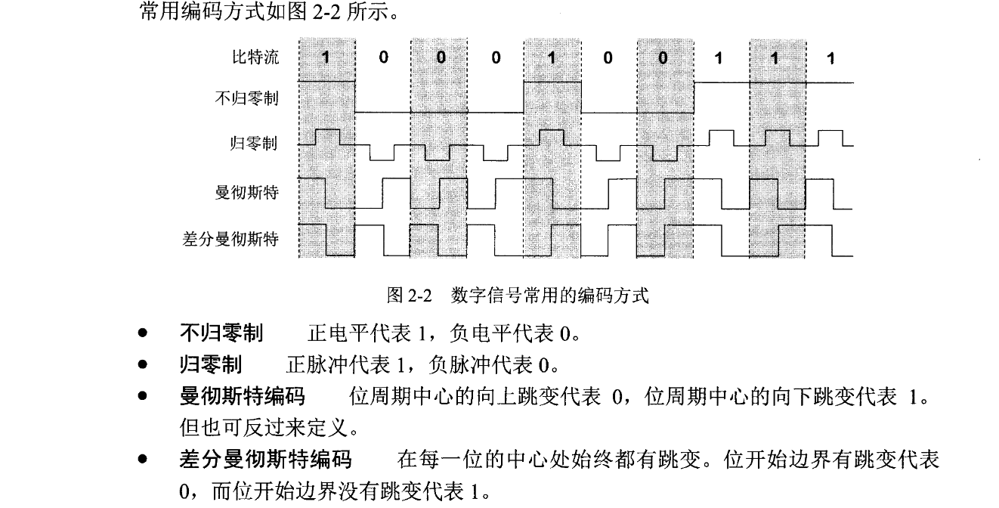
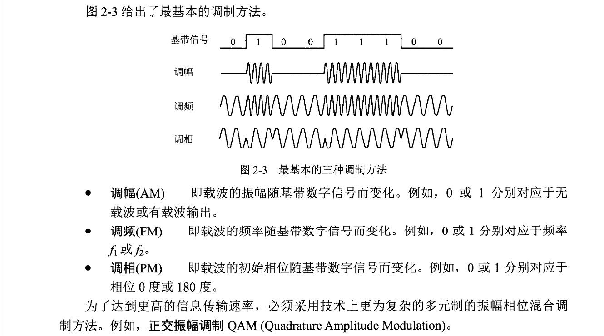

# 导论

互联网标准与 RFC。

互联网的组成：网络边缘与网络中心。

C/S 模式。

P2P 模式。

电路交换：

建立连接---通话---释放连接。

最开始和铁路搬轨一样，是线路的交换，后来是发展到多路信号的某一路（某个频率，时隙，码序）和另一路的交换。

特点是效率低。

分组交换：

把一个很长的信息划分为特定长度的片段，加上一些标记信息构成了一个分组，又称一个包。就像快递包裹一样，这些数据包经由网络从起点到达目的地。

这些数据包不是一次性从起点达到目的地，而是经过中间链路一个个的转发。

## 计算机网络的性能

**速率**：即网速，单位 bit/s，常用的是 Mbit/s，Gbit/s

M=1000K

**带宽：**

本来的含义：在模拟电路中，信道允许通过的信号频带范围。信号具有的频带宽度3.1kHz = 3.4kHz-300Hz。

现在含义：单位时间内某信道能通过的最高数据率。此时为 bit/s

**吞吐量**：某个时间范围内通过信道、接口的数据量。

**时延**

发送时延=数据长度（bit）/发送速率（bit/s）

传播时延=信道长度（m）/电磁波在信道上的速率（m/s）

处理时延：数据包拆包，数据校验等花的时间

排队时延：数据包排队等待发送的时间。

**时延带宽积**=传播时延 \* 带宽。例如 20ms \* 10Mbit/s = 200000bit 

意义：表示在第一个比特从发送到接收的时间内，共发送了 200000bit，它们都在线路上面。时延带宽积又称以比特为单位的链路长度。

**往返时间 RTT**

接收端接收完数据后向发送端发送确认信息的时间。

有效数据率=数据长度/（发送时延+ RTT）

**利用率**

信道利用率：信道有百分之几的时间是有数据的。

网络利用率：全网络的信道利用率的加权平均值。

信道利用率并非越高越好，这是因为利用率很高时表示网络很忙碌，丢包率增加。

用 $D_0$ 表示网络空闲时延，$D$ 表示当前时延，网络利用率 $U$ 可是计算如下：
$$
U=1-\frac{D_0}{D}
$$
其他非性能特征：

费用

质量

标准化

可靠性

可扩展性

易管理与维护性

## 网络体系结构

网络协议的要素：

语法：数据与控制信息的结构或格式。

语义：需要发出何种控制信息，完成何种动作以及做出何种响应。

同步：事件实现顺序的详细说明。

**网络分层**

应用层：例如 DNS，HTTP，SMTP

运输层：两台主机进程之间通信提供的通用数据传输数据服务，TCP、UDP 协议。

网络层：为网络上两台不同主机提供通信服务，在发送数据时负责把数据封装成分组或包，IP 协议。

数据链路层：把 IP 数据包封装成帧，在两个相邻节点间的链路上传送。

物理层：物理层传送的数据是比特流。

实体：任何可以发送或接收信息的硬件或软件进程。

协议：控制两个或多个对等的实体进行通信的规则集合。

# 物理层

本节重点：

物理层的任务

常用的信道复用技术

常用的带宽接入技术

## 基本概念

源，源点，信源

发送器

接收器

终点，目的站，信宿

信息

数据：运送信息的实体

信号：数据的电气或电磁表现。

模拟信号：连续信号。

数字信号：离散信号。

码元：代表不同离散值的基本波形。

信道，单向信道（单工），双向交替信道（半双工），双向同时信道（全双工）。

基带信号：来自信源的信号

调制：有些基带信号不满足传送的条件，需要对基带信号调制以达到可传送的条件。

编码：又叫基带调制，把一种数字信号转换成另一种数字信号。

载波：把基带信号搬移到更高的频段，并转换为模拟信号。调制后的信号称为带通信号。

码间串扰：码元之间的界限在传输过程中变得模糊，导致识别码元。

奈氏准则：在任何信道中，码元的传输速率是有上限的，超过此上限就会导致码间串扰。

信噪比：信号的平均功率 $S$ 和噪声的平均功率 $N$ 之比，记为 $S/N$，单位：分贝(dB)
$$
信噪比(dB)=10\log_{10}(S/N) (dB)
$$
信道的极限传输速率：
$$
C=W\log_2(1+S/N) (bit/s)
$$
其中：W为带宽(Hz)。

传输介质：双绞线，同轴电缆，光缆，无线电。

【信道复用技术】

频分复用：FDM，用户在同样的时间占用不同的频带宽资源。

时分复用：TDM，用户在不同时间占用同样的频带宽度。

波分复用：WDM，光的频分复用，用于光纤。

【码分复用】

CDM，或码分多址（CDMA），用户使用特殊挑选的不同码型，因此用户之间不会干扰。

码片：在CDMA中，每个比特时间被划分为m个短的间隔。满足正交性，规格化：
$$
S\cdot T=0\quad S\cdot S=1
$$
接收信号的方法就是做内积运算：$S\cdot (S_x+T_x)=S\cdot S_x=\pm1$

# 数据链路层

了链路层使用的信道有如下两种方式：

- 点对点信道
- 广播信道

本章重点：

1. 数据链路层点对点信道与广播信道的特点，以及这两种信道使用的协议：PPP，CSMA/CD
2. 数据链路层的三个基本问题：封装成帧，透明传输，差错检验
3. 以太网 MAC 层的地址映射。
4. 适配器，转发器，集线器，网桥，以太网交换机的作用以及使用场合。

链路：一个节点到相邻节点的一段物理线路，中间没有任何其他交换节点。

数据链路：物理线路+控制数据传输的通信协议，现在用网络适配器（既有软件，也由硬件）来实现这些协议。

帧：数据链路层的协议数据单元。

**【点对点通信数据链路层工作】**

1. 节点A把将上层传下来的IP数据报添加首部和尾部封装成帧。
2. 节点A把帧发送给节点B
3. 节点B验证接收到的帧无差错后，从帧中取出IP数据报交给上面的网络层，否则丢弃。

【三个基本问题】

- 封装成帧
- 透明传输
- 差错检验

数据传送单元 MTU：帧中数据部分长度上限。

帧的首部开始控制字符SOH：0x01

帧的尾部结束控制字符EOT：0x04

由于键盘上输入的ASCII码不会与帧界定符冲突，都可以放在这样的帧中传输，这称为透明传输。但是一些二进制文件确可能发生冲突。

在数据链路层透明传输数据表示

