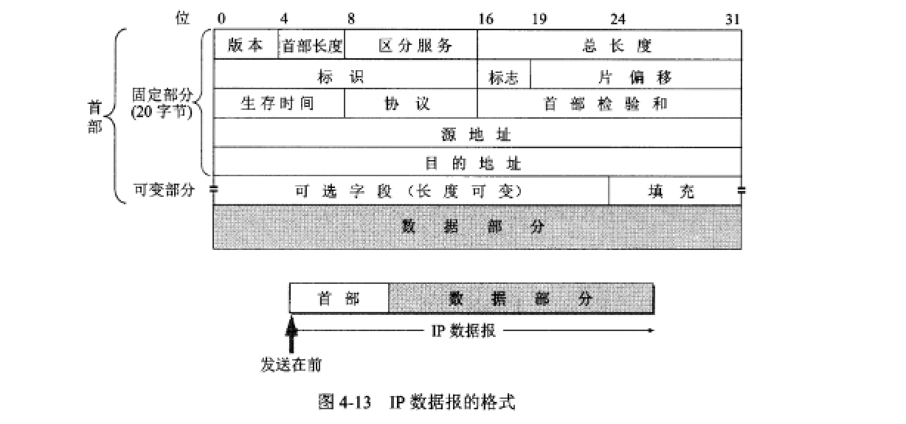
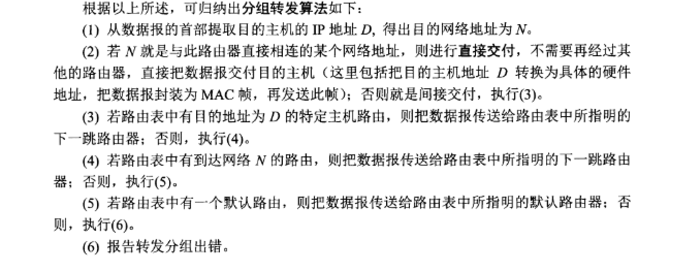
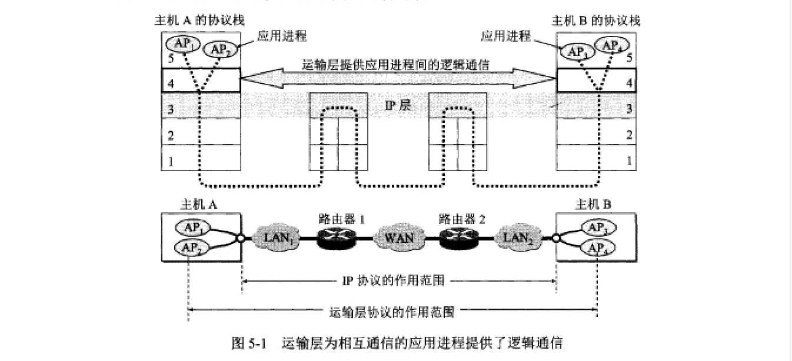

# 导论

互联网标准与 RFC。

互联网的组成：网络边缘与网络中心。

C/S 模式。

P2P 模式。

电路交换：

建立连接---通话---释放连接。

最开始和铁路搬轨一样，是线路的交换，后来是发展到多路信号的某一路（某个频率，时隙，码序）和另一路的交换。

特点是效率低。

分组交换：

把一个很长的信息划分为特定长度的片段，加上一些标记信息构成了一个分组，又称一个包。就像快递包裹一样，这些数据包经由网络从起点到达目的地。

这些数据包不是一次性从起点达到目的地，而是经过中间链路一个个的转发。

## 计算机网络的性能

**速率**：即网速，单位 bit/s，常用的是 Mbit/s，Gbit/s

M=1000K

**带宽：**

本来的含义：在模拟电路中，信道允许通过的信号频带范围。信号具有的频带宽度3.1kHz = 3.4kHz-300Hz。

现在含义：单位时间内某信道能通过的最高数据率。此时为 bit/s

**吞吐量**：某个时间范围内通过信道、接口的数据量。

**时延**

发送时延=数据长度（bit）/发送速率（bit/s）

传播时延=信道长度（m）/电磁波在信道上的速率（m/s）

处理时延：数据包拆包，数据校验等花的时间

排队时延：数据包排队等待发送的时间。

**时延带宽积**=传播时延 \* 带宽。例如 20ms \* 10Mbit/s = 200000bit 

意义：表示在第一个比特从发送到接收的时间内，共发送了 200000bit，它们都在线路上面。时延带宽积又称以比特为单位的链路长度。

**往返时间 RTT**

接收端接收完数据后向发送端发送确认信息的时间。

有效数据率=数据长度/（发送时延+ RTT）

**利用率**

信道利用率：信道有百分之几的时间是有数据的。

网络利用率：全网络的信道利用率的加权平均值。

信道利用率并非越高越好，这是因为利用率很高时表示网络很忙碌，丢包率增加。

用 $D_0$ 表示网络空闲时延，$D$ 表示当前时延，网络利用率 $U$ 可是计算如下：
$$
U=1-\frac{D_0}{D}
$$
其他非性能特征：

费用

质量

标准化

可靠性

可扩展性

易管理与维护性

## 网络体系结构

网络协议的要素：

语法：数据与控制信息的结构或格式。

语义：需要发出何种控制信息，完成何种动作以及做出何种响应。

同步：事件实现顺序的详细说明。

**网络分层**

应用层：例如 DNS，HTTP，SMTP

运输层：两台主机进程之间通信提供的通用数据传输数据服务，TCP、UDP 协议。

网络层：为网络上两台不同主机提供通信服务，在发送数据时负责把数据封装成分组或包，IP 协议。

数据链路层：把 IP 数据包封装成帧，在两个相邻节点间的链路上传送。

物理层：物理层传送的数据是比特流。

实体：任何可以发送或接收信息的硬件或软件进程。

协议：控制两个或多个对等的实体进行通信的规则集合。

# 物理层

本节重点：

物理层的任务

常用的信道复用技术

常用的带宽接入技术

## 基本概念

源，源点，信源

发送器

接收器

终点，目的站，信宿

信息

数据：运送信息的实体

信号：数据的电气或电磁表现。

模拟信号：连续信号。

数字信号：离散信号。

码元：代表不同离散值的基本波形。

信道，单向信道（单工），双向交替信道（半双工），双向同时信道（全双工）。

基带信号：来自信源的信号

调制：有些基带信号不满足传送的条件，需要对基带信号调制以达到可传送的条件。

编码：又叫基带调制，把一种数字信号转换成另一种数字信号。

载波：把基带信号搬移到更高的频段，并转换为模拟信号。调制后的信号称为带通信号。

码间串扰：码元之间的界限在传输过程中变得模糊，导致识别码元。

奈氏准则：在任何信道中，码元的传输速率是有上限的，超过此上限就会导致码间串扰。

信噪比：信号的平均功率 $S$ 和噪声的平均功率 $N$ 之比，记为 $S/N$，单位：分贝(dB)
$$
信噪比(dB)=10\log_{10}(S/N) (dB)
$$
信道的极限传输速率：
$$
C=W\log_2(1+S/N) (bit/s)
$$
其中：W为带宽(Hz)。

传输介质：双绞线，同轴电缆，光缆，无线电。

【信道复用技术】

频分复用：FDM，用户在同样的时间占用不同的频带宽资源。

时分复用：TDM，用户在不同时间占用同样的频带宽度。

波分复用：WDM，光的频分复用，用于光纤。

【码分复用】

CDM，或码分多址（CDMA），用户使用特殊挑选的不同码型，因此用户之间不会干扰。

码片：在CDMA中，每个比特时间被划分为m个短的间隔。满足正交性，规格化：
$$
S\cdot T=0\quad S\cdot S=1
$$
接收信号的方法就是做内积运算：$S\cdot (S_x+T_x)=S\cdot S_x=\pm1$

# 数据链路层

了链路层使用的信道有如下两种方式：

- 点对点信道
- 广播信道

本章重点：

1. 数据链路层点对点信道与广播信道的特点，以及这两种信道使用的协议：PPP，CSMA/CD
2. 数据链路层的三个基本问题：封装成帧，透明传输，差错检验
3. 以太网 MAC 层的地址映射。
4. 适配器，转发器，集线器，网桥，以太网交换机的作用以及使用场合。

链路：一个节点到相邻节点的一段物理线路，中间没有任何其他交换节点。

数据链路：物理线路+控制数据传输的通信协议，现在用网络适配器（既有软件，也由硬件）来实现这些协议。

帧：数据链路层的协议数据单元。

**【点对点通信数据链路层工作】**

1. 节点A把将上层传下来的IP数据报添加首部和尾部封装成帧。
2. 节点A把帧发送给节点B
3. 节点B验证接收到的帧无差错后，从帧中取出IP数据报交给上面的网络层，否则丢弃。

【三个基本问题】

- 封装成帧
- 透明传输
- 差错检验

数据传送单元 MTU：帧中数据部分长度上限。

帧的首部开始控制字符SOH：0x01

帧的尾部结束控制字符EOT：0x04

由于键盘上输入的ASCII码不会与帧界定符冲突，都可以放在这样的帧中传输，这称为透明传输。但是一些二进制文件确可能发生冲突。

解决方法：在界定符前加入转义字符：ESC

【差错检验】

CRC检验：

【PPP】协议

P79

【局域网】

以以太网为主，总线结构，还有环形、星形结构。

无连接，不可靠交付

【局域网数据链路层】

两个子层：LLC，MAC

【CSMA/CD协议】

- 多点接入
- 载波监听：发送前和发送中要不停检测信道
- 碰撞检测：边发送边监听

$t=\tau$时 B 收到数据，检测到发生碰撞。

$t=2\tau-\delta$，A 收到数据，A 检测到了碰撞。

【以太网信道利用率】

碰撞参数：$a=\frac{\tau}{T_0}$，a越小，争用期所占比例越少，因此帧不能太短。

【MAC层】

MAC 地址高24位要买，后 24 位厂商自己分配。

规定：第一字节的最低为为I/G 位，0：单站地址，1：多播地址。

# 网络层

## 网际协议IP

配套的三个协议：

- 地址解析协议ARP
- 网际控制报文协议ICMP
- 网际组管理协议IGMP

直接交付：不要经过路由器

间接交付：需要经过路由器

IP地址遍址方法共经历了三个阶段：

- 分类的IP地址
- 子网的划分
- 构成超网

【IP地址特点】

- 每个 IP 地址由网络号和主机号组成，二级 IP 结构。--->第一阶段，不好用。
- 跨网络的主机至少有两个 IP 地址，它们的网络段是不同的，每个路由器显然至少有两个IP地址。
- 由网桥或转发器连接的局域网仍是同一个网络，它们网络号相同。

【与MAC地址比较】

- 网络层只能看到 ip 地址， 链路层只能看到 MAC地址

【IP数据报】

- 版本：IP v4？v6？
- 首部长度，占4位，4字节为一个单位，一般首部长度为20字节，填0101。
- 总长度：此长度不能超过链路层的MTU
- 标识：IP软件维护一个计数器，每来一个数据报，计数器加一，然后复制到标识字段里。
- 标志：共三位，目前只使用两位：MF=1表示后面还有分片，MF=0表示最后一片；DF=0允许分片否则不允许。
- 片偏移：片第一个字节号除以8

- 生存时间：每经过一个路由器就减一，为零不再转发。
- 协议：标记上层协议以便交付给相应处理软件
- 首部校验和：

反码算术运算求和：带进位加法，如果最高有进位，则最后结果再加一。

## 地址解析协议ARP

根据 ip 地址找出对应的 MAC 地址。

反向的协议：能根据 MAC 地址找出 IP 地址—>DHCP

简单工作原理：

- 找缓存表

- 需要 MAC 地址的主机发送 ARP 广播：我的IP是XXX，MAC是XXX，IP 是192.3.4.5的吱一声。
- 收到广播的主机检查自己的IP，如果符合：我是192.3.4.5，MAC是XXX

## 分组转发

## 子网划分

三级IP结构：IP::={网络段，子网段，主机段}

单单是个IP地址无法知道子网段在哪，因此利用子网掩码标记。子网掩码中的零对应主机段，1对应网络段。

## 子网分组转发算法

## 构成超网

废除ABC类地址，子网划分的概念，采用无分类遍址（CIDR），网络号加主机号的斜线记法。

## ICMP

分两类：ICMP 差错报告报文，ICMP询问报文

应用：ping，traceroute

## 路由选择协议

【内部网关协议IGP】

1. RIP

距离定义：与路由器直接相连的网络为1，每增加一个路由距离+1。

【边界网关协议BGP】

边界网关协议特点：

- 网络规模大--->可达性优先考虑

- 自治系统之间路由满足某些策略--->较优路径而不是最优

协议：路径向量路由选择协议。

## NAT

# 运输层

运输层层次结构：

【端口】

问题：如何定位网络主机上的一个进程？

显然不能用进程号标记，因为进程号是动态变化的，因此就有了端口的概念。

## TCP

特点：

- 面向连接：三次握手，四次挥手
- 可靠连接
- 只能一对一
- 全双工通信方式
- 面向字节流：把应用程序数据看做无结构的字节流

套接字 socket ::= (IP号: 端口号)

tcp连接 ::= (socket1, socket2)

## 可靠性原理

停等协议：

发送--->等待确认恢复--->收到确认回复，继续发送

## 滑动窗口协议 ARQ

A收到确认号34之后：

相比停等协议，滑动窗口协议增加了传输效率。

## TCP流量控制

所谓流量控制就是不要让发送方发得过快，以至于接收方来不及接收。

方法：窗口协议确认信息中有指示发送方可发送的字节数。

## TCP 首部

- 源端口，目的端口
- 序号：字节流中字节的编号。例如要发送100个字节的数据，第一个字节编号301，则最后一个为400。
- 确认号：如果确认号为N，表明到 $N - 1$ 为止的所有数据已经收到。
- 数据偏移：用于指明TCP首部长度。
- 保留：未使用
- URG：1表示紧急，应优先传输。
- ACK：为1表示确认号有效，还规定建立连接后的ACK均为1
- PSH：键入的命令信息时希望尽快得到响应
- RST：复位，TCP连接出现差错时，释放连接，重新建立
- SYN：同步，建立连接的同步信号。SYN=1，ACK=0：请求建立连接，SYN=1，ACK=1：接受连接请求。
- FIN：终，数据发送完毕，可以释放连接
- 窗口：窗口值作为接收方让发送放设置其发送窗口的依据，因为接收方缓冲区大小有限制。
- 校验和：数据和首部的校验和
- 紧急指针：与URG=1一起使用

## TCP拥塞控制

方法：发送方维护一个拥塞窗口，发送窗口等于拥塞窗口。当增加发送窗口时，发送的数据量就增大，网络上的数据流量增加。减小则相反。因此出现拥塞时，减小发送窗口即可。

如何知道网络的拥塞情况呢？如果发送的数据超时率越高，说明数据丢失的可能性增加，说明网络拥塞。

- 慢开始：每经过一个传输轮次，发送窗口加倍。其实不慢。
- 拥塞避免：按线性规律增长
- 快重传：让发送方尽早知道报文丢失，即使失序也要确认。
- 快恢复：发送方知道只是丢失了个别数据，于是不用慢开始，而采用快恢复。

## UDP

特点：

- 无连接
- 尽最大努力交付
- 面向报文：简单的把数据加上 UDP 首部就交付给网络层。
- 没有拥塞控制
- 支持一对多，一对一，多对一，多对多通信

# 应用层

## DNS

