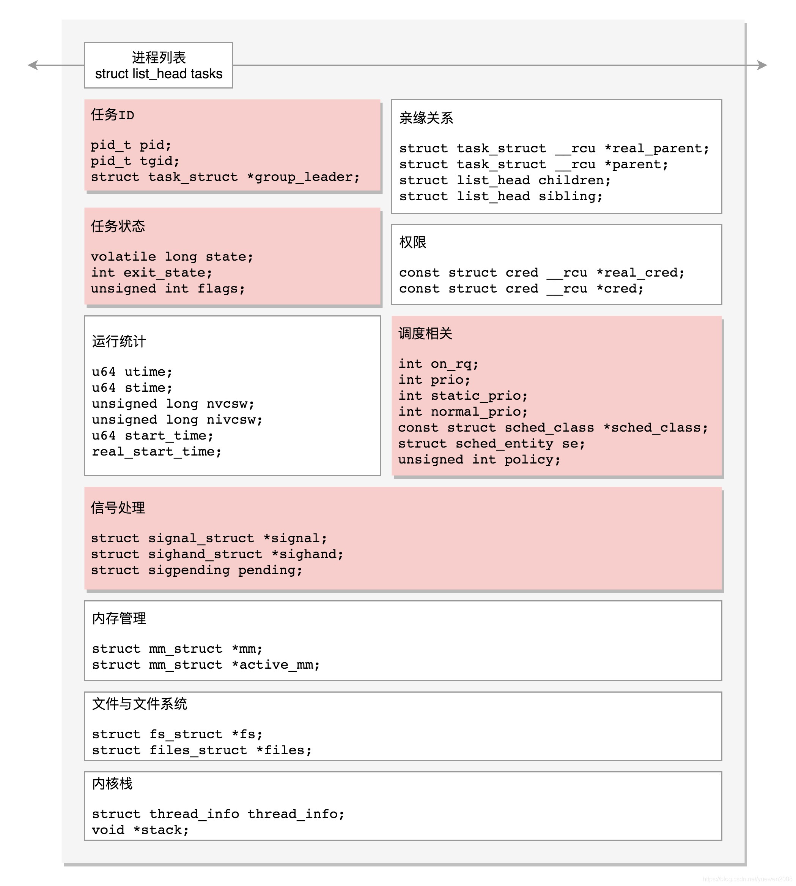
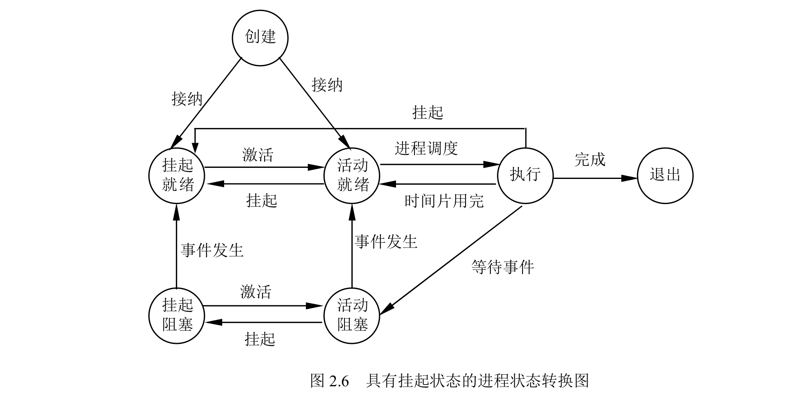

# 操作系统


# 进程与线程


## 进程的定义与描述

进程的本质是一个结构体，称为 PCB，主要包括如下几个方面：

- 进程标识符。
- 进程当前状态。
- 进程队列指针。
- 程序合数据地址。
- 进程优先级。
- CPU 现场保护。
- 通信信息。
- 家族关系。
- 资源清单。

Linux 进程结构体部分如：

```c
struct task_struct{
    /* -1 unrunnable, 0 runnable, >0 stopped: */
	volatile long			state;
	/*
	 * This begins the randomizable portion of task_struct. Only
	 * scheduling-critical items should be added above here.
	 */
	randomized_struct_fields_start

	void				*stack;
	atomic_t			usage;
	/* Per task flags (PF_*), defined further below: */
	unsigned int			flags;
	unsigned int			ptrace;
	int				on_rq;
	int				prio;
	int				static_prio;
	int				normal_prio;
	unsigned int			rt_priority;

	const struct sched_class	*sched_class;
	struct sched_entity		se;
	struct sched_rt_entity		rt;
	struct sched_dl_entity		dl;

	unsigned int			policy;
	int				nr_cpus_allowed;
	cpumask_t			cpus_allowed;
	struct sched_info		sched_info;
	struct list_head		tasks;
	struct mm_struct		*mm;
	struct mm_struct		*active_mm;
}
```


结构体的组成如下图所示：




进程的状态转换图：





## 进程的生命周期

进程的创建：


## 进程的组织


### 线程  


# 进程同步与通信

 ## 同步与互斥的基本概念


## 信号量


## 管程


## 进程通信


# 调度与死锁

# 存储管理

# 虚拟存储

# 设备管理

# 文件管理
