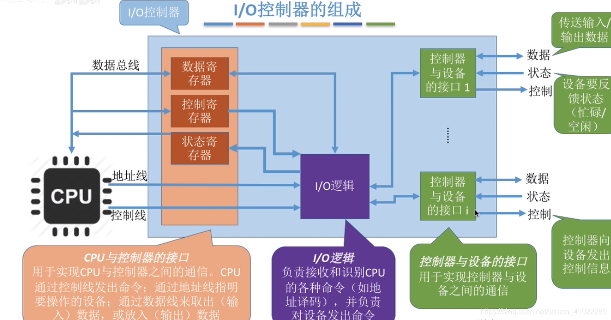

# 操作系统


# 进程与线程


前驱图

一个又向无环图，用于描述程序，代码段或语句的先后执行顺序。


## 进程的定义与描述

进程的本质是一个结构体，称为 PCB，主要包括如下几个方面：

- 进程标识符。
- 进程当前状态。
- 进程队列指针。
- 程序合数据地址。
- 进程优先级。
- CPU 现场保护。
- 通信信息。
- 家族关系。
- 资源清单。

Linux 进程结构体部分如：

```c
struct task_struct{
    /* -1 unrunnable, 0 runnable, >0 stopped: */
	volatile long			state;
	/*
	 * This begins the randomizable portion of task_struct. Only
	 * scheduling-critical items should be added above here.
	 */
	randomized_struct_fields_start

	void				*stack;
	atomic_t			usage;
	/* Per task flags (PF_*), defined further below: */
	unsigned int			flags;
	unsigned int			ptrace;
	int				on_rq;
	int				prio;
	int				static_prio;
	int				normal_prio;
	unsigned int			rt_priority;

	const struct sched_class	*sched_class;
	struct sched_entity		se;
	struct sched_rt_entity		rt;
	struct sched_dl_entity		dl;

	unsigned int			policy;
	int				nr_cpus_allowed;
	cpumask_t			cpus_allowed;
	struct sched_info		sched_info;
	struct list_head		tasks;
	struct mm_struct		*mm;
	struct mm_struct		*active_mm;
}
```


结构体的组成如下图所示：


进程的状态转换图：


## 进程的生命周期

进程的创建：


## 进程的组织


### 线程  


# 进程同步与通信

 ## 同步与互斥的基本概念

临界资源：一次仅允许一个进程使用的资源。打印机，变量，代码段都可以是临界资源。

临界区：进程中访问临界资源的那段代码。

进入区：为了进入临界区使用临界资源，在进入区检查是否可以进入临界区。

临界区：访问临界资源。

退出区：清除“正在访问临界区”标志。

剩余区：其他代码段。


为了合理使用临界资源，应满足如下条件：

空闲让进：没有进程位于临界区时，可以允许一个进程进入临界区；

忙则等待：当已有进程进入临界区时，其他试图进入临界区的进程必须等待；

有限等待：对要访问临界区资源的进程来说，应该在有限的等待时间内进入自己的临界区。

让权等待：当进程不能进入临界区时，可以释放 CPU。


进程同步：多个相互合作的进程在一些关键点上需要相互等待或交换信息。“同步”不是“齐头并进”的意思，而是定义了一种先后关系，有时序的含义。

进程互斥：当一个进程占有资源时，不允许其他进程访问，只有当此进程释放资源时，其他进程允许访问。


**互斥算法**

下面的互斥算法不一定是正确的。

1. 交替算法：

```c++
int turn =0;

P0:{
    do {
        while(turn != 0);
        // P0 的临界区
        turn = 1;
        // P0 的其他代码
    }while(1)
}

P1:{
    do {
        while(turn != 1);
        // P1 的临界区
        turn = 0;
        // P1 的其他代码
    }while(1)
}
```

本算法满足忙则等待的条件，但不满足空闲让进的条件，因为 P1 不执行，P0 也无法执行。


2. 设置一个标志数组用来表示当前进程是否在临界区中运行，初值为假。当一个进程试图进入临界区时，先检查其他进程的标志，若没有一个为真，则设置自己的标志为真，并进入临界区，退出时设置标志为假。

问题：如果两个进程几乎同时检查对方的标志时，发现标志均为假，结果同时进入了临界区，违背“忙则等待”的原则。

3. 设置一个标志数组用来表示当前进程希望在临界区中运行，初值为假。当一个进程希望进入临界区时，先设置自己的标志为真，再检查其他进程的标志，若其他进程的标志有一个为真，则等待；否则进入临界区，退出时设置标志为假。

问题：若果两个进程都希望进入临界区，检查对方标志时均为真，由于相互谦让，他们有可能都无法进入临界区。

4. 方案一和三的结合体。

:bulb: 以上算法之所以出现问题，是因为临界资源状态的检查与修改没有作为一个整体来实现。​


硬件方法：

1. 禁止中断
2. 硬件指令方法


【锁机制】

```c
lock(w){
    while(w == 1){
        w=1;
    }
}

unlock(w){
    w = 0;
}


// P1,P2
//...
lock(w);
//临界区;
unlock(w);
//...
```


## 信号量

问题：设有 $M$ 个互斥的资源，有N 个同步的进程，每个进程每次占有 k 个资源，求信号量的取值范围？

信号号量s由两个成员 `count,queue` 构成，`count` 表示系统中某类资源的使用情况，初始值为一个非负数，当它大于0时，表示当前系统中可用的资源数目，当它的值小于0时，表示因请求该资源而阻塞的进程数量。`queue`用于记录阻塞的进程，初值为空队列。

信号量的值仅能P操作（也称wait 操作）和V操作（也称signal操作）修改。


```c
struct Semaphore{
    int count;
    Queue queue;
}

wait(Semaphore s){
    s.count--;
    if(s.count<0){
        //阻塞该进程
        //将其加入s.queue
    }
}

signal(Semaphore s){
    s.count++;
    if(s.count<=0){
        //从s.queue取出一个进程
        //将其加入就绪队列
    }
}
```


```c

Semaphore s = Semaphore(1);

cobegin
    P1();
	P2();
coend
    
P1(){
    //...
    P(s);
    //临界区
    V(s);
    //...
}
P2(){
    //...
    P(s);
    //临界区
    V(s);
    //...
}
```


 经典进程同步问题

【生产者-消费者问题】

生产者与消费者进程共享一个长度为n的有界缓冲区。缓冲区满时，生产者被阻塞；缓冲区空时，消费者被阻塞；生产者与消费者只能有一个操作缓冲区。实现的伪代码如下：

```c
semaphore full = 0;
semaphore empty = n;
semaphore mutex = 1;

producer(){
    while(1){
        produce();
        P(empty);
        P(mutex);
        //把数据放到缓冲区
        V(mutex);
        V(full);
    }
}

customer(){
    while(1){
        produce();
        P(full);
        P(mutex);
        //从缓冲区取出数据
        V(mutex);
        V(empty);
    }
}
```


【读者写者问题】

如果进程只对共享资源进行读操作，那么没有问题，但如果有进程对共享资源进行写操作，就会破坏数据的完整性。为了同步读写操作，需要对资源加锁，伪代码如下：

```c
semaphore rmutex =1;
semaphore wmutex =1;
int count = 0;

reader(){
    while(true){
        P(rmutex);
        if (count==0)P(wmutex);
        count++;
        V(rmutex);
        // read()
        P(rmutex);
        count--;
        if (count==0)V(wmutex);
        V(rmutex);
    }
}

writer(){
    while(true){
        P(wmutex);
		// write()
        V(wmutex);
    }
}

main(){
    //cobegin
    reader()
    writer()
    //coend
}
```


## 管程

管程定义了一个数据结构和能为并发进程所执行的的一组操作，这组操作能同步进程和操作管程中的数据。


## 进程通信

信号与管道是Unix系统最古老的通信机制，为了增强进程间通信能力，Unix System V 提出了共享内存，信号量，消息队列的通信机制。在计算算网络中，使用套接字实现不同主机进程间通信。


1. 管道
2. FIFO
3. 消息队列
4. 信号量
5. 共享内存
6. 套接字


# 调度与死锁


- 什么是调度？调度要解决哪些基本问题？
- 什么是死锁？
- 如何解决死锁问题？


进程调度就就绪队列中选一个执行。

由于进程有长有短，有紧急的和不紧急的，而且系统的设计要求不一样，没有统一的解决方案。


【调度性能的评价指标】

- CPU 利用率
- 系统吞吐量：单位时间完成的任务量
- 周转时间：任务从提交到完成的时间间隔。
- 平均周转时间：所有任务的周转时间取平均数。
- 带权周转时间：周转时间除以实际运行时间
- 平均带权周转时间：所有带权周转时间取平均。
- 系统延迟：从提交到首次响应的时间间隔。


【调度算法】

- 先来先服务

- 短作业优先：低周转时间

- 优先级调度算法

- 时间片轮转：每一个进程分配一定时间片，时间片用尽就放回队列
- 高响应比优先
- 多级反馈队列：多个轮转队列，先把优先级高的队列轮空，每轮完就下放到低优先级队列中。


【死锁】

- 互斥条件：资源只能被一个进程独占
- 不能抢占资源
- 请求和保持：等待新资源时，继续占有已分配的资源
- 循环等待：一个进程占有的资源是下一个资源请求的资源。


【银行家算法】

银行家算法是避免死锁的算法。

设有 n 个进程 $P_1,p_2,...,P_n$，m 类资源 $R_1,R_2,...,R_m$，记录资源分配的数据结构如下：

可用资源用向量 Available ：$Available[i]=j$ 表示 $R_i$ 有 $j$ 个可用。

分配矩阵 Allocation ：$Allocation[i,j]=k$，表示 $P_i$ 已经分配资源 $R_j$ 的数目为 $k$。

需求矩阵 Need ：$Need[i,j]=k$，表示 $P_i$ 还需要分配资源 $R_j$ 的数目为 $k$。

最大需求矩阵 Max ：$Max[i,j]=k$，表示 $P_i$ 需要分配最大资源 $R_j$ 的数目为 $k$。

资源请求矩阵 Request ：$Request[i][j]=k$ 表示当进程 $P_i$ 请求资源 $R_j$ 的数目为 $k$。

系统空闲向量Work：$Work[i]=j$ 表示预运行进程 $P_i$ 系统空闲资源数目。

能否完成向量Finish：$Finish[i]=true$ 表示当前资源分配能保证 $P_i$ 运行到结束。


银行家算法步骤：

1. 检查 $Request[i] \le Need[i]$，flase 表示出错。

2. 检查 $Request[j] \leq Available[i]$，flase 表示当前进程需要阻塞。

3. 尝试分配：

   1) $Available[i]=Available[i]-Request[i][i]$

   2) $Allcation[i]=Allocation[i]+Requests[i]$

   3) $Need[i]=Need[i]=Requests[i]$

4. 然后进行死锁检查算法：

   1) 初始化：$Work=Available，Finish=false$

   2) 不断找出一个进程满足：$Finihs[i]=flase\quad \&\&\quad Need[i][j]\le Work[j]$，执行:

   ​	$Work[j]=Work[j]+Allocation[i][j]$，表示执行完之后会释放其占有的资源。

   ​	$Finish[i]=true$

   3) 如果所有 $Finish=true$，说明本次预运行是畅通的，可以执行。


【死锁消除】

- 取消不可抢占的限制
- 撤销进程


# 内储管理

- 指令与数据如何加载到CPU？
- 不同的进程如何隔离，不会随便读写到别的进程的地盘。

- 内存如何分配？如何回收？


【指令与数据】

CPU执行指令就像自动步枪一样，执行一个，下一个自动加载。这些指令各有各的功能，有的执行运算，有的执行跳转，有的 load 数据，有的 store 数据，宏观来看，就是指令和数据流进CPU，数据流出CPU。

如果不考虑缓存，那么就是指令和数据从内存流进 CPU，数据从 CPU 流出到内存。


【程序如何存储在内存】

如果只有一个程序，那只需要把内存分为两个部分即可：一个部分存储只读的指令，另一部分存储数据，当然还可以增加堆栈区，静态区等。


如果有两个以上的程序呢？

一个简单的方法是可以把内存划分为几块，每个程序分一块地盘。这么做的问题也很明显，一是不能事先知道有多少个程序要执行，二是有的程序大，有的程序小，怎么划分合理呢？


方法1：分段的存储方式

仔细分析每个程序，发现他们有一些共同特征：

- 只读的指令：程序的二进制代码，也叫文本段，这部分是确定的。
- 函数调用栈：用于保存函数上下文的区域，这部分会随着程序运行不断变化。
- 静态区：保存静态变量，常量，全局变量，这部分也是不变的
- 堆：动态内存分配的地方，也是变化的。


分段是每个程序跟具需求，把自己分成若干段。内核为每个进程维护一个段表，程序加载的时候，在段表里记录段的起始位置，段长等信息；程序获得CPU的时候，会把段的起始位记录到段寄存器里；程序访问内存的时候，就用程序的内部地址加上段地址生成物理地址。


方法2：分页的储存方式，虚拟内存。

把内存划分为更大的基本单元：页，而不再使用字节作为基本单元，我们会看到这么做的好处。

当需要把程序加载到内存的时候，只要计算程序需要多少个页即可。这些页不一定是连续的，因此可以用链表的方式拼接起来，也可建立一个索引表。显然索引表的方式更可取，虽然会占用额外的空间，但是性能好，这个索引表叫页表。

内核为每个进程维护一个页表。


【虚拟内存】

有了页表就可做更强大的事情了。如果页表不是根据程序实际的页使用情况建立，而是一开始就建立好，那么就有了虚拟内存的概念。

试想一下，这些一开始就分配好的页表没有什么实际意义，但是好像已经有了一个内存空间。程序加载的时候，只需要修改页表项使之对应实际的内存页面，程序就可以正常运行了。


有了虚拟内存的概念，我们还可以把硬盘与内存看做一个概念。

硬盘与内存一样，也是分页的，那么虚拟内存的页无非在两个地方：要么对应物理内存的某个页，要么对应硬盘上的某个页，因此内存是硬盘的缓存。

这体现了计算中的一个重要思想：缓存。那么缓存背后的思想是什么呢？就是时间局部性和空间局部性？局部性背后的思想是什么呢？就是加速大概率事件的思想。什么是加速大概率事件的思想呢？

- 例如当你经常点开QQ，那么QQ图标会出现在你手机最显眼的位置
- 例如当你经常需要和某个人聊天的时候，那么他会在你的特别关注列表里。


理解了虚拟内存的概念之后，许多问题就可以解决了：

- 什么是缺页？显然就是缓存未命中，页在磁盘上而不在内存。

- 什么是换入换出？显然换入换出是解决缓存冲突的方法。


【如何理解分页的好处？】

缓存有两个重要的概念：关联性与缺失率，它们是一对矛盾体。

把内存看成一个页，任何位置都可以存，它的关联度低，访问时间较长，缺失率低。

把内存分为许多页，只有特定位置可以存，它的关联度高，访问时间短（只需在特定位置找即可），缺失率较高（竞争同一个位置引起缺失）。


分页之后提高了关联度，增加了性能。


【如何理解多级页表】

道理与多级缓存一样。更大的级相当于把更大的空间作为一个整体，进一步增加关联度，试图进一步提高性能。


# I/O 管理

- 数据是如何被送进计算机的？又如何从计算机输出？

- I/O 的控制方式？
- 中断在 I/O 中的应用？

- 如何解决 I/O 与 CPU 速度匹配的问题？

- 设备调度算法？


【I/O 控制器】

I/O 控制器相当于 I/O 总管，CPU 只需要和这个总管打交道，而 I/O 设备只需与这个总管相连即可。

 




管理 I/O 设备的数据结构：

系统设备表SDT：设备类别，设备标识符，驱动程序入口，DCT指针

通道管理表：通道标识符，通道状态，通道等待队列指针

设备控制器管理表COCT：设备控制器标识符，设备控制器状态，设备控制器等待队列指针

设备管理表：DCT：设备类型，设备标志符，设备状态，设备等待队列指针


【I/O控制方式】

第一种方法：CPU直接控制。当某条指令等待外部数据时，CPU 会通过循环指令检查状态寄存器，如果OK那么继续执行。


第二种方法：中断。当需要加载数据时，I/O 控制器对CPU说：你先去干别的，数据好了我叫你。计算机机是怎么叫的的呢？通过中断信号。


第三种方法：DMA（Direct Memory Access）。例如看电影时，需要把数据从磁盘拷到内存，那么只需要内存和磁盘打交道就可以了，CPU只需要搭个桥牵个线就可以了，不需要一直插手。


【中断】

每个CPU 都有中断机制，相当于每个人都有耳朵，能接受并分辨中断信号。每个中断信号都有对应的处理程序。


中断的处理过程：

- 保存当前CPU状态

- 执行中断处理程序
- 恢复到之前状态。


【缓冲】

I/O 的读写较慢，很难跟上CPU的节奏，那么只好集齐一定量的数据CPU才来处理。就像拼车一样，只有凑够一定的人才发车。


- 单缓冲
- 双缓冲：一个输入的时候另一个输出，依次交替
- 循环缓冲
- 缓冲池


【分配策略】

- 独占
- 共享
- 虚拟分配


分配算法：

- 先到先得
- 优先级高的先服务


# 文件管理


- 数据在文件内是如何组织的？
- 文件在磁盘上是如何组织的？
- 磁盘空闲空间是如何组织的？
- 磁盘空间是如何分配给文件的？当文件删除时，如何回收文件空间？
- 文件系统如何管理目录，权限，修改时间等源信息？


【文件内部的数据组织】

一是结构化的记录，例如日志文件；二是没有固定形式的流式文件，常见的二进制文件如图片、视频。


【文件在磁盘上存储】

在解释文件的存储方式之前，需要说明的是：磁盘并不是一个整块，而是被划分为一个个的基本单元，称为块，每个块都有自己的编号。


方式一：顺序存储，文件存储在连续的n个块中，与数组类似。

优点：访问速度快，只需要知道首块地址和文件大小，就可以读取文件。

缺点：不利于修改，如果要增加文件内容，那么有可能覆盖后面的文件，因此需要重新分配空间。


方式二：链接，文件的块随机的分散在n个块中，每一个块包含下一个块的地址信息，类似单链表。

优点：扩展方便

缺点：读取文件的时候需要从一个块跳到另一个块，没有顺序存储块。


方式三：索引结构，每个文件都有一个块的索引表。

优点：方便读写，修改

缺点：索引表占用额外空间。


【空闲块的组织】

- 空闲文件目录：把空闲块看做空白文件
- 空闲块链：这个好理解，可以是单一链表，也可以是多组链表。
- 位图：把空闲块标记为0，使用的块标记为1。


【目录组织】

多级目录的树形结构。


Linux 中的目录是一种特殊的文件，存储的是文件名和 inode 号。

inode 是储存文件元信息的数据结构，中文译名为"索引节点"，每个文件都有唯一的一个 inode节点与之对应。


【超级块】

超级块，存放文件系统本身的元信息。包括每个区块的大小，空闲链表指针，inode 表等。


【虚拟文件系统 VFS】

VFS 并不是一种实际的文件系统，它只存在于内存中，不存在任何外存空间，VFS 在系统启动时建立，在系统关闭时消亡。VFS 由（超级块、inode、dentry、vfsmount）等结构来组成。


