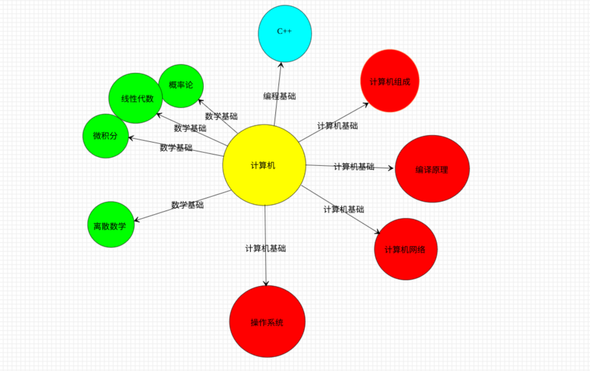
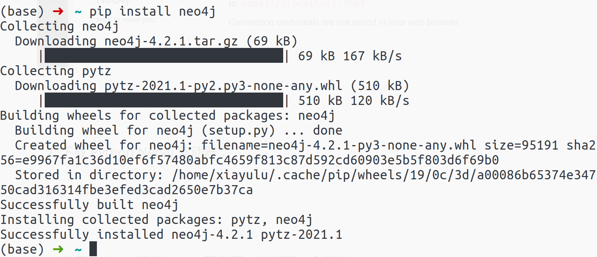
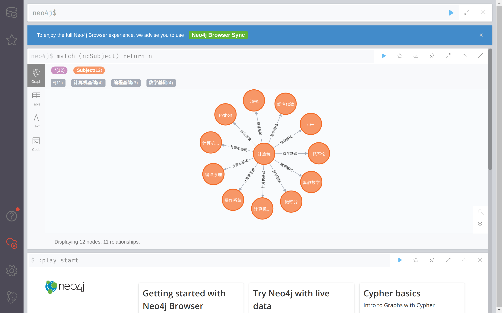

# Neo4j 知识图谱项目

姓名：周千森，学号：2015301020007

## 目的与意义

计算机科学知识体系复杂而且更新迅速，建立一个计算机科学方面的知识图谱有利于

- 梳理计算机科学的分支；
- 把握计算机科学的发展方向；
- 为学习计算机科学提供指导。


本次项目的目的是建立如下图所示的计算机知识图谱：




## 任务

1. 启动 Neo4j 服务；
2. 用 Python 语言驱动程序连接 Neo4j 图数据库。
3. 在 Neo4j 图数据库中创建节点。
4. 在 Neo4j 图数据库中创建节点属性。
5. 在 Neo4j 图数据库中创建节点的关系。
6. 查询计算机学科的“数学基础”


## 方法

1.启动 Neo4j 服务

为了启动 Neo4j服务，我们使用 docker 完成，docker-compose.yaml 内容如下：

```yaml
version: '3'
services:
  neo4j:
    image: neo4j:4.2
    hostname: neo4j
    container_name: neo4j
    ports:
      - "7474:7474"
      - "7687:7687"
    volumes:
      - $HOME/neo4j/data:/var/lib/neo4j/data # host:container <---must be absolute path
      - $HOME/neo4j/logs:/logs

    environment:
      NEO4J_AUTH: neo4j/test
      NEO4J_ACCEPT_LICENSE_AGREEMENT: "yes"
      NEO4J_dbms_logs_debug_level: DEBUG
```

运行 Neo4j 服务：

```sh
docker-compose up
```

访问 `http://localhost:7474/browser/`界面如下：


2. 下载 Python Neo4j 驱动器：

```sh
pip install neo4j
```




3. 使用 Python 连接 Neo4j 服务器，并创建我们的知识图谱：

```python
import logging
from neo4j import GraphDatabase
from neo4j.exceptions import ServiceUnavailable

logging.basicConfig(level=logging.DEBUG)


class App(object):

    def __init__(self, uri, auth):
        self.driver = GraphDatabase.driver(uri, auth=auth)

    def close(self):
        # Don't forget to close the driver connection when you are finished with it
        self.driver.close()

    def create_subject(self, name):
        with self.driver.session() as session:
            # Write transactions allow the driver to handle retries and transient errors
            results = session.write_transaction(
                self._create_subject, name)
            for result in results:
                logging.info(f'Create subject {result}')

    @staticmethod
    def _create_subject(tx, name):

        # To learn more about the Cypher syntax,
        # see https://neo4j.com/docs/cypher-manual/current/

        # The Reference Card is also a good resource for keywords,
        # see https://neo4j.com/docs/cypher-refcard/current/

        query = (
            "CREATE (subject:Subject { name: $name }) "
            "RETURN subject"
        )
        results = tx.run(query, name=name)
        try:
            return [result["subject"]["name"] for result in results]
        # Capture any errors along with the query and data for traceability
        except ServiceUnavailable as exception:
            logging.error("{query} raised an error: \n {exception}".format(
                query=query, exception=exception))
            raise

    def find_subject(self, name):
        with self.driver.session() as session:
            result = session.read_transaction(self._find_suject, name)
            for record in result:
                logging.info(f"Found Subject: {record}")

    @staticmethod
    def _find_suject(tx, name):
        query = (
            "MATCH (s:Subject) "
            "WHERE s.name = $name "
            "RETURN s.name AS name"
        )
        result = tx.run(query, name=name)
        return [record["name"] for record in result]

    def create_relation(self, name1, name2, relation):
        with self.driver.session() as session:
            # Write transactions allow the driver to handle retries and transient errors
            results = session.write_transaction(
                self._create_relation, name1, name2, relation)
            for result in results:
                logging.info(
                    f'Create relation {result[0]}-[{relation}]->{result[1]}')

    @staticmethod
    def _create_relation(tx, name1, name2, relation):

        if relation == "数学基础":
            query = (
                f"MATCH (s1:Subject) WHERE s1.name = $name1 "
                "MATCH (s2:Subject) WHERE s2.name = $name2 "
                "CREATE (s1)-[:数学基础]->(s2)"
                "return s1.name as name1, s2.name as name2"
            )

        if relation == "编程基础":
            query = (
                f"MATCH (s1:Subject) WHERE s1.name = $name1 "
                "MATCH (s2:Subject) WHERE s2.name = $name2 "
                "CREATE (s1)-[:编程基础]->(s2)"
                "return s1.name as name1, s2.name as name2"
            )

        if relation == "计算机基础":
            query = (
                f"MATCH (s1:Subject) WHERE s1.name = $name1 "
                "MATCH (s2:Subject) WHERE s2.name = $name2 "
                "CREATE (s1)-[:计算机基础]->(s2)"
                "return s1.name as name1, s2.name as name2"
            )

        results = tx.run(query, name1=name1, name2=name2, relation=relation)
        try:
            return [[result['name1'], result['name2']] for result in results]
        # Capture any errors along with the query and data for traceability
        except ServiceUnavailable as exception:
            logging.error("{query} raised an error: \n {exception}".format(
                query=query, exception=exception))
            raise


if __name__ == "__main__":
    uri = "neo4j://localhost:7687"
    auth = ("neo4j", "test")
    app = App(uri, auth=auth)
    subjects = ["计算机"]
    subjects_math = ["微积分", "离散数学", "概率论", "线性代数"]
    subjects_program = ["c++", "Java", "Python"]
    subjects_computer = ["计算机组成", "计算机网络", "编译原理", "操作系统"]

    for subject in subjects+subjects_math+subjects_program+subjects_computer:
        app.create_subject(subject)

    for subject in subjects_math:
        app.create_relation("计算机", subject, "数学基础")

    for subject in subjects_program:
        app.create_relation("计算机", subject, "编程基础")

    for subject in subjects_computer:
        app.create_relation("计算机", subject, "计算机基础")

    app.find_subject("计算机")
    app.close()

```


## 执行结果




## 讨论

本项目的难点如下：

- 安装并运行 Neo4j 服务；
- 熟悉 cypher 语言；

- 熟悉 Python 编程语言。

本项目的收货：

- 成功的搭建起了一个简单的有关计算机的知识图谱。
- 掌握了运行 Neo4j 服务的的方法
- 学习如何用 Python 语言解决问题。

