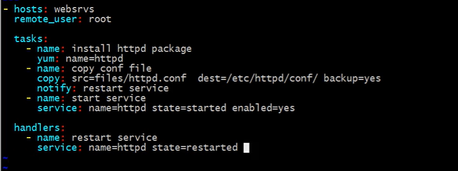

# 安装


# 主机配置

/etc/ansible/hosts

```sh
ansible [hostgroup] -m ping -k
```


`etc/ansible/ansible.conf`

```sh
host_key_checking = False
log_path = ...
```


```sh
ansible-doc -l
ansible [module-name]
```


```sh
#install openssh
ssh-keygen
ssh-copy-id [ip]

```


一些常用module:

- command: 默认

- shell: 参数可以有特殊字符，如$
- script
- file

```shell
ansible all -m file -a 'path=/data/log state=touch'
```


- copy

```sh
ansible all -m copy -a 'src=/root/ansible/selinux dest=/etc/selinux/config backup=yes'
```

- fetch：从远程抓取到本地

- cron

```shell
ansible all -m cron -a 'minute=* weekday=1,3,5 job="/usr/bin/wall FBI Warning" name=fbiwarning'

ansible all -m cron -a 'disabled=true job="/usr/bin/wall FBI Warning" name=fbiwarning'

ansible all -m cron -a 'job="/usr/bin/wall FBI Warning" name=fbiwarning state=absent'
```


# Role


```shell
ansible-galaxy install xxx
```


# playbook

```shell
ansible-palybook xxx.yaml

ansible-vault encrypt xxx.yaml
ansible-vault decrypt xxx.yaml
ansible-vault view xxx.yaml
ansible-vault edit xxx.yaml

ansible-palybook  -C xxx.yaml
```

```yaml
- hosts: web
  remote_user: root
  tasks:
    - name: hello
      command: ls /root/
  
```



