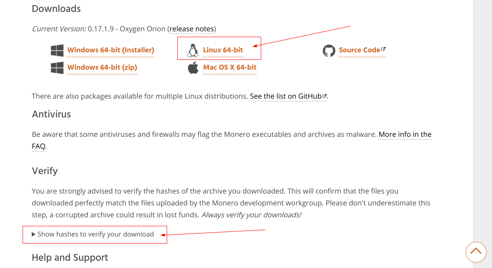
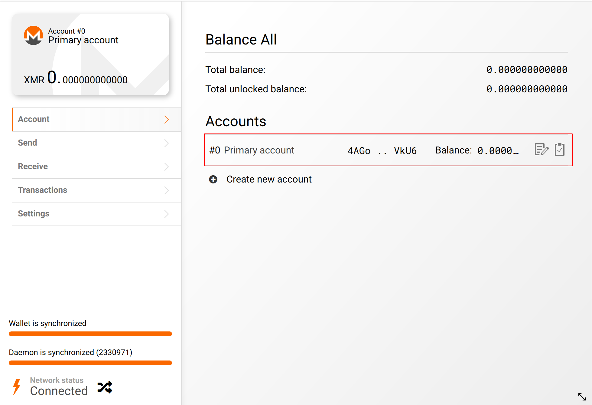

# 门罗币挖矿教程

我们这里使用的环境为 ubuntu系统。


## 第一步：下载钱包软件


- [下载地址](https://www.getmonero.org/downloads/)，下载页面如下图所示：



校验下载的文件:

```shell
$ sha256sum monero-gui-linux-x64-v0.17.1.9.tar.bz2 
6334acbe9877e2e86b1902b111abc59e170aedc701ea71cbae49830191bbd745  monero-gui-linux-x64-v0.17.1.9.tar.bz2
```

解压缩，进入那个文件，运行即可进入钱包界面:

```shell
# https://cialu.net/how-to-install-a-monero-gui-wallet-in-linux/
$ tar -xvjf monero-gui-linux-x64-v0.17.1.9.tar.bz2 
$ cd monero-gui-linux-x64-v0.17.1.9
$ ./monero-wallet-gui
```

按照提示注册钱包即可，打框的地方就是我们的支付账号，也是挖矿地址，支付地址：



## 第二步：下载挖矿程序

[下载页面](https://github.com/xmrig/xmrig/releases)

我下载的是：[xmrig-6.10.0-linux-x64.tar.gz](https://github.com/xmrig/xmrig/releases/download/v6.10.0/xmrig-6.10.0-linux-x64.tar.gz)

我矿池选择：https://minexmr.com/miningguide

生成配置的页面：https://xmrig.com/wizard，

```shell
$ tar -xvzf xmrig-6.10.0-linux-x64.tar.gz
$ cd xmrig-6.10.0-linux-x64
$ ./xmrig -o pool.minexmr.com:443 -u 4AGo86GjhgJ1BZWn14NbXjTtzcUjmoEQzg5zhuQkRjdAGPgXBEDVcZVY8GK4oxusB8hepyygXtmhZDXowzBsbUF1HrZVkU6 -k --tls
```

查看挖矿进度：https://minexmr.com/dashboard，输入你的挖矿地址就可以看到挖矿进度了。


配置文件示例：

```shell
{
    "autosave": true,
    "cpu": true,
    "opencl": false,
    "cuda": false,
    "pools": [
        {
            "url": "pool.minexmr.com:443",
            "user": "4AGo86GjhgJ1BZWn14NbXjTtzcUjmoEQzg5zhuQkRjdAGPgXBEDVcZVY8GK4oxusB8hepyygXtmhZDXowzBsbUF1HrZVkU6",
            "keepalive": true,
            "tls": true
        }
    ]
}
```

```shell
./xmrig -B -c config.json
```

