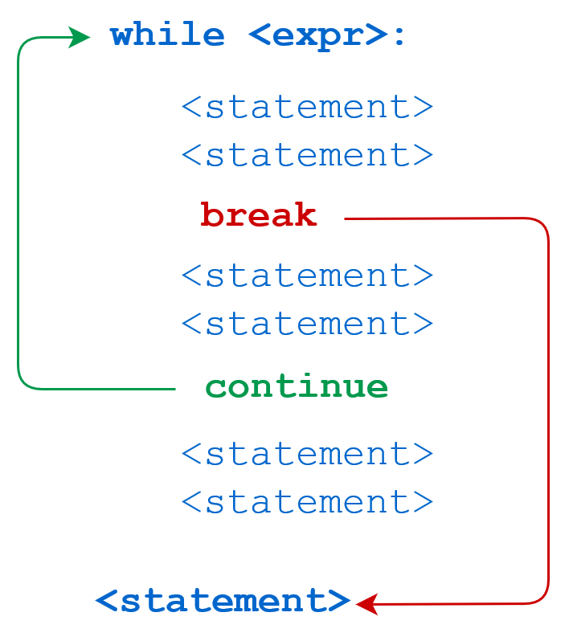

上一章讲解了一个完整的 Python 程序，包括怎么使用函数，怎么使用循环与条件判断。在细讲这些结构之前，先讲解一般程序的结构。

# 程序如何组织

除了 Python 你可能接触过其他编程语言，例如`c/C++,Java,javascript,c#`等。那么这些语言有什么共同点呢？

写程序和写作文一样，有特定的结构和**模式**。虽然有千千万万数不清的程序代码，但是他们的结构和模式却是有限的。一般来说，程序代码是由字，句，段组成的。

**字 **(word) 是程序的基本要素，包括：

- 标识符
- 关键字
- 运算符

**句** (expression，expr) 是程序的基本单元， 在 Python 中能独立存在，有些语言在表达式末尾加`;`。

- 字面值
- 运算表达式
- 注释

**段** (block, statement) 组织复杂的程序结构，特定的段有特定的书写规则，某些语言用`{}`，Python要求缩进。

- 条件判断
- 循环
- 函数定义
- 类定义
- 异常捕获

# 字级结构

**字 **(word) 是程序的基本要素，包括：

## 标识符

**标识符**是字，如：变量名，函数名，模块名，类名等。Python 语言的标识符必须以字母、下画线 (\_) 开头，后面可以跟任意数目的字母、数字和下画线（\_）。此处的字母并不局限于 26 个英文字母，可以包含中文字符、日文字符等。

## 关键字

**关键字**是字。关键字控制程序的结构，不能用作标识符。看看你认识几个关键字：

| `False`  | `await`    | `else`    | `import`   | `pass`   |
| -------- | ---------- | --------- | ---------- | -------- |
| `None`   | `break`    | `except`  | `in`       | `raise`  |
| `True`   | `class`    | `finally` | `is`       | `return` |
| `and`    | `continue` | `for`     | `lambda`   | `try`    |
| `as`     | `def`      | `from`    | `nonlocal` | `while`  |
| `assert` | `del`      | `global`  | `not`      | `with`   |
| `async`  | `elif`     | `if`      | `or`       | `yield`  |

**运算符**是字。

## 算术运算符

| Operator | Meaning                                                      | Example                  |
| :------- | :----------------------------------------------------------- | :----------------------- |
| +        | Add two operands or unary plus                               | x + y+ 2                 |
| -        | Subtract right operand from the left or unary minus          | x - y- 2                 |
| *        | Multiply two operands                                        | x * y                    |
| /        | Divide left operand by the right one (always results into float) | x / y                    |
| %        | Modulus - remainder of the division of left operand by the right | x % y (remainder of x/y) |
| //       | Floor division - division that results into whole number adjusted to the left in the number line | x // y                   |
| **       | Exponent - left operand raised to the power of right         | x**y (x to the power y)  |

## 逻辑运算符

| Operator | Meaning                                                      | Example |
| :------- | :----------------------------------------------------------- | :------ |
| >        | Greater than - True if left operand is greater than the right | x > y   |
| <        | Less than - True if left operand is less than the right      | x < y   |
| ==       | Equal to - True if both operands are equal                   | x == y  |
| !=       | Not equal to - True if operands are not equal                | x != y  |
| >=       | Greater than or equal to - True if left operand is greater than or equal to the right | x >= y  |
| <=       | Less than or equal to - True if left operand is less than or equal to the right | x <= y  |
| and  | True if both the operands are true                 | x and y |
| or   | True if either of the operands is true             | x or y  |
| not  | True if operand is false (complements the operand) | not x   |

## 位运算符

| Operator | Meaning             | Example                   |
| :------- | :------------------ | :------------------------ |
| &        | Bitwise AND         | x & y = 0 (`0000 0000`)   |
| \|       | Bitwise OR          | x \| y = 14 (`0000 1110`) |
| ~        | Bitwise NOT         | ~x = -11 (`1111 0101`)    |
| ^        | Bitwise XOR         | x ^ y = 14 (`0000 1110`)  |
| >>       | Bitwise right shift | x >> 2 = 2 (`0000 0010`)  |
| <<       | Bitwise left shift  | x << 2 = 40 (`0010 1000`) |

## 赋值运算符

| Operator | Example | Equivalent to |
| :------- | :------ | :------------ |
| =        | x = 5   | x = 5         |
| +=       | x += 5  | x = x + 5     |
| -=       | x -= 5  | x = x - 5     |
| *=       | x *= 5  | x = x * 5     |
| /=       | x /= 5  | x = x / 5     |
| %=       | x %= 5  | x = x % 5     |
| //=      | x //= 5 | x = x // 5    |
| **=      | x **= 5 | x = x ** 5    |
| &=       | x &= 5  | x = x & 5     |
| \|=      | x \|= 5 | x = x \| 5    |
| ^=       | x ^= 5  | x = x ^ 5     |
| >>=      | x >>= 5 | x = x >> 5    |
| <<=      | x <<= 5 | x = x << 5    |

## 特殊运算符

| Operator | Meaning                                                      | Example       |
| :------- | :----------------------------------------------------------- | :------------ |
| is       | True if the operands are identical (refer to the same object) | x is True     |
| is not   | True if the operands are not identical (do not refer to the same object) | x is not True |
| in     | True if value/variable is found in the sequence     | 5 in x     |
| not in | True if value/variable is not found in the sequence | 5 not in x |

# 句级结构

1. 字面值

## 字符串

【主题一】Python 如何表示字符串？

字符串是一系列的字符序列，Python中用单引号('')，双引号("")，或者三个单引号(''' ''')三个双引号(""" """)来表示字符串常量。

【主题二】Python 如何表示特殊字符？

Python 使用转义字符表示特殊字符。

| 转义序列 | 意义                     | 注意事项           |
| -------- | ------------------------ | ------------------ |
| \\       | 反斜线（\）              |                    |
| \’       | 单引号（’）              |                    |
| \"       | 双引号（”）              |                    |
| \a       | ASCII Bell（BEL）        |                    |
| \b       | ASCII 退格（BS）         |                    |
| \f       | ASCII 换页符（FF）       |                    |
| \n       | ASCII 换行符（LF）       |                    |
| \r       | ASCII 回车符（CR）       |                    |
| \t       | ASCII 水平制表符（TAB）  |                    |
| \v       | ASCII 垂直制表符（VT）   |                    |
| \ooo     | 八进制值为 *ooo* 的字符  | 最多三个八进制数   |
| \xhh     | 十六进制值为 *hh* 的字符 | 最多两个十六进制数 |

字符串文本中的转义序列规则如下：

| 转义序列   | 意   义                              | 注意事项 |
| ---------- | ------------------------------------ | -------- |
| \N{name}   | Unicode 数据库中以 *name* 命名的字符 |          |
| \uxxxx     | 4个16进制字符值：*xxxx*              |          |
| \Uxxxxxxxx | 8个16进制字符值：*xxxxxxxx*          |          |

示例：

```python
print('\114')
print('\x6f')
print("\N{SOLIDUS}")
print("\N{BLACK SPADE SUIT}")
print('\u73de')
print('\U00008bfe')
# L
# o
# /
# ♠
# 珞
# 课
```

【主题三】什么是 raw string?

Raw string 以`r`开头，内部的转义字符被当做普通字符。

示例1：

```python
looke = 'Looke\nLooke.com'
raw_looke = r'Looke\nLooke.com'
print(looke)
print('----------------')
print(raw_looke)

path= r'C:\Users\Looke\Desktop\python'
print(path)
```

示例二：

```python
import re


html='''
<div class="star">
  <span class="rating5-t"></span>
  <span class="rating_num" property="v:average">9.7</span>
  <span property="v:best" content="10.0"></span>
  <span>2386600人评价</span>
</div>
'''
rate_regex = '<span class="rating_num" property="v:average">(\d+\.\d+)</span>'
rate = re.findall(rate_regex, html)
print(rate)
# ['9.7']
```

以上两个例子说明raw字符串用于表示路径与正则表达式时非常方便。

【主题四】什么是字节文本？

字节文本总是以 'b' 或 'B' 开头；它们会生成 [bytes](https://docs.python.org/3/library/functions.html#bytes) 类型实例而不是 [str](https://docs.python.org/3/library/stdtypes.html#str) 类型。它们可能只包含 ASCII 字符；大于或等于 128 的数字必须使用转义字符表示。

示例

```python
one_str = "少壮不努力，老大学Python"
str_to_byte = one_str.encode('utf-8')
print(str_to_byte)
byte_to_str = str_to_byte.decode('utf-8')
print(byte_to_str)

#b'\xe5\xb0\x91\xe5\xa3\xae\xe4\xb8\x8d\xe5\x8a\xaa\xe5\x8a\x9b\xef\xbc\x8c\xe8\x80\x81\xe5\xa4\xa7\xe5\xad\xa6Python'
#少壮不努力，老大学Python
```


【主题五】为什么要用字节文本？

文本在内存中以对象存在，可以有复杂的结构，但是保存或进行网络传输的时候以字节序列的方式存在。


【主题六】什么是模板字符串？

模板字符串能方便的嵌入变量值，书写格式为：以 `f` 开头，变量用`{}`界定。

示例：

```python
name = 'LookeLooke.com'
print(f'Hello {name}')

x = 9
print(f'{x} * {x} = {x*x}')
```

【主题六】字符串的运算

假设有字符串`str1 = 'Looke',str2 = 'Python'`

| 操作符 | 描述                                               | 实例                       |
| :----- | :------------------------------------------------- | :------------------------- |
| +      | 字符串连接                                         | str1 + str2 # Looke Python |
| *      | 重复输出字符串                                     | str1 * 2 # LookeLooke      |
| []     | 通过索引获取字符串中字符                           | str1[1] # o                |
| [ : ]  | 截取字符串(切片，slice)                            | str1[2:4] # ok             |
| in     | 成员运算符 - 如果字符串中包含给定的字符返回 True   | 'ok' in str1 # True        |
| not in | 成员运算符 - 如果字符串中不包含给定的字符返回 True | 'o' not in str1 # False    |


## Python 中的数

Python 中有整数，浮点数（小数），虚数。

【整数及其表示】

| 定义(前缀)        | 举例       | 值(十进制值) |
| ----------------- | ---------- | ------------ |
| 二进制(0b)        | 0b11000000 | 192          |
| 八进制(0o)        | 0o10       | 8            |
| 十进制(0-9的数字) | 10_000     | 10000        |
| 十六进制(0x)      | 0x1f       | 31           |

【整数示例】

```python
7     2147483647                        0o177    0b100110111
3     79228162514264337593543950336     0o377    0xdeadbeef
      100_000_000_000                   0b_1110_0101
```

【浮点数示例】

```python
3.14    10.    .001    1e100    3.14e-10    0e0    3.14_15_93
```

【虚数示例】

```python
3.14j   10.j    10j     .001j   1e100j   3.14e-10j   3.14_15_93j
```

注意：

1. 除了 0 以外，十进制数字的开头不允许有零。
2. 数值字面值不含正负号；实际上，`-1` 等负数是由一元运算符 '`-`' 和字面值 `1` 合成的。
3. 整数字面值的长度没有限制，能一直大到占满可用内存。
4. 在 3.6 版以后已支持在字面值中，用下划线分组数字。


# 条件判断

请看如下的猜数字游戏：

```python
import random

print("==猜数字(0-20)==")
number = random.randint(0,20)
while True:
    guess = int(input("请输入你猜的数字："))
    if guess > number:
        print("猜的数字大了...")
        continue
    elif guess < number:
        print("猜的数字小了...")
        continue
    else:
        print("恭喜，你猜对了！")
        break
print("==猜数字游戏结束==")
```

Python 没有 `swith ... case...`语句：https://docs.python.org/3/faq/design.html#why-isn-t-there-a-switch-or-case-statement-in-python。



# 循环

循环有两种方式：

1. `whie...:`
2. `for ... in ...:`

请看下面数羊代码：

```python
import time

sheep_count = int(input("你有多少只羊:"))
for number in range(sheep_count):
    print(number,"只羊")
    time.sleep(1)
```

中午吃什么

```python
lunches = ['肉夹馍','火锅','刀削面','炒年糕','麻辣香锅','烤肉饭']

for lunch in lunches:
    print(lunch)
```


# 函数

Python 函数定义的基本格式为：

```python
def 函数名(参数列表):
    函数体
    return 返回值列表
```

【知识点一】函数的参数。

Python 函数参数有如下几种：必须参数，带默认值的参数，不定长参数，关键字参数。

1. 必须参数示例：

```python
def greet(name):
    print(f'Hello {name}!')

greet('Looker')
# Hello Looker!

greet()
# Traceback (most recent call last):
#   File "script.py", line 4, in 
#     greet()
# TypeError: greet() missing 1 required positional argument: 'name'
```

2. 默认值参数示例：

```python
def greet(name, program='Python'):
    print(f'Hello {name}. Welcome to {program} course!')

greet('Looker')
# Hello Looker. Welcome to Python course!

greet('Looker', 'Java')
# Hello Looker. Welcome to Java course!
```

3. 变长参数示例：

```python
def accumulate(*numbers):
    result = 0
    for number in numbers:
        result += number
    return result

result = accumulate(1,2,3,4)
print(result)
# 10
```

4. 关键字参数示例：

```python
def show_product_info(**product):
	for key in product:
		print(key, ': ', product[key])

show_product_info(
	title='GeForce RTX 3080 Ti GAMING X TRIO 12G 超频版 旗舰款 电竞游戏设计专业电脑显卡',
	price=13999.00,
	reviews=100000
)
# title :  GeForce RTX 3080 Ti GAMING X TRIO 12G 超频版 旗舰款 电竞游戏设计专业电脑显卡
# price :  13999.0
# reviews :  100000
```

【知识点二】函数返回值

示例：

```python
def min_max(*numbers):
  min = numbers[0]
  max = numbers[0]
  for number in numbers:
    if number < min:
      min = number
    if number > max:
      max = number
  return min, max

min, max = min_max(3,2,1,4,5)
print(min, max)
# 1 5
```

