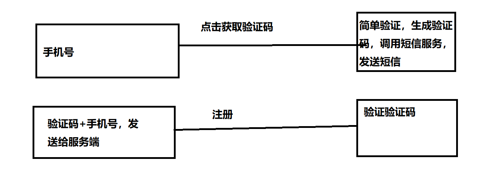

# Install

```shell
python -m venv venv
source venv/Script/activate

pip install django djangorestframework

django-admin startproject project_name .

python manage.py runserver
```

# First page

Step 1: start an app

```shell
django-admin startapp app_name
```

Step 2: setting up your app

In  `project_name/settings.py`: 

```python

INSTALLED_APPS = [
    'django.contrib.admin',
    'django.contrib.auth',
    'django.contrib.contenttypes',
    'django.contrib.sessions',
    'django.contrib.messages',
    'django.contrib.staticfiles',
    'app_name.apps.App_nameConfig', # <---register the new app
]
```

Step 3: setup urls

In `project_name/urls.py`

```python
from django.urls import path, include

urlpatterns = [
    path('', include('app_name.urls')),
]
```

Step 4: Write view functions

In `app_name/views.py`

```python
from django.http import HttpResponse


def index(request):
    return HttpResponse('hello')
```

In `app_name/urls.py`
```python
from django.urls import path
from . import views

urlpatterns = [
    path('hello', views.index),
]
```


Step 5: Start server

```shell
python manage.py runserver
```

Step 6: Visit `localhost:8000/hello`

# Database and first api

https://www.django-rest-framework.org/tutorial/quickstart/


Step 1: Config database.

```shell
pip install psycopg2-binary djangorestframework
```

In `setting.py` :
```python
INSTALLED_APPS = [
    'rest_framework', # <--- add restframework
]

# Database
# https://docs.djangoproject.com/en/3.2/ref/settings/#databases

DATABASES = {
    'default': {
        'ENGINE': 'django.db.backends.postgresql',
        'NAME': 'test',
        'USER': 'postgres',
        'PASSWORD': '123456',
        'HOST': '116.62.161.62',
        'PORT': '5432'
    }
}
```

Step 2: create superuser

```shell
pyhon manage.py migrate
python manage.py createsuperuser --email admin@example.com --username admin
```

step 3: create `serializers.py`

```python
from django.contrib.auth.models import User, Group
from rest_framework import serializers


class UserSerializer(serializers.HyperlinkedModelSerializer):
    class Meta:
        model = User
        fields = ['url', 'username', 'email', 'groups']


class GroupSerializer(serializers.HyperlinkedModelSerializer):
    class Meta:
        model = Group
        fields = ['url', 'name']
```

Step 4：Reafact `views.py`

```python
from django.contrib.auth.models import User, Group
from rest_framework import viewsets
from rest_framework import permissions
from tutorial.quickstart.serializers import UserSerializer, GroupSerializer


class UserViewSet(viewsets.ModelViewSet):
    """
    API endpoint that allows users to be viewed or edited.
    """
    queryset = User.objects.all().order_by('-date_joined')
    serializer_class = UserSerializer
    permission_classes = [permissions.IsAuthenticated]


class GroupViewSet(viewsets.ModelViewSet):
    """
    API endpoint that allows groups to be viewed or edited.
    """
    queryset = Group.objects.all()
    serializer_class = GroupSerializer
    permission_classes = [permissions.IsAuthenticated]
```

Step 5: Refactor app's `urls.py`

https://www.django-rest-framework.org/api-guide/routers/

```python
from . import views
from rest_framework import routers

router = routers.SimpleRouter()
router.register(r'users', views.UserViewSet)
router.register(r'groups',views.GroupViewSet)
urlpatterns = router.urls
```
In `project/urls.py`
```python
# Additionally, we include login URLs for the browsable API.
urlpatterns = [
    path('api-auth/', include('rest_framework.urls', namespace='rest_framework'))
]

```


# 自定义用户模块

自定义 Django 的用户模块有多种方法，这里我们使用的是改变最大的方法，[官方文档链接。]( https://docs.djangoproject.com/en/3.2/topics/auth/customizing/#using-a-custom-user-model-when-starting-a-project)需要做的有：

- 自定义`UserManager`类，继承 `BaseUserManager`
- 自定义`User` 类，继承`AbstractBaseUser, PermissionsMixin`
- 自定义`UserAdmin` 类
- 在`settings.py` 使用 自定义的类。

In custom user app `models.py`

```python
from datetime import datetime, timedelta
from django.conf import settings
from django.contrib.auth.models import (
    AbstractBaseUser, BaseUserManager, PermissionsMixin
)
from django.db import models


class UserManager(BaseUserManager):
    """
    Django requires that custom users define their own Manager class. By
    inheriting from `BaseUserManager`, we get a lot of the same code used by
    Django to create a `User` for free.
    All we have to do is override the `create_user` function which we will use
    to create `User` objects.
    """

    def create_user(self, username, email, password):
        """Create and return a `User` with an email, username and password."""
        if username is None:
            raise TypeError('Users must have a username.')
        if email is None:
            raise TypeError('Users must have an email address.')
        if password is None:
            raise TypeError('Users must have a password.')

        user = self.model(username=username, email=self.normalize_email(email))

        # Warning: Do not set password in the function above.
        # That password is not hashed
        user.set_password(password)
        user.save()
        return user

    def create_superuser(self, username, email, password):
        """
      Create and return a `User` with superuser powers.
      Superuser powers means that this use is an admin that can do anything
      they want.
      """
        user = self.create_user(username, email, password)
        user.is_active = True
        user.is_superuser = True
        user.is_staff = True
        user.save()

        return user


class User(AbstractBaseUser, PermissionsMixin):
    """
    This is a custom User model, some fields are dropped.
    You can see AbstractBaseUser for more details.
    """

    username = models.CharField(db_index=True, max_length=31, unique=True)
    email = models.EmailField(db_index=True, unique=True)

    # 1. If email is not verified, is_active will be False
    #    If email is verified, is_active will be True
    is_active = models.BooleanField(default=False)

    # The `is_staff` flag is expected by Django to determine who can and cannot
    # log into the Django admin site. For most users, this flag will always be
    # false.
    is_staff = models.BooleanField(default=False)

    # Higher reputation is means this user is more valuable.
    reputation = models.IntegerField(default=0)

    # The `USERNAME_FIELD` property tells us which field we will use to log in.
    # In this case, we want that to be the email field.
    USERNAME_FIELD = 'username'
    REQUIRED_FIELDS = ['email']
    EMAIL_FIELD = 'email'

    # Tells Django that the UserManager class defined above should manage
    # objects of this type.
    objects = UserManager()

    def __str__(self):
        """
        Returns a string representation of this `User`.
        This string is used when a `User` is printed in the console.
        """
        return f'<User {self.username}>'

```


In custom user app `admin.py`

```python
from django.contrib import admin
from django.utils.translation import gettext_lazy as _
from django.contrib.auth.admin import UserAdmin
from .models import User


class CustomUserAdmin(UserAdmin):
    """
    Fix ERRORS:
    <class 'django.contrib.auth.admin.UserAdmin'>: (admin.E108) The value of 'list
    _display[2]' refers to 'first_name', which is not a callable, an attribute of
    'UserAdmin', or an attribute or method on 'user.User'.
    """
    fieldsets = (
        (None, {'fields': ('username', 'password')}),
        (_('Personal info'), {'fields': ('phone', 'email')}),
        (_('Permissions'), {
            'fields': ('is_active', 'is_staff', 'is_superuser', 'groups', 'user_permissions'),
        }),
        (_('Important dates'), {'fields': ('last_login', 'date_joined')}),
    )
    list_display = ('username', 'email', 'is_staff')
    search_fields = ('username', 'email')


admin.site.register(User, CustomUserAdmin)
```

可以发现我们干掉了一些字段：`first_name, last_name`，增加了一些字段：`reputation`


In project `settings.py`

```python
AUTH_USER_MODEL = 'user.User'
```


# 认证与授权

- 认证解决"是谁"的问题。
- 授权解决“谁能做什么”的问题。


 短信验证码



