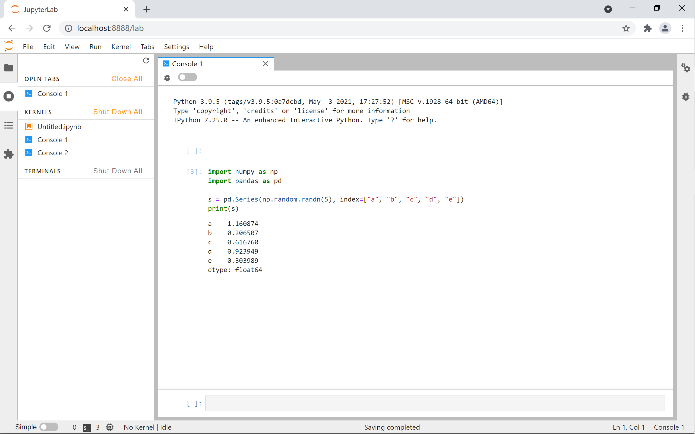

Python 适合做数据分析，下面以股票分析为例简单的介绍数据分析流程。


【知识点】数据获取。

有关股票数据的api可以在网上找，这里出两个教程以供参考

-  https://www.cnblogs.com/Walker-lyl/p/13874792.html
- [股票数据API整理](https://blog.csdn.net/xp5xp6/article/details/53121481?ops_request_misc=%257B%2522request%255Fid%2522%253A%2522162674196616780366523425%2522%252C%2522scm%2522%253A%252220140713.130102334..%2522%257D&request_id=162674196616780366523425&biz_id=0&utm_medium=distribute.pc_search_result.none-task-blog-2~all~sobaiduend~default-1-53121481.first_rank_v2_pc_rank_v29&utm_term=%E8%82%A1%E7%A5%A8%E6%95%B0%E6%8D%AEapi&spm=1018.2226.3001.4187)。

其中几个比较好用的数据api如下：

1. 搜狐数据接口：`http://q.stock.sohu.com/hisHq?code={code}&start={start}&end={end}`，`{code}`替换为股票代码，大陆股票代码加前缀 `cn_`。`{start}` 替换为起始日期，`{end}` 替换为结束日期。

    例如：http://q.stock.sohu.com/hisHq?code=cn_601766,cn_000002&start=20150601&end=20160414

    其中数据依次对应含义如下：

    日期，今日开盘价，今日收盘价，涨跌幅度，涨跌百分比，今日最低价，今日最高价，今日成交股票手数，今日成交金额(单位：万)，换手率。

2. 网易公开api：`http://quotes.money.163.com/service/chddata.html?code=[股票代码]&start=[开始日期]&end=[结束日期]&fields=[自定义列]`

    返回结果：历史股价及相关情况；CSV文件。

    其中，自定义列可定义TCLOSE收盘价 ;HIGH最高价;LOW最低价;TOPEN开盘价;LCLOSE前收盘价;CHG涨跌额;PCHG涨跌幅;TURNOVER换手率;VOTURNOVER成交量;VATURNOVER成交金额;TCAP总市值;MCAP流通市值这些值。

    例如: http://quotes.money.163.com/service/chddata.html?code=0601857&start=20071105&end=20210618&fields=TCLOSE;HIGH;LOW;TOPEN;LCLOSE;CHG;PCHG;TURNOVER;VOTURNOVER;VATURNOVER;TCAP;MCAP。

3. 网易财经

    获取今日数据：`http://img1.money.126.net/data/[沪深拼音]/time/today/[股票代码].json`

    例如：http://img1.money.126.net/data/hs/time/today/1399001.json，返回深证成指当日分时图数据。

    

    获取一年数据：`http://img1.money.126.net/data/[沪深拼音]/[是否复权]/day/history/[年份]/[股票代码].json`

    其中，是否复权，不复权为kline，复权为klinederc。

    例如: http://img1.money.126.net/data/hs/kline/day/history/2015/1399001.json，获取深证成指2015年所有日线数据。

    

    获取日线所有时间节点数据：`http://img1.money.126.net/data/[沪深拼音]/[是否复权]/[周期]/times/[股票代码].json`

    

    其中，[周期]，day为日数据，week周数据，month月数据。

    例如：http://img1.money.126.net/data/hs/kline/day/times/1399001.json，获取深证成指所有时间节点数据。

    

我们使用第二个方法，原因是直接可以用浏览器下载csv，并且可以做离线分析。

> 学习建议:
>
> 本次教程将使用 jupyterlab 作为演示环境。
>
> ```shell
> pip install jupyterlab
> jupyter-lab
> ```

# NumPy

Numpy 是 Python 数据科学三剑客Numpy，SciPy，Pandas之一，他们的主要区别是：

- NumPy 是基础。Numpy定义了许多有关线性代数的数据结构和函数。
- SciPy 是一个用于数学、科学、工程领域的常用软件包，可以处理插值、积分、优化、图像处理、常微分方程数值解的求解、信号处理等问题。
- Pandas 为了解决数据分析任务而创建的，定义了数据统计分析的数据结构与函数。


【NumPy数组】

NumPy 最基础的数据结构是`ndarray`，从字面意思可以知道它叫 $n$ 维数组(n-dimensional array)，它对应与线性代数的多维向量。

```python
import numpy as np

a = np.array([6, 7, 8])
print(a)
#[6 7 8]
print(type(a))
#<class 'numpy.ndarray'>


b = np.array([[1,  2],  [3,  4]])  
print(b)
#[[1 2]
# [3 4]]
```

【NumPy数据类型】

NumPy 支持比 Python 更多种类的数值类型。 下表显示了 NumPy 中定义的不同标量数据类型。

| 序号 | 数据类型及描述                                               |
| :--- | :----------------------------------------------------------- |
| 1.   | `bool_` 存储为一个字节的布尔值（真或假）                     |
| 2.   | `int_` 默认整数，相当于 C 的`long`，通常为`int32`或`int64`   |
| 3.   | `intc` 相当于 C 的`int`，通常为`int32`或`int64`              |
| 4.   | `intp` 用于索引的整数，相当于 C 的`size_t`，通常为`int32`或`int64` |
| 5.   | `int8` 字节（-128 ~ 127）                                    |
| 6.   | `int16` 16 位整数（-32768 ~ 32767）                          |
| 7.   | `int32` 32 位整数（-2147483648 ~ 2147483647）                |
| 8.   | `int64` 64 位整数（-9223372036854775808 ~ 9223372036854775807） |
| 9.   | `uint8` 8 位无符号整数（0 ~ 255）                            |
| 10.  | `uint16` 16 位无符号整数（0 ~ 65535）                        |
| 11.  | `uint32` 32 位无符号整数（0 ~ 4294967295）                   |
| 12.  | `uint64` 64 位无符号整数（0 ~ 18446744073709551615）         |
| 13.  | `float_` `float64`的简写                                     |
| 14.  | `float16` 半精度浮点：符号位，5 位指数，10 位尾数            |
| 15.  | `float32` 单精度浮点：符号位，8 位指数，23 位尾数            |
| 16.  | `float64` 双精度浮点：符号位，11 位指数，52 位尾数           |
| 17.  | `complex_` `complex128`的简写                                |
| 18.  | `complex64` 复数，由两个 32 位浮点表示（实部和虚部）         |
| 19.  | `complex128` 复数，由两个 64 位浮点表示（实部和虚部）        |

```python
c = np.array([1.2, 3.5, 5.1])
print(c.dtype)
#float64
```

【NumPy属性】

1. `ndarray.shape` 返回数组维度的元组

```python
a = np.array([[[1,2,3],[1,2,3]],[[1,2,3],[1,2,3]]])
print(a.shape)
#(2, 2, 3)
```

2. `ndarray.ndim`返回数组的维数

```python
a = np.array([[[1,2,3],[1,2,3]],[[1,2,3],[1,2,3]]])
print(a.ndim)
#3
```


【NumPy构造方法】

1. 从Python列表或元组创建

```python
d = np.array([1,2,3])
e = np.array((1,2,3))
```

2. 用 `numpy.empty()` 返回的是空(不确定的)数组。

```python
shape = (2,3)
a= np.empty(shape, dtype = float)
print(a)
#[[4.24399158e-314 2.12199579e-314 6.36598737e-314]
# [4.24399158e-314 2.12199579e-314 6.36598737e-314]]
```

3. 创建全零或全一数组

```python
shape = (2,3)
a= np.ones(shape)
print(a)
#[[1. 1. 1.]
# [1. 1. 1.]]

b= np.zeros(shape)
print(b)
#[[0. 0. 0.]
# [0. 0. 0.]]
```

4. 构造等差一维数组有两个方法：
    一是指定步长`numpy.arange(start, stop, step, dtype)`

  | 序号 | 参数及描述                                                   |
  | :--- | :----------------------------------------------------------- |
  | 1.   | `start` 范围的起始值，默认为`0`                              |
  | 2.   | `stop` 范围的终止值（不包含）                                |
  | 3.   | `step` 两个值的间隔，默认为`1`                               |
  | 4.   | `dtype` 返回`ndarray`的数据类型，如果没有提供，则会使用输入数据的类型。 |

  ```python
  x = np.arange(10,20,2)
  print(x)
  #[10 12 14 16 18]
  ```

  

  另一个是等分区间法`numpy.linspace(start, stop, num, endpoint, retstep, dtype)`

  | 序号 | 参数及描述                                                   |
  | :--- | :----------------------------------------------------------- |
  | 1.   | `start` 序列的起始值                                         |
  | 2.   | `stop` 序列的终止值，如果`endpoint`为`true`，该值包含于序列中 |
  | 3.   | `num` 要生成的等间隔样例数量，默认为`50`                     |
  | 4.   | `endpoint` 序列中是否包含`stop`值，默认为`ture`              |
  | 5.   | `retstep` 如果为`true`，返回样例，以及连续数字之间的步长     |
  | 6.   | `dtype` 输出`ndarray`的数据类型                              |

  ```python
  x = np.linspace(10,20,5)  
  print(x)
  #[10.  12.5 15.  17.5 20. ]
  ```

  

【NumPy运算】

```python
>>> a = np.array([20, 30, 40, 50])
>>> b = np.arange(4)
>>> b
array([0, 1, 2, 3])
>>> c = a - b
>>> c
array([20, 29, 38, 47])
>>> b**2
array([0, 1, 4, 9])
>>> 10 * np.sin(a)
array([ 9.12945251, -9.88031624,  7.4511316 , -2.62374854])
>>> a < 35
array([ True,  True, False, False])
# matrix
>>> A = np.array([[1, 1],
...               [0, 1]])
>>> B = np.array([[2, 0],
...               [3, 4]])
>>> A * B     # elementwise product
array([[2, 0],
       [0, 4]])
>>> A @ B     # matrix product, python>=3.5
array([[5, 4],
       [3, 4]])
>>> A.dot(B)  # another matrix product
array([[5, 4],
       [3, 4]])
```

【NumPy通用函数( universal functions, ufunc )】

```python
>>> b = np.arange(12).reshape(3, 4)
>>> b
array([[ 0,  1,  2,  3],
       [ 4,  5,  6,  7],
       [ 8,  9, 10, 11]])
>>>
>>> b.sum(axis=0)     # sum of each column
array([12, 15, 18, 21])
>>>
>>> b.min(axis=1)     # min of each row
array([0, 4, 8])
>>>
>>> b.cumsum(axis=1)  # cumulative sum along each row
array([[ 0,  1,  3,  6],
       [ 4,  9, 15, 22],
       [ 8, 17, 27, 38]])

>>> B = np.arange(3)
>>> B
array([0, 1, 2])
>>> np.exp(B)
array([1.        , 2.71828183, 7.3890561 ])
>>> np.sqrt(B)
array([0.        , 1.        , 1.41421356])
>>> C = np.array([2., -1., 4.])
>>> np.add(B, C)
array([2., 0., 6.])
```

【NumPy 索引和切片】

```python
>>> a = np.arange(10)**3
>>> a
array([  0,   1,   8,  27,  64, 125, 216, 343, 512, 729])
>>> a[2]
8
>>> a[2:5]
array([ 8, 27, 64])
>>> a[:6:2] = 1000
>>> # equivalent to a[0:6:2] = 1000;
>>> # from start to position 6, exclusive, set every 2nd element to 1000
>>> a
array([1000,    1, 1000,   27, 1000,  125,  216,  343,  512,  729])
>>> a[::-1]  # reversed a
array([ 729,  512,  343,  216,  125, 1000,   27, 1000,    1, 1000])
```

更多的操作请见官网：

- 用户教程：https://numpy.org/doc/stable/user/index.html

- 各种函数：https://numpy.org/doc/stable/reference/arrays.ndarray.html


# Pandas

Pandas(Python Data Analysis Library) 是 Python 数据分析库。


【Pandas 数据结构】

Pandas 对于两种基本的数据结构，一维的序列(Series)与二维的数据表(DataFrame)。

# Series

一维的序列(Series)可以是整数，浮点数，字符等的序列，除了数据序列还有下标序列(index)。

```python
import numpy as np
import pandas as pd

s = pd.Series(np.random.randn(5), index=["a", "b", "c", "d", "e"])
print(s)
a   -1.775720
b   -1.998024
c    0.330159
d   -0.719999
e   -0.533145
dtype: float64
  
print(s.index)
Index(['a', 'b', 'c', 'd', 'e'], dtype='object')
```

演示环境为 Jupyter-Ipython:



可以通过下标索引相应的值：

```python
print(s['a'])
1.1608735518210116
```

【Series 构建方法】

Series 可以从如下几个方式构建：

- NumPy ndarray
- Python Dict
- a scalar value(标量，例如 5)

```python
d = {"b": 1, "a": 0, "c": 2}
s1 = pd.Series(d)
print(s1)
b    1
a    0
c    2
dtype: int64
  

s2 = pd.Series(5.0, index=["a", "b", "c", "d", "e"])
print(s2)
a    5.0
b    5.0
c    5.0
d    5.0
e    5.0
dtype: float64
  
s3 = pd.Series(d, index=["b", "c", "d", "a"])
print(s3)
b    1.0
c    2.0
d    NaN
a    0.0
dtype: float64
```

# 数据表

数据表(DataFrame)是二维的数据结构，类似 Excel 表格和关系数据库表。可以通过如下方式建立 DataFrame：

- Dict of 1D ndarrays, lists, dicts, or Series
- 2-D numpy.ndarray
- [Structured or record](https://numpy.org/doc/stable/user/basics.rec.html) ndarray
- A `Series`
- Another `DataFrame`

1. 从Series构建：

```python
d = {
"one": pd.Series([1.0, 2.0, 3.0], index=["a", "b", "c"]),
"two": pd.Series([1.0, 2.0, 3.0, 4.0], index=["a", "b", "c", "d"]),
}

df = pd.DataFrame(d)
print(df)
   one  two
a  1.0  1.0
b  2.0  2.0
c  3.0  3.0
d  NaN  4.0
```


2. 从 Python 字典构建：

```python
d = {"one": [1.0, 2.0, 3.0, 4.0], "two": [4.0, 3.0, 2.0, 1.0]}
df = pd.DataFrame(d)
print(df)
   one  two
0  1.0  4.0
1  2.0  3.0
2  3.0  2.0
3  4.0  1.0
```

【DataFrame重要属性】

行标 (index) 和列标 (columns)：

```python
print(df.index)
Index(['a', 'b', 'c', 'd'], dtype='object')


print(df.columns)
Index(['one', 'two'], dtype='object')
```

数值

```python
print(df.values)
[[1. 4.]
 [2. 3.]
 [3. 2.]
 [4. 1.]]
```

维度信息与数据类型：

```python
print(df.shape)
(4, 2)


print(df.dtypes)
one    float64
two    float64
dtype: object


print(df['one'].dtype)
float64
```


【列选择与插入】

```python
df = pd.DataFrame({
  'A':[1,2,3,4],
  'B':[3,1,4,np.nan]
})

# select
print(df['B'])
0    3.0
1    1.0
2    4.0
3    NaN
Name: B, dtype: float64

# insert
df['C'] = df['A']*df['B']
print(df)
   A    B     C
0  1  3.0   3.0
1  2  1.0   2.0
2  3  4.0  12.0
3  4  NaN   NaN

# delete
df.pop('B')
print(df)
   A     C
0  1   3.0
1  2   2.0
2  3  12.0
3  4   NaN
```

汇总：

| 操作               | 语法            | 返回结果  |
| :----------------- | :-------------- | :-------- |
| 选择列             | `df[col]`       | Series    |
| 通过行标选择行     | `df.loc[label]` | Series    |
| 通过数值下标选择行 | `df.iloc[loc]`  | Series    |
| 行切片             | `df[5:10]`      | DataFrame |
| 通过布尔向量选择   | `df[bool_vec]`  | DataFrame |

【query 函数】

```python
n = 10

df = pd.DataFrame(np.random.rand(n, 3), columns=list('abc'))

print(df)
          a         b         c
0  0.438921  0.118680  0.863670
1  0.138138  0.577363  0.686602
2  0.595307  0.564592  0.520630
3  0.913052  0.926075  0.616184
4  0.078718  0.854477  0.898725
5  0.076404  0.523211  0.591538
6  0.792342  0.216974  0.564056
7  0.397890  0.454131  0.915716
8  0.074315  0.437913  0.019794
9  0.559209  0.502065  0.026437

# pure python
print(df[(df['a'] < df['b']) & (df['b'] < df['c'])])
          a         b         c
1  0.138138  0.577363  0.686602
4  0.078718  0.854477  0.898725
5  0.076404  0.523211  0.591538
7  0.397890  0.454131  0.915716

# query
print(df.query('(a < b) & (b < c)'))
          a         b         c
1  0.138138  0.577363  0.686602
4  0.078718  0.854477  0.898725
5  0.076404  0.523211  0.591538
7  0.397890  0.454131  0.915716
```

【重要函数】
查看数据前后几行`head(), tail()`

```python
print(df.head()) #默认前5行数据
   one  two
0  1.0  4.0
1  2.0  3.0
2  3.0  2.0
3  4.0  1.0

print(df.tail(2))
   one  two
2  3.0  2.0
3  4.0  1.0
```


空值、唯一值

```python
print(df.isnull())
     one    two
0  False  False
1  False  False
2  False  False
3  False  False


print(df['one'].unique())
[1. 2. 3. 4.]
```


算术运算

```python
df = pd.DataFrame(
{
	"one": pd.Series(np.random.randn(3), index=["a", "b", "c"]),
	"two": pd.Series(np.random.randn(4), index=["a", "b", "c", "d"]),
	"three": pd.Series(np.random.randn(3), index=["b", "c", "d"]),
}
)


print(df)
        one       two     three
a  1.394981  1.772517       NaN
b  0.343054  1.912123 -0.050390
c  0.695246  1.478369  1.227435
d       NaN  0.279344 -0.613172

row = df.iloc[1]
column = df["two"]

print(df.sub(row, axis="columns"))
        one       two     three
a  1.051928 -0.139606       NaN
b  0.000000  0.000000  0.000000
c  0.352192 -0.433754  1.277825
d       NaN -1.632779 -0.562782

print(df.sub(row, axis=1))
        one       two     three
a  1.051928 -0.139606       NaN
b  0.000000  0.000000  0.000000
c  0.352192 -0.433754  1.277825
d       NaN -1.632779 -0.562782

print(df.sub(column, axis="index"))
        one  two     three
a -0.377535  0.0       NaN
b -1.569069  0.0 -1.962513
c -0.783123  0.0 -0.250933
d       NaN  0.0 -0.892516

print(df.sub(column, axis=0))
        one  two     three
a -0.377535  0.0       NaN
b -1.569069  0.0 -1.962513
c -0.783123  0.0 -0.250933
d       NaN  0.0 -0.892516
```


数据整体信息

```python
print(df.info())
<class 'pandas.core.frame.DataFrame'>
RangeIndex: 4 entries, 0 to 3
Data columns (total 2 columns):
 #   Column  Non-Null Count  Dtype  
---  ------  --------------  -----  
 0   one     4 non-null      float64
 1   two     4 non-null      float64
dtypes: float64(2)
memory usage: 192.0 bytes
None

print(df.describe())
```

