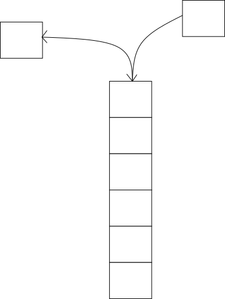
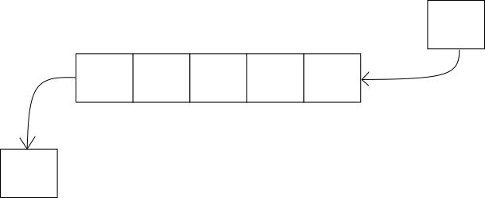

## 栈

栈(stark)是构建在数组或链表之上的更高级的数据结构。栈的特性：

- 栈只能在栈顶插入(入栈，push)和删除(出栈，pop)元素。

因此栈又称为后进先出队列（LIFO），这种特殊性质使得栈用途广泛：

- 编译原理，如：括号匹配，表达式求值。
- 函数调用。函数调用的实现依赖于栈，计算机底层有两个专门用于栈操作的指令，`push` 和 `pop`，可见栈的用途非常普遍。
- 解决某些算法问题。如递归算法，就可以用栈来解决，典型的是深度优先搜索算法。



[C++ STL 栈](https://www.cplusplus.com/reference/stack/stack/)常用的方法如下：

```c++
// The header file
#include <stack>

// The constructor
std::stack<int>  s;

// size_type size() const; Returns the number of elements in the stack.
s.size();
// bool empty() const;
s.empty();


// const_reference top() const; Returns a reference to the top element in the stack.
s.top();

//void push (const value_type& val);Inserts a new element at the top of the stack.
s.push(42);
//void pop(); Removes the element on top of the stack, effectively reducing its size by one.
s.pop();
```


示例代码：

```c++
// stack::push/pop
#include <iostream>       // std::cout
#include <stack>          // std::stack

int main ()
{
  std::stack<int> mystack;

  for (int i=0; i<5; ++i) mystack.push(i);

  std::cout << "Popping out elements...";
  while (!mystack.empty())
  {
     std::cout << ' ' << mystack.top();
     mystack.pop();
  }
  std::cout << '\n';

  return 0;
}
```


## 队列

队列( Queue )是一种构建在数组或链表之上的数据结构。队列的特性：

- 队列只能从队列的尾部插入(入队，enqueue)结点，从队列的头部删除( 出队, dequeue )结点。

队列的主要应用领域：

- 进程调度。操作系统进程调度广泛的使用了队列；
- 消息队列。消息队列广泛用于后端服务，常见的的有Rabbit MQ，Kafka；




[C++ STL 队列](https://www.cplusplus.com/reference/queue/queue/)常用的方法如下：

```c++
// The header file
#include <queue>

// The constructor
std::queue<int> q;

// size_type size() const; Returns the number of elements in the queue.
q.size();
// bool empty() const; Returns whether the queue is empty: i.e. whether its size is zero.
q.empty();

//reference& front(); Returns a reference to the oldest element in the queue.
q.front();
//reference& back(); Returns a reference to the newest element in the queue.
q.back();

// void push (value_type&& val); Inserts a new element at the end of the queue.
q.push(42);
// void pop(); Removes the oldest element in the queue.
q.pop();
```


使用示例：

```c++
// queue::push/pop
#include <iostream>       // std::cin, std::cout
#include <queue>          // std::queue

int main ()
{
  std::queue<int> myqueue;
  int myint;

  std::cout << "Please enter some integers (enter 0 to end):\n";

  do {
    std::cin >> myint;
    myqueue.push (myint);
  } while (myint);

  std::cout << "myqueue contains: ";
  while (!myqueue.empty())
  {
    std::cout << ' ' << myqueue.front();
    myqueue.pop();
  }
  std::cout << '\n';

  return 0;
}
```

