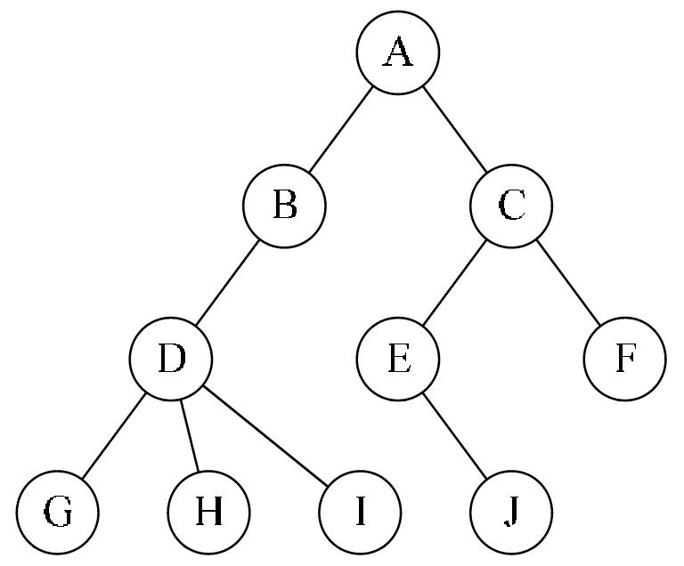

## 概念

 在树( tree )形结构中，每个结点有多个后继结点( succeeding node, succeesor )或称子结点( child, children )，但有且仅有一个前驱结点( precursor )或父结点( parent )，唯一的例外是根节点( root )没有父节点。



- 根( root )：没有父结点，一般画在最上面那个结点，上图 A 是根结点。
- 兄弟结点( sibling )：拥有相同父结点的结点互称兄弟结点，上图 G, H, I 是兄弟结点。
- 祖先( ancestor )与子孙( descendant )：祖先：父结点，父父结点，父父父...结点统称祖先结点，上图 D, B, A 都是 G 的祖先结点；子孙结点：子结点，子子...结点统称子孙结点，C 的子孙结点有 E, J。
- 叶子( leaf )结点：没有子结点的叫叶子结点， G, H, I, J, F 都是叶子结点。
- 结点的度( degree )：该结点拥有的子结点数，例如 D 的度为3，C 的度为 2。
- 路径( path )：某个结点沿着父结点的父结点的$\dots$父结点到根，这个过程经历了一系列结点。那么这些结点组成了“某个结点”到根结点的一条路径，这条路径是唯一的。
- 森林( forest )：独木不成林，树的集合叫森林。
- 树的深度( depth ): 结点到根的路径长度叫该结点的深度。树根的深度不同教材定义有不一样的，定义为 1 可能方便些。从树根开始，每一代子结点的深度加一。整棵树的深度可以用下式计算：

$$
depth(tree)=max(depth(tree.children))+1
$$


##  树有关的计算式

- 树的结点数等于所有结点的度之和加一。

## 树的表示

【跟踪父结点】每个结点除了保存数据还需要保存父结点的指针。特点：寻找父结点简单，寻找子结点难。

```c++
struct node {
  data_t data;
  struct node *parent;
}
```

【跟踪子结点】每个结点除了保存数据还需要保存所有子结点的指针。特点：寻找子结点简单，寻找父结点难。

```c++
struct node {
  data_t data;
  struct node *children[MAX_CHILDREN_NUM];
}
```


【兄弟链】一个指针指向最左边的孩子，一个指针指向他的下一个兄弟。

```c++
struct node {
  data_t data;
  struct node *child;
  struct node *sibling;
}
```


## 二叉树

### 概念

**二叉树**是n(n>=0)个结点的有限集合，该集合或者为空集( 称为空二叉树 )，或者由一个根结点和两棵互不相交的、分别称为根结点的左子树和右子树组成。

- 与度为二的树（2次树）的区别：2次树至少需要一个度为二的结点，二叉树没有这种要求；2次树不区分左右子树，而二叉树严格区分左右子树。

- 完全二叉树：只允许最后两层结点度数小于2，而且最下面一层结点从左到右依次排列，看起就像右下角有个小缺口。

- 满二叉树：只有度为0和2的结点，而且叶子结点全在最后一层。右下角的缺口都没有了。

- 几乎完全二叉树：所有分支结点都存在左子树和右子树，并且所有叶子都在同一层上，这样的二叉树称为满二叉树。


二叉树性质：设有一编号为 $i$ 的结点，其父结点编号为$\lfloor i/2 \rfloor $, 如果有左子结点，则其编号为 $2i$，如果有右子结点，则其编号为 $2i+1$。

### 普通树，森林与二叉树互转

 普通树转二叉树：

- 讲所有兄弟结点间连一条线
- 除了第一个子节点，删除父结点其他子节点的连线

还原：

- 某个结点的右孩子，右右孩子，右...右孩子是他的兄弟结点，他们与**某个结点**有共同的父亲结点。
- 因此，从最右的子节点开始断绝关系，把他们依次连接到**某个结点**的父结点即可。

森林转为二叉树

- 把森林中的每棵树转为二叉树
- 把后一棵树的根节点作为前一棵树的右子节点连起来

还原：

- 由于根没有父结点，因此与**某个结点**有没共同的父亲结点自立为树，形成森林。

### 二叉树的存储

- 如果使用线性表( 数组 )表示完全二叉树，可以用以下性质：

> 编号为$i$的结点，其父结点编号为$\lfloor i/2 \rfloor $, 如果有左子结点，则其编号为$2i$，如果有右子结点，则其编号为$2i+1$。

这里有个细节需要注意：这里的编号是从1开始的，如果从 0 开始，那么左孩子为 $2i+1$，右孩子为 $2i+$2，你可以自己验证。编程的时候，数组第一个下标是 0，你可以不用，也可以用另外一个关系式。

- 如果用数组表示一般的二叉树，中间有结点缺失，那么可以用一些特殊符号表示空结点，把他补成一个完全二叉树。

- 用链表表示。

用链表这就简单了。还记得前面我们记录子节点的表示方法吧，只需设置`MAX_CHILDREN_NUM=2`即可，然后用children[0]表示左结点，children[1]表示右结点，你也可以把数组拆成两个域left, right

```c++
struct node {
  data_t data;
  struct node *children[2]; 
}


struct node {
  data_t data;
  struct node *left;
  struct node *right;
}


struct node {
  data_t data;
  struct node *left;
  struct node *right;
  struct node *parent;
}
```

