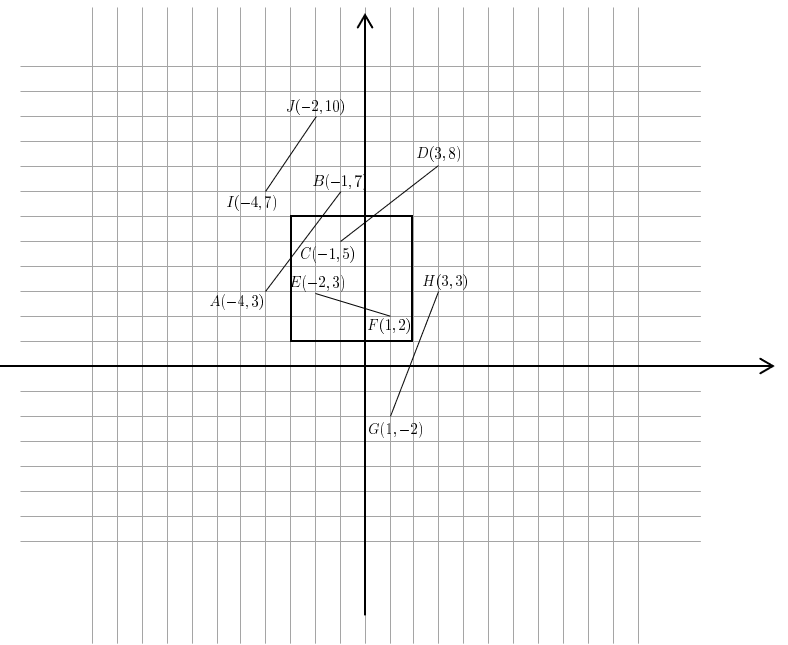

一、名词解释 。（25）

- Frame buffer(帧缓存)
- Parallel projection（平行投影）
- Homogeneous coordinates（其次坐标）
- Logical device （逻辑设备）
- Scan conversion （扫描转换）

二、试述深度缓存算法，即Z-缓存算法。（8）

三、试述 Gouraud 着色方法与 Phong 着色方法之间的区别。（8）

四、试述图象精度算法和对象精度算法的原理和各自的特点。（8）

五、请使用 Bresenham 中点画线算法生成线段 $P_1(0,0)P_2(8,3)$，要求写出生成过程中像素点的坐标即判别式的值。（12）

六、已知多边形 $V_1(2,4),V_2(9,4),V_3(9,7),V_4(8,7),V_5(8,9),V_6(4,9),V_7(4,7),V_8(2,7)$，请详细说明用扫描线算法扫描转换多边形的过程，需要给出边表，活动边表，以及汇出的像素序列，说明各水平边的处理方法即结果。（12）

七、写出三维图形的三种基本变换（平移、缩放、旋转）的矩阵表示，并说明各矩阵的功能。（12）

八、如图所示有五条线段：$AB,CD,EF,GH,IJ$ 以及一个裁剪窗口，请使用 Cohen-Sutherland 算法实现线段裁剪，要求绘出区域编码并逐条线段分析。

