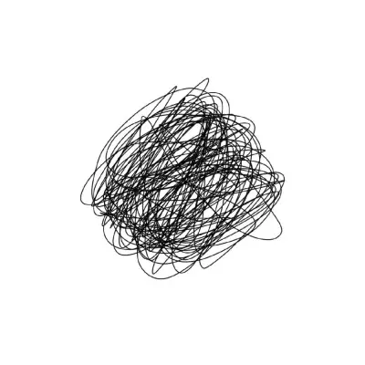
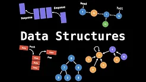

在学习本数据结构之前，你的脑子是这样的：



学习了数据结构之后：



事物在计算机中是如何描述的呢？事物在计算机里是以抽象的数字存在的，假如我们需要表示一只猫，那么可以用一些属性描述它：

```c
cat {
  name: 汤姆
}
```

其实只需要一个简单的名字就可以让你的脑袋里描绘出一个汤姆猫，假如这只猫的名字叫加菲猫，那么另一只又肥又懒的猫会出现在你的脑海里。这就是抽象的力量，抽象可以把复杂的事物简单的表现出来。

计算机如何通过简单的数字表现复杂的世界呢? 

- 计算机的世界由两个原子数`0, 1`表示。

- 一组0与1通过编码表示出整数，负数，小数（浮点数），字符（串）。在这一抽象层面上，已经可以表达出有实际意义的信息，高级编程语言都是从这里起步，构建起计算机的世界。
- 有了整数，小数，字符串还不能构成复杂的世界，例如人物，猫，狗，汽车，建筑物，98k，红buff，还需要定义更加复杂的结构。

许多编程语言都有定义复杂数据结构的机制，`struct, class` 是最常见的两种方式，例如 c：

```c
#include <stdio.h>
#include <string.h>

typedef struct {
  char name[20];
  int color;
  int category;
} Cat;

int main() {
    Cat cat={"Tom", 255, 0};
    printf("%s\n", cat.name);
    return 0; 
}
```

`name, color, category` 这些变量描述了 `Cat` 的**属性**，通过属性就可以知道事物的特点，这些属性在某一时刻的值构成物体的**状态**。

事物总是在变化着的，现在定义了一种交通工具：

```c
#include <stdio.h>
#include <string.h>

typedef struct {
  char name[20];
  float speed;
} Vehicle;

int main() {
    Vehicle car={"car", 0};
    printf("%.2f\n", car.speed);
    return 0; 
}
```

这辆车是静止的，如何才能开车呢？

```c
#include <stdio.h>
#include <string.h>

typedef struct {
  char name[20];
  float speed;
} Vehicle;

void accelerate(Vehicle *car){
    car->speed += 1;
};

int main() {
    Vehicle car={"car", 0};
    printf("%.2f\n", car.speed);
    
    accelerate(&car);
    printf("%.2f\n", car.speed);
    return 0; 
}
```

加速后这辆车的速度不再是0，可以跑起来了。可以看出`accelerate()`函数改变了`car`的属性，从而事物表现出不同的状态，从而表达了客观世界的运动与变化。这种改变事物对象的函数在编程语言里又叫**方法**(method)，改变事物对象的“方法“可以不止一个，它们的集合称为**接口**(interface)。定义了事物的结构(struct)与方法之后，事物有自己的属性状态，并且可以改变，栩栩如生的计算机世界就这样构建起来了。

现在的问题是真实的世界如此复杂，有没有特定的模式可以遵循，答案是有的。

最基本的数据结构有线性的结构：如数组，列表，栈，队列；有树状的结构如：二叉树，红黑树；有网状结构，如简单连通图。我们要学习这些结构的属性，还要学习改变他们状态的方法，最后把它们与显示事物联系起来，解决实际问题。


