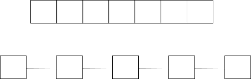
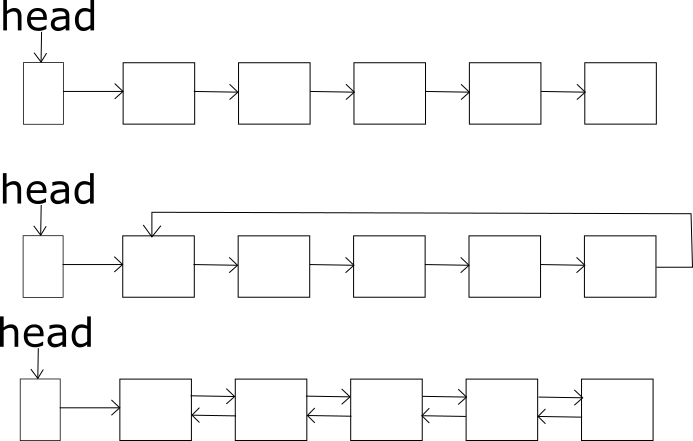
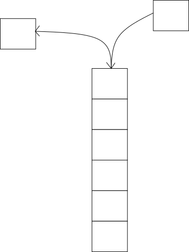

什么是线性结构呢，线性结构的特点是除了起始结点与末尾结点，每个结点仅有一个前驱或后继。

两种典型的线性结构如下图所示：

它们一个叫数组(array)，一个叫链表(list)。可以从上图直观的看出“线性”的含义。不同点在于：

- 数组是连续的存储单元。
- 链表不是连续的存储单元，每个链表结点除了需要保存数据，还需要保存下一个结点的地址。

## 数组

数组是连续的存储单元，数组有三个重要的属性，一是首地址(base)，二是每个元素大小(size)，三是数组总大小(length)。因此访问数组中任何一个元素所需要的的时间复杂度是一个常数，因为数组中的第 $i$​ 个元素的地址可以通过如下公式算出：
$$
address[i] = base + i * size
$$
如果 $i$​​ 的大小超过了数组的长度(length)，称为数组越界，所得的地址是无效的。

【数组的优点】

- 读取速度快。由于可以通过简单的计算可以得出每个数组元素的地址，因此数组元素的读取非常快。

【数组的缺点】

- 删除与插入操作比较困难。由于数组的长度固定，这导致数组元素的删除与插入操作比较困难。因为在数组中间插入一个元素需要把其他元素后移。
- 固定的容量。在实际的使用中，数组的使用长度可能比分配的长度小，数组可能达到的最大长度称为数组的容量(capacity)。

## 链表

【链表的优点】
链表是很常用的一种数据结构，不需要初始化容量，可以任意加减元素；
添加或者删除元素时只需要改变前后两个元素结点的指针域指向地址即可，所以添加，删除很快；

【链表的缺点】

- 额外空间开销。因为含有大量的指针域，占用空间较大；
- 查找效率低。查找元素需要从头元素开始，一个一个往下找，效率没有数组高。

【链表的变种】

如下图所示：

第一种链表称为单链表，每个结点只保存后继结点的指针。

第二种链表称为循环链表，最后一个结点保存了第一个结点的指针，构成了一个环。

第三种链表每个结点不仅保存后继结点的指针，还保存前驱结点的指针，这种链表不仅可以正向开车，还可以反向开车。

## 栈

栈是构建在数组或链表之上的更高级的数据结构。本质上栈依然是线性的结构。栈只能从栈顶存取数据，不能访问中间或其他地方的结点。

## 队列

队列也是构建在数组或链表之上的数据结构，队列本质上也是线性结构。队列的特点是只能从队列的尾部插入结点，从队列的头部删除结点。

