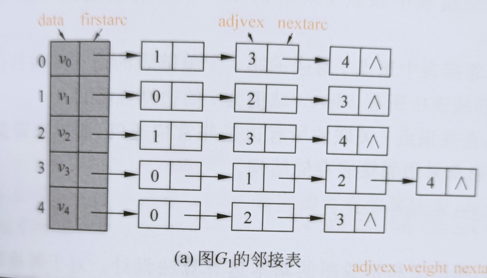

## 概念

- 图 G(graph) 由顶点集合 V(vertex)，边集合 E(edge) 组成，记做 $G=(V,E)$。
- 有向图的边用 $<i, j>$ 表示，$<i,j>$ 与 $<j,i>$ 不是同一条边。
- 无向图的边用 $(i,j)$ 表示，$(i,j)$ 与 $(j,i)$ 是同一条边。
- 一个顶点的出度与入度之和顶点的度，一个图的度数之和等于边数之和的两倍。
- 完全图：无向图中任意两顶点之间存在边，有向图任意两顶点存在反向的两条边。
- 路径：顶点 $i$ 到 $j$ 的路径是一个顶点序列$(i,v_1,\dots,v_i,j)$ ,路径长度等于边数。
- 环或回路：条路径的起始节点与结束结点是同一个结点。
- 连通性：图 $G$ 中任意两个顶点有路径相连，则称图是连通的，有向图称强连通的。无向图的极大连通子图称为 G 的连通分量，有向图的称作强连通分量。
- 拓扑序列：对于有向图 G ，其顶点序列 $v_1,v_2,\dots,v_n$ ，其中任何两个顶点 $i<j$ 时， $v_i$到 $v_j$ 有路径。
- AOE 网与关键路径：用有向图入度为零的顶点表示工程的开始事件，用出度为零的顶点表示工程结束事件，用边表示一项活动持续时间，那么这个有向图为边表示活动 AOE(activity on edge) 的网。

## 图的存储

1. 邻接矩阵

用矩阵元素 $A[i][j]$ 表示顶点$i,j$ 的关系：

- 对于无权图，$A[i][j]=1$ 表示有边 $<i,j>$，$A[i][j]=0$ 表示 $i,j$ 之间没有边。
- 对于带权图，$A[i][j]=w_{ij}$ 边 $<i,j>$ 的权重为$w_{ij}$，$A[i][j]=\infty$ 表示 $i,j$ 之间没有边, $A[i][j]=0$ 表示 $i=j$ ，即顶点自己到自己的权重。

边的权重怎么设可以根据具体问题调整。

我们可以得出如下结论：

- 无向图的邻接矩阵是对称矩阵。

2. 邻接表存储

先看一个邻接表的例子：

这是怎么存储的呢?

1. 左边那一列把所有的顶点存起来了。
2. 每个顶点右边挂的是与他直接他相连的所有顶点。

这个好理解：

- 在无向图中：你与我相连，我与你也相连，有向图就不一定了。
- 边的权重如何表示呢？在右边挂的结点增加一个权重域。
