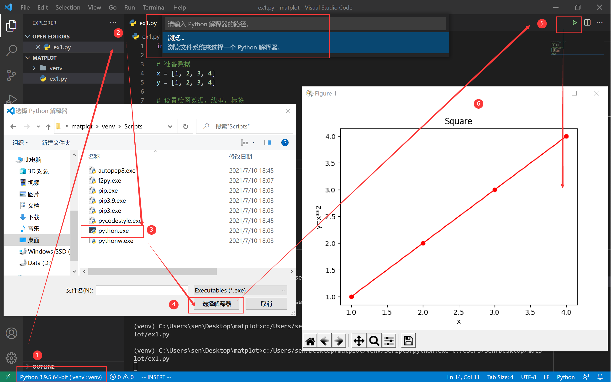
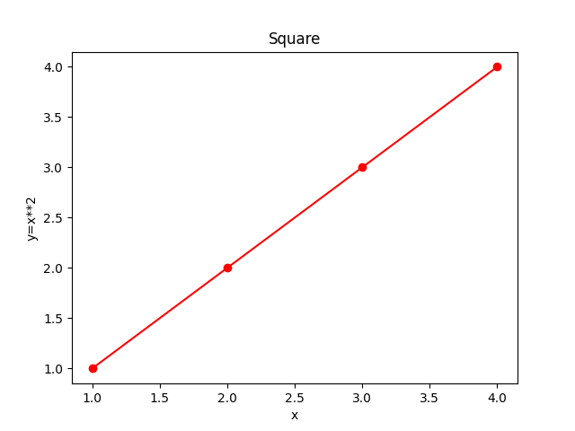
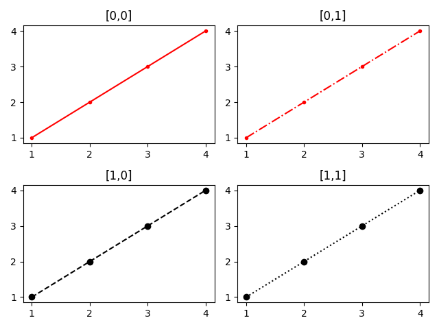
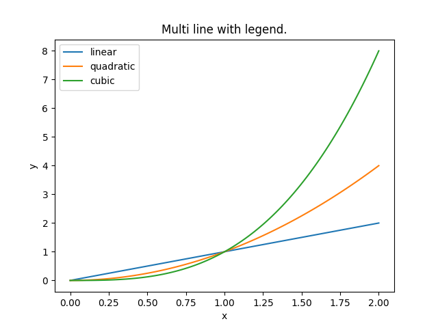

接下来学习如何用 Python 的可视化库 `matplotlib` 作图。


# 安装

1. 使用虚拟环境

```shell
$ python -m venv venv
$ source venv/Scripts/activate
```

2. 安装`matplotlib`

```shell
$ pip install -U matplotlib
$ pip list
Package         Version
--------------- -------
cycler          0.10.0
kiwisolver      1.3.1
matplotlib      3.4.2
numpy           1.21.0
Pillow          8.3.1
pip             21.1.1
pyparsing       2.4.7
python-dateutil 2.8.1
setuptools      56.0.0
six             1.16.0
```

注意 `matplotlib` 与 `numpy` 两个 Package。

3. 使用 Vscode 编写代码



# 绘图示例

【知识点一】绘制简单的散点图

```python
import matplotlib.pyplot as plt

# 准备数据
x = [1, 2, 3, 4]
y = [1, 2, 3, 4]

# 设置绘图数据，线型，标签
plt.plot(x, y, 'ro-')
plt.xlabel('x')
plt.ylabel('y=x**2')
plt.title('Square')

# 展示图片
plt.show()
```



说明：

1. 关于 `plt.plot(x, y, 'ro-')`的解释：

前两个参数横纵坐标数据，这好理解，第三个参数表示线型。

第一个参数表示颜色，例如: r红色，g绿色， b蓝色，k黑色，w白色，[更多颜色示例](https://matplotlib.org/stable/tutorials/colors/colors.html#sphx-glr-tutorials-colors-colors-py)。

第二个参数表示点型，例如：`+ . 1 2 3 4 x o ,` 等。

第三个参数表示线型，例如：`- -- -. : steps` 等。

【知识点二】图片构成要素


【知识点三】子图

```python
import matplotlib.pyplot as plt

x = [1, 2, 3, 4]
y = [1, 2, 3, 4]

fig, axs = plt.subplots(2, 2)
axs[0,0].plot(x, y, 'r.-')
axs[0,0].set(title='[0,0]')

axs[0,1].plot(x, y, 'r.-.')
axs[0,1].set(title='[0,1]')

axs[1,0].plot(x, y, 'ko--')
axs[1,0].set(title='[1,0]')

axs[1,1].plot(x, y, 'ko:')
axs[1,1].set(title='[1,1]')

fig.tight_layout() # 设置子图间隔(spacing)
plt.show()
```



从上述例子可以直观的看出各个子图的关系。

【知识点四】一个图画多条曲线。

```python
import matplotlib.pyplot as plt
import numpy as np


x = np.linspace(0, 2, 100)
y1 = x
y2 = x**2
y3 = x**3

fig, ax = plt.subplots()
ax.plot(x, y1, label='linear')
ax.plot(x, y2, label='quadratic')
ax.plot(x, y3, label='cubic')
ax.set(xlabel='x', ylabel='y', title='Multi line with legend.')
ax.legend()
plt.show()
```



【知识点五】直方图示例

```python
import numpy as np
import matplotlib.pyplot as plt

np.random.seed(19680801)

# example data
mu = 100  # mean of distribution
sigma = 15  # standard deviation of distribution
x = mu + sigma * np.random.randn(437)

num_bins = 50

fig, ax = plt.subplots()

# the histogram of the data
n, bins, patches = ax.hist(x, num_bins, density=True)

# add a 'best fit' line
y = ((1 / (np.sqrt(2 * np.pi) * sigma)) *
     np.exp(-0.5 * (1 / sigma * (bins - mu))**2))
ax.plot(bins, y, '--')
ax.set_xlabel('Smarts')
ax.set_ylabel('Probability density')
ax.set_title(r'Histogram of IQ: $\mu=100$, $\sigma=15$')

# Tweak spacing to prevent clipping of ylabel
fig.tight_layout()
plt.show()
```


[更多作图示例。](https://matplotlib.org/stable/gallery/index.html#)

