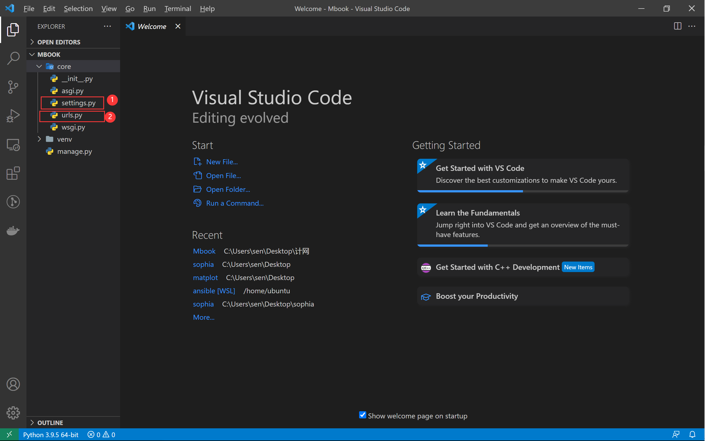
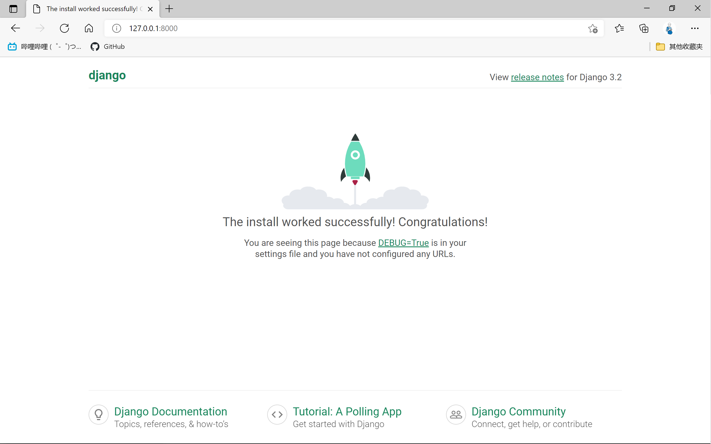
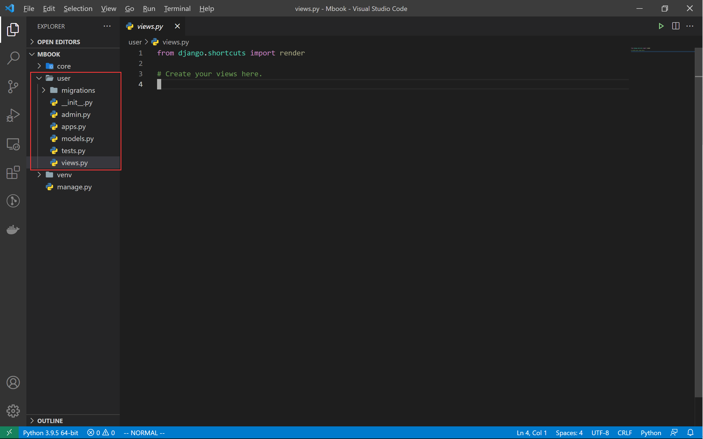
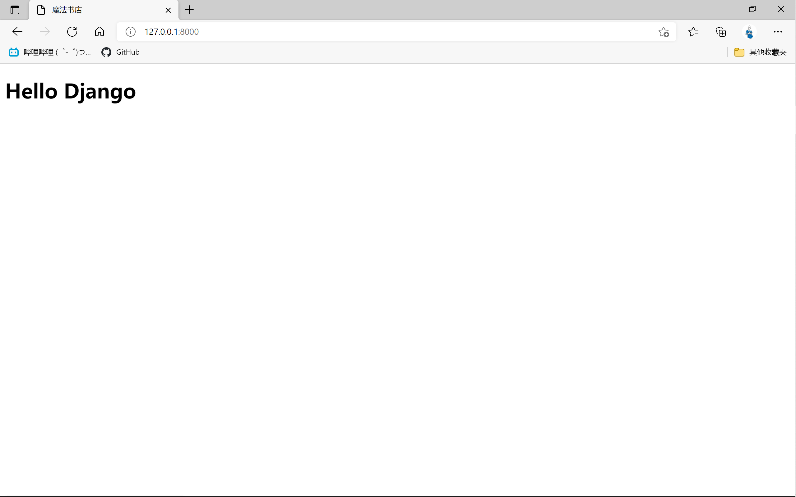

Python 做网站主要有许多框架选择：Flask ， Django，fastAPI等。

我们以 Django 为例做一个购物网站。

【知识点】开发环境搭建。

1. 首先确保自己已经安装了 Python 解释器。

```shell
C:\Users\sen>py --version
Python 3.9.5

C:\Users\sen>pip --version
pip 21.1.1 from d:\program files\python\python39\lib\site-packages\pip (python 3.9)
```

2. 创建 Python 虚拟环境

新建项目文件夹`Mbook`

```shell
python -m venv venv

.\venv\Scripts\activate # windows cmd
source venv/Scripts/activate # bash
```

3. 安装 Django

```shell
pip install django
```

【知识点】Django项目结构

1. 生成Django项目

```shell
django-admin startproject core .
```

用 VScode 打开项目文件夹，可以看到两个文件夹：

- `venv` ：这是`python -m venv venv` 创建的虚拟环境。
- `core`: 这是`django-admin startproject core .` 创建的全局项目文件夹。

一个文件`manage.py`: 这是`django-admin startproject core .` 创建的Django项目管理文件。

在`core` 文件夹里有两个重要的文件：

- `settings.py`：这是Django项目的配置文件，所有的配置写在这里面。
- `urls.py`：全局的路由注册文件，所有的路由在这里注册。

其它的文件可以不用管。



在项目根目录下运行：

```shell
$ py manage.py runserver
Watching for file changes with StatReloader
Performing system checks...

System check identified no issues (0 silenced).

You have 18 unapplied migration(s). Your project may not work properly until y
ou apply the migrations for app(s): admin, auth, contenttypes, sessions.
Run 'python manage.py migrate' to apply them.
July 19, 2021 - 10:13:16
Django version 3.2.5, using settings 'core.settings'
Starting development server at http://127.0.0.1:8000/
Quit the server with CTRL-BREAK.
```

打开 http://127.0.0.1:8000/:



2. 生成一个APP

一个Django项目可以拆分成许多子应用，现在建立用户(user)子应用。

```shell
django-admin startapp user
```

此时项目的根目录下又多了一个文件夹user：



从这些文件的名字可以大致的看出他们作用。

【知识点】第一个页面。

1. 编写第一个视图`user/views.py`

```python
from django.shortcuts import render
from django.views import View


class HomeView(View):
    def get(self, request):
        return render(
            request,
            'home.html'
        )
```

2. 编写模板：

项目根目录下新建一个文件夹`templates`，在此文件夹内建立文件`home.html`

```html
<!doctype html>
<html lang="en">
<head>
    <meta charset="utf-8">
    <meta name="viewport" content="width=device-width, initial-scale=1">
    <title>魔法书店</title>
</head>

<body>
    <h1>Hello Django</h1>
</body>
</html>
```

3. 注册模板

在`core/settings.py`里找到模板相关配置：

```python
TEMPLATES = [
    {
        'BACKEND': 'django.template.backends.django.DjangoTemplates',
        'DIRS': [BASE_DIR / 'templates'], #####修改这里####
        'APP_DIRS': True,
        'OPTIONS': {
            'context_processors': [
                'django.template.context_processors.debug',
                'django.template.context_processors.request',
                'django.contrib.auth.context_processors.auth',
                'django.contrib.messages.context_processors.messages',
            ],
        },
    },
]
```

4. 注册路由：

在 user 子 APP 文件夹里新建文夹`urls.py`:

```python
from django.urls import path
from .views import HomeView


urlpatterns = [
    path('', HomeView.as_view(), name='home')
]
```

在全局路由文件`core/urls.py`里注册子应用的路由，注意那个`include`：

```python
from django.contrib import admin
from django.urls import path, include

urlpatterns = [
    path('admin/', admin.site.urls),
    path('', include('user.urls')),
]
```

5. 再次访问主页：



6. 小结

Django开发网站很简单，开发一个网站页面就是增加一个视图(views.py)，模板(templates)，路由(urls.py)，只要熟悉了这个模式，可以很快的开发出各种网站。

