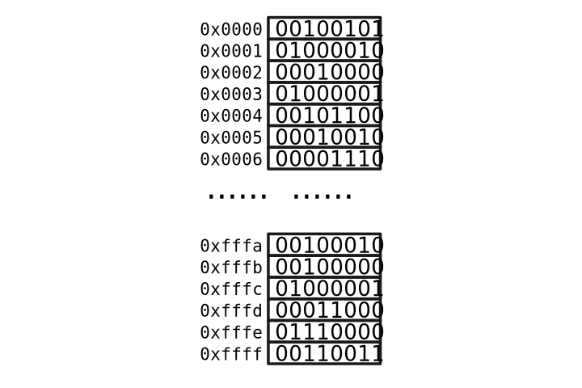

---
图片上传失败！！！
---

数据结构主要有三种常见结构：线性，树形，图。根据二八原理，学好这三种基本的数据结构就可以解决许多问题了。数据结构还有一个孪生兄弟，即算法。为了简单，本笔记只介绍与相关数据结构相关的算法。

# 编程环境

由于数据结构偏底层，所以采用偏底层的语言更容易理解其中的逻辑，所以采用 `C/C++` 作为示例程序的语言。考虑到 `C/C++`的编程环境搭建有些难，建议新手采用一些在线的编程环境，你可以搜索 `C++ online` 或者 `C playground`可以获取在线环境，开箱即用，非常简单。本笔记使用：

- [C Playground](https://cplayground.com/)

作为运行环境，并使用 `VS Code`作为本地编辑器。

本地代码环境的搭建建议上B站自己搜 `VS Code C++`  或者 `Visual Studio`。使用 Linux 系统的建议自己搜。

# 理解内存

内存是一系列连续的存储单元，一个单元是8位，即一个字节。每个单元有一个编号，这个编号叫内存地址。对内存有两个基本的操作：

- 读内存。读内存只需要一个参数：内存地址，表示读哪个单元的数据。
- 写内存。写内存需要两个参数，内存地址和要写的数据，表示把某某数据写入某某单元。

即使是这样简单的内存结构却能构造出复杂的计算机世界。

# 理解数据

在计算机中只有数：0和1，通过对0与1组成串编码可以表示特定的信息。C语言提供如下几类数据的编码：

- 无符号整数
- 有符号数
- 浮点数
- ASCII字符
- 内存地址

事实上，这些内置的数据类型也有结构，不过那是计算机组成原理的知识，本笔记不予以讨论。`C/C++`内置的数据类型其实有限，例如：Unicode等支持不友好，不如其他应用层语言那样方便。不过有了这些基本的数据类型的支持，通过 `struct` 关键字能构造出复杂的数据结构。

# 理解状态

物理世界可以用事物的属性描述事物的特点，例如用年龄描述一个人的衰老程度，用花呗余额描述一个人的贫穷程度，这些属性值随着时间的流逝在不断变化着。计算机利用内存记录相应事物的属性值，如果把这些值放在特定的场景下，你会发现，这段内存就可以代表相应的事物。

静止的内存数据不能表达动态的世界，如果对相应的变量定义运算法则，并通过这些运算法则改变这些变量的值，那么计算机就能表达运动的世界。

在面向对象编程里，这些特定的内存称为**对象**(object)，改变这些对象状态的运算规则称为**方法**(method)。

# 数据结构容器观点

先有数据还是先有结构？一种观察数据结构的观点是：先有数据，然后把这些数据按照某种结构组织起来。另外一种观点是：先有结构，当数据来的时候，就按照这种结构的方式存取数据。从后一种观点来看，数据结构就好像容器一样，各个编程语言都有相应的实现，而且这种容器还能存储不同类型的数据，具有泛型的特点。

说了这么多，感紧开始学习吧。
