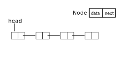

# 什么是链表

数组有一些缺点：

- 容量固定，如果数据量超出数组容量，需要一种扩容策略扩容。
- 删除与插入中间元素比较麻烦，为了保持连续性，需要移动后面的元素。

接下来我们设计一种可以克服上述问题的结构：链表。



# 链表的实现

```c++
#include <iostream>

using namespace std;

template <typename T>
struct LinkList
{
private:
    struct Node
    {
        T data;
        Node *next;
    };

    Node *head;

public:
    LinkList()
    {
        head = nullptr;
    }
};

int main()
{
    LinkList<int> numbers;
    return 0;
}
```

运行上述代码，除了编译通过之外，你不会得到任何结果。不过实现链表最重要的结构：

```c++
    struct Node
    {
        T data;
        Node *next;
    };

    Node *head;
```

已经写好了。接下来，为我们的链表实现两个接口，一个用于插入元素，一个用于打印链表信息：

```c++
#include <iostream>

using namespace std;

template <typename T>
struct LinkList
{
private:
    struct Node
    {
        T data;
        Node *next;
    };

    Node *head;

public:
    LinkList()
    {
        head = nullptr;
    }
    void insert(T value)
    {
        Node *tmp = new Node;
        tmp->data = value;
        tmp->next = head;
        head = tmp;
    }

    void show()
    {

        for (Node *p = head; p != nullptr; p = p->next)
        {
            cout << p << ": " << p->data << "|" << p->next << "  ";
        }
        cout << endl;
    }
};

int main()
{
    LinkList<int> numbers;
    numbers.insert(3);
    numbers.insert(3);
    numbers.insert(2);
    numbers.show();
    return 0;
}
```

终于可以看到结果了：

```shell
0xe48ef0: 2|0xe48ed0  0xe48ed0: 3|0xe48eb0  0xe48eb0: 3|0  
```


# 更多的接口

接下来的代码我们实现了删除方法和重载了索引操作符，并重写了插入方法，这样我们的链表可以在任何位置插入元素：

```c++
#include <iostream>
#include <exception>

using namespace std;

template <typename T>
struct LinkList
{
private:
    struct Node
    {
        T data;
        Node *next;
    };

    Node *head;

public:
    LinkList()
    {
        head = nullptr;
    }

    /* insert value at index
    return index if success
    else throw out of index exception.
    */
    size_t insert(T value, size_t index = 0)
    {
        size_t i = index;
        // insert at head
        if (i == 0)
        {
            Node *tmp = new Node;
            tmp->data = value;
            tmp->next = head;
            head = tmp;
            return 0;
        }

        // insert at other place
        for (Node *p = head; p != nullptr; p = p->next)
        {
            if (i == 1)
            {
                Node *tmp = new Node;
                tmp->data = value;
                tmp->next = p->next;
                p->next = tmp;
                return index;
            }
            --i;// Do not use i=i-1;
        }

        throw range_error("Out of index.");
    }

    void show()
    {

        for (Node *p = head; p != nullptr; p = p->next)
        {
            cout << p << ": " << p->data << "|" << p->next << "  ";
        }
        cout << endl;
    }

    /* remove nth elements
     * return n if success
     * else throw out of index exception.
    */
    size_t remove(size_t index)
    {
        size_t i = index;
        Node *p = head;

        // remove first element
        if (i == 0)
        {
            head = p->next;
            delete p;
            return 0;
        }

        // remove other elements
        for (; p->next != nullptr; p = p->next)
        {
            if (i == 1)
            {
                Node *tmp = p->next;
                p->next = (p->next)->next;
                delete tmp;
                return index;
            }
            --i;
        }

        // out of index
        throw range_error("Out of index.");
    }

    T operator[](size_t index)
    {
        int i = index;
        for (Node *p = head; p != nullptr; p = p->next)
        {
            if (i == 0)
            {
                return p->data;
            }
            --i;
        }
        throw range_error("Out of index.");
    }
};

int main()
{
    LinkList<int> numbers;
    numbers.insert(5);
    numbers.insert(4);
    numbers.insert(3);
    numbers.insert(2);
    numbers.insert(1);
    numbers.insert(0, 2);
    numbers.show();
    cout << "index 2: " << numbers[2] << endl;
    return 0;
}
```

从上面的例子可以看出，对链表的操作主要靠：

```c++
for (Node *p = head; p != nullptr; p = p->next)
```

在`c++`标准库中还提供了迭代器的概念以此来访问链表中的元素。

我们这里实现的链表非常简单，不过收获还是蛮大的：实现底层数据结构有助于理解内存，指针，也能提高编程语言运用能力。

