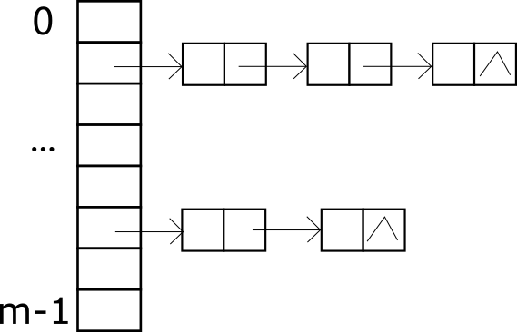

哈希表(Hash table, Hash Map)是一种常用的数据结构。与数组不同，哈希表最大的特点是除了能用整数作为下标，还能使用字符(char)，字符串(string)，浮点数(Float)，函数(function)等对象作为下标。

把数组下标从数字扩充到任何对象是有意义的，请看如下 Python 代码：

```python
handles={}

def handle_get():
    pass

def handle_post():
    pass

handles['get'] = handle_get
handles['post'] = handle_post
```

这段代码的意图很明显，就是为不同的 Http 请求定义相应的处理函数。初一看，感觉和数组差不多，其实下标用的是字符串。我们知道数组的下标只能是从0开始的整数，要想把这些“乱七八糟”的对象转换成从0开始的整数，就需要做一个映射（Map)，建立起“乱七八糟”对象与整数下标的关系。


哈希表在生活中的应用非常广泛：

- 区块链就是一个巨大的哈希表。

- 著名的版本管理工具 Git 它所维护的版本信息其实也是一个巨大的哈希表。


# 概念

**哈希表**（Hash Table）是一种按键值对(key, value)储存数据的结构，可以通过键 (key) 存储 (put)，获取(get)，修改 (update) 以及删除 (delete) 哈希表中的值(value)，这里的键与值可以是任何对象。

**哈希函数**(Hash function) 能把键转换成一个内存地址的函数。有了哈希函数，就可以得到值得存储地址，就可以对值进行相应的操作。

**哈希冲突** (Hash collisions)，又叫哈希碰撞，是哈希函数映射的一种特殊情况，即把两个不同的键映射到相同的内存地址了。如何处理哈希冲突是哈希表的一个重要知识点。


# 哈希函数

哈希函数的一个重要特点是对于任何长度的输入，它都能输出特定长度的数据，并且输入与输出一一对应。哈希函数操作不可逆，给你哈希值，你无法知道这是谁的的哈希值。关于“任何长度”的说明：“乱七八糟”的对象可以通过编码成为“任何长度”的01二进制串。

哈希函数这种一一对应的特性使得哈希函数在计算机安全领域应用相当广泛。哈希函数验证真伪过程：假如我现在要发布一个教程，我先把文件做一次哈希得到哈希值，然后发布；读者拿到我的教程之后，他也做一次哈希，得到一个哈希值，如果他的哈希值与我发布的哈希值一样，那说明他得到的教程是完好的。


下面介绍几种简单的哈希函数。

## 直接地址法

直接地址法其实是一种线性映射关系：
$$
h(K)=aK+b
$$
例如: 计算机学院的 21级的学号格式为 20213021xxx，你想把21级的信息加载到一个数组里，你只需要一个`students[1000]` 的数组即可，数组下标映射关系为：
$$
h(K)=K-20213021000
$$

## 除留余数法

取余数的方法如下：
$$
h(K) = K\ mod\ p
$$
这里 $p$ 一般是哈希表的容量大小，理论研究表明 $p$ 取大于容量的最小素数能减少碰撞。 ​​


# 哈希冲突解决方法

## 开放地址法

开放地址法的基本思想：如果出现哈希碰撞，就在哈希表中寻找一个新的空闲位置。开放地址法有多种方法找空闲位置，例如线性探测法，平方探测法，伪随机数法，双哈希函数法等。

1. 线性探测法

线性探测法是在发生哈希冲突，就尝试哈希地址的下一个地址，如果为空就使用，否则继续寻找下一个。

优点：简单

缺点：容易产生堆积现象。由于同义词（哈希值相同的键）冲突占用了别的空闲位置，导致原本没有冲突的键也会产生冲突。走别人的路，让别人无路可走。

2. 平方探测法

探测公式：
$$
d_0=h(K)\\
d_i=(d_0\pm i^2)\ mod\ m \quad(1\le i \le m-1)
$$

## 拉链法(chaining)

拉链法的基本思想是在产生碰撞的地址单元建立一个链表，哈希表存储链表的首地址，这样无论有多少冲突的节点，哈希表都可以放得下。




# C++ STL 的哈希表

[C++ STL 哈希表](https://www.cplusplus.com/reference/unordered_map/unordered_map/)的实现是：`unordered_map`，来看一个例子：

```c++
#include <iostream>
#include <unordered_map>

int main()
{
    std::unordered_map<std::string, std::string> mymap;
    mymap = {{"中国", "北京"},{"U.S.", "Washington"},{"France", "Paris"}};

    mymap["Japan"] = "Tokyo";            // new element inserted
    std::string capital = mymap["中国"]; // existing element accessed (read)
    mymap["China"] = capital;            // existing element accessed (written)

    std::cout << "mymap contains:";
    for (auto it = mymap.begin(); it != mymap.end(); ++it)
        std::cout << " " << it->first << ":" << it->second;
    std::cout << std::endl;

    std::cout << "mymap's buckets contain:\n";
    for (unsigned i = 0; i < mymap.bucket_count(); ++i)
    {
        std::cout << "bucket #" << i << " contains:";
        for (auto local_it = mymap.begin(i); local_it != mymap.end(i); ++local_it)
            std::cout << " " << local_it->first << ":" << local_it->second;
        std::cout << std::endl;
    }

    return 0;
}
```


# 简单的哈希表实现

```c++
#include <iostream>
#include <tr1/functional> /* tr1::hash, defines many hash functions */
#include <random>
#include <list>

using namespace std;

template <typename T>
struct Hash
{
private:
    size_t capacity;

    list<T> *table;

public:
    Hash(size_t c)
    {
        capacity = c;
        table = new list<T>[capacity];
    }

    size_t hash_function(T key)
    {
        return tr1::hash<T>()(key) % capacity;
    }

    void insert_element(T key)
    {
        size_t index = hash_function(key);
        table[index].push_back(key);
    }

    void delete_element(T key)
    {
        size_t index = hash_function(key);
        for (auto it = table[index].begin(); it != table[index].end(); ++it)
        {
            if (*it == key)
            {
                table[index].erase(it);
                break;
            }
        }
    }

    void show()
    {
        for (int i = 0; i < capacity; ++i)
        {
            cout << "["<<i<<"]";
            for (auto x : table[i])
                cout << "--->" << x;
            cout << endl;
        }
    }
};

int main()
{
    Hash<int> h(7);

    // set random engine
    random_device rd;
    mt19937 mt(rd());
    uniform_int_distribution<size_t> dist(1, 100);

    for (int i = 0; i < 10; ++i)
        h.insert_element(dist(mt));

    h.show();
}
```

