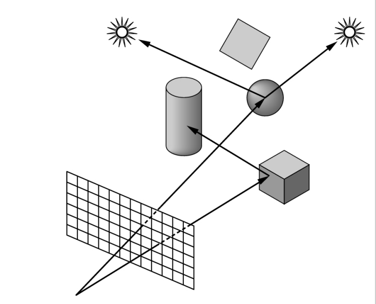
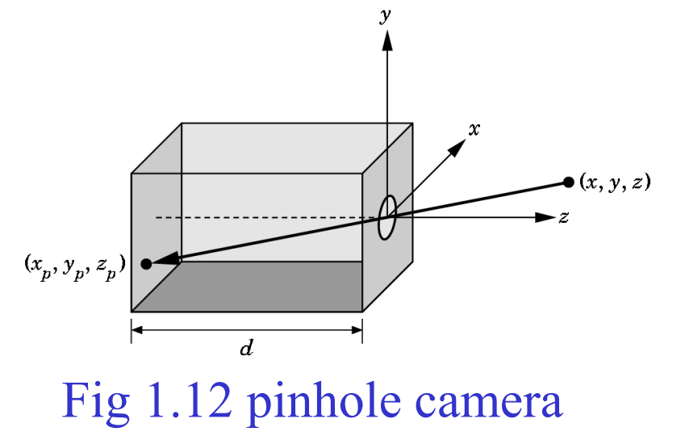
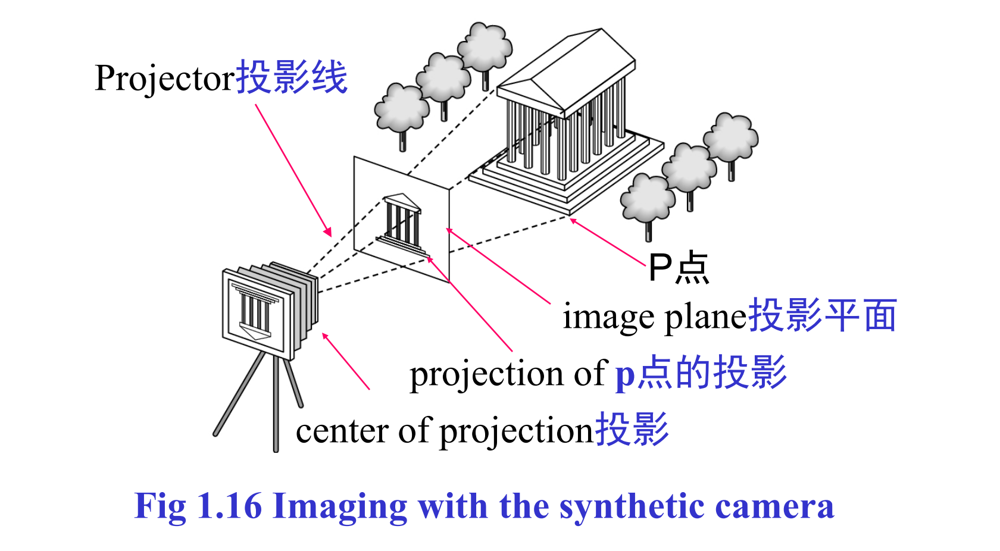

# 什么是计算机图形学

计算机图形学需要解决的问题使用计算机生成图像。它应用领域：

- 信息的显示
- 设计
- 仿真和动画
- 用户界面

图形系统包括了如下6个元素：

- 输入设备
- CPU
- GPU
- 存储器
- 帧缓存
- 输出设备

像素：对应图像的一个位置；

光栅：像素阵列；

帧缓存：缓存图像的区域，一帧还有的像素数称为分辨率，通常用长*宽表示。

深度：每个像素所用的比特数，用来表示像素的颜色等信息。全彩色是至少 8*3=24位。

光栅化：把几何物体转化为帧中像素的计算过程。

刷新率：显示器每秒绘制的帧数。

输入设备：物理设备例如鼠标、键盘、触摸屏。逻辑设备通常以应用程序接口的形式出现，例如 `printf, scanf`，逻辑输入设备通常提供字符信息，或定位信息（如鼠标坐标）。

# 成像系统

成像过程要素：

- 对象：点，线，多边形，曲面。

- 材质属性：颜色吸收率，散射率等。

- 观察者：镜头中心位置（COP)，朝向，焦距，胶片平面长与宽。

- 光源：点光源、特定方向光源与锥形光源，近光与远光，强度信息等。

光线追踪：跟踪光线与物体的交互过程。

## 小孔成像

根据相似三角形可以得出：$(x_p,y_p,z_p)=(-d\frac{x}{z},-d\frac{y}{z},-d)$

## 人眼成像

光线通过角膜和晶状体在视网膜上成像。

# 图片颜色

灰度图像：由单色和灰度等级决定，典型的是黑白电影

彩色图像：色调，饱和度，亮度

加色模型：由红绿蓝三原色按不同比例组成

减色模型：由青色，品红，黄色过滤白光组成

# 图形绘制系统架构

一个场景包含了一组图形对象，每个图形对象由一组图元构成，每个图元包含一组顶点。因此，图形的绘制有如下步骤：

- 顶点处理：涉及坐标变换与颜色值计算，还可能将3D图像投影为2D图像。
- 裁剪和图元组装：显示器的大小是有限制的，需要把顶点组装成线段或多边形这样的图元，然后对图元进行裁剪。
- 光栅化：把图元转化为片元，片元是携带位置与颜色信息的潜在像素点。
- 片元处理：处理纹理映射，遮挡信息等，然后更新帧缓存里的像素。

